<p align="center">
  
</p>

<h1 align="center">ai-memory&trade;</h1>
<p align="center"><em>universal AI memory</em></p>

[](https://github.com/alphaonedev/ai-memory-mcp/actions/workflows/ci.yml)
[](https://github.com/alphaonedev/ai-memory-mcp/actions/workflows/bench.yml)
[](https://github.com/alphaonedev/ai-memory-mcp/actions/workflows/session-boot-lifetime.yml)
[](https://www.rust-lang.org/)
[](LICENSE)
[](https://www.sqlite.org/)
[](https://alphaonedev.github.io/ai-memory-mcp/evidence.html)
[](https://alphaonedev.github.io/ai-memory-mcp/evidence/)
[](https://github.com/alphaonedev/ai-memory-test-hub/blob/main/campaigns/v0.6.4.md)
[]()
[](https://alphaonedev.github.io/ai-memory-mcp/compliance/nsa-csi-mcp.html)
[](https://alphaonedev.github.io/ai-memory-mcp/evidence.html)
[](docs/v0.7.0/release-notes.md)
[](https://crates.io/crates/ai-memory)
[](https://www.npmjs.com/package/@alphaone/ai-memory)
[](https://pypi.org/project/ai-memory-mcp/)

**ai-memory is a persistent memory system for AI assistants.** It works with **any AI that supports MCP** -- Claude, ChatGPT, Grok, Llama, and more. It stores what your AI learns in a local SQLite database, ranks memories by relevance when recalling, and auto-promotes important knowledge to permanent storage. Install it once, and every AI assistant you use remembers your architecture, your preferences, your corrections -- forever.

---

### Choose your installation path

| You are… | Your deployment is… | Start here |
|---|---|---|
| **A single developer** trying ai-memory | One AI client on a laptop | [`docs/install-quickstart.md`](docs/install-quickstart.md) — 5-min super-simple install + LLM-backend wired in one block |
| **An engineer / architect** | Single-node production, or multiple agents on one node | [`docs/INSTALL.md`](docs/INSTALL.md) → [`docs/production-deployment.md`](docs/production-deployment.md) |
| **An engineer / architect** | Multi-server / multi-rack / multi-DC / swarm / hive / federation | [`docs/enterprise-deployment.md`](docs/enterprise-deployment.md) — 8 topologies, singleton → multi-region |
| **An engineer / architect** | PostgreSQL + Apache AGE storage (multi-writer, KG-heavy) | [`docs/postgres-age-guide.md`](docs/postgres-age-guide.md) — postgres operator guide. Read [Backend parity](#backend-parity) first: Postgres serves a **subset** of the HTTP surface and cannot host the stdio MCP path. |
| **A decision-maker** evaluating adoption | — | [`docs/audience/decision-maker.html`](https://alphaonedev.github.io/ai-memory-mcp/audience/decision-maker.html) |

> Configuring the LLM backend (xAI Grok, OpenAI, Anthropic, Gemini, DeepSeek, Kimi, Qwen, Mistral, Groq, Together, Cerebras, OpenRouter, Fireworks, LMStudio, vLLM, llama.cpp server, or local Ollama)? See [`docs/integrations/llm-backends.md`](docs/integrations/llm-backends.md) — the MCP env-block recipe is the same regardless of installation path.

---

**v1.0.0 — current release.** The GA of the *defaults stop lying* program: knobs that shipped OFF — or shipped non-functional — through v0.10.0 now resolve to their secure posture by default, each carrying the one-cycle deprecation WARN the v0.10.0 `warn-carrier` release delivered ahead of it. Federation per-write content attestation (`AI_MEMORY_FED_REQUIRE_WRITE_SIG`, [#1954](https://github.com/alphaonedev/ai-memory-mcp/issues/1954)) and per-signal author attestation (`AI_MEMORY_FED_REQUIRE_SIGNAL_SIG`, [#1843](https://github.com/alphaonedev/ai-memory-mcp/issues/1843)) flip their compiled defaults `false` → **`true`**; the reflection decorrelation probe flips `off` → **`advisory`** ([#1952](https://github.com/alphaonedev/ai-memory-mcp/issues/1952)); the macaroon capability layer flips ON *additively* — a token-less caller gains **zero** new denials — with a zero-config `owner` mint ([#1960](https://github.com/alphaonedev/ai-memory-mcp/issues/1960)); and `AI_MEMORY_RECALL_TOUCH_SYNC` is **removed** ([#1953](https://github.com/alphaonedev/ai-memory-mcp/issues/1953)), making recall unconditionally pure on every surface. Agent attestation becomes **surface-scoped** ([#1985](https://github.com/alphaonedev/ai-memory-mcp/issues/1985), resolving the [#1981](https://github.com/alphaonedev/ai-memory-mcp/issues/1981) break): an unsigned HTTP `POST /api/v1/memories` (+`/bulk`) is rejected `403 ATTESTATION_FAILED`, while MCP `memory_store` and CLI `store` stay permissive as the operator-as-actor path — a presented-but-forged signature is rejected on every surface regardless. Net-new machinery: an open-time rollback-evidence check ([#1946](https://github.com/alphaonedev/ai-memory-mcp/issues/1946)), an inference-plane egress gate (`AI_MEMORY_INFERENCE_EGRESS`, [#1963](https://github.com/alphaonedev/ai-memory-mcp/issues/1963)), human-key-signed m-of-n approvals ([#1957](https://github.com/alphaonedev/ai-memory-mcp/issues/1957)), M-of-N threshold key recovery ([#1831](https://github.com/alphaonedev/ai-memory-mcp/issues/1831)), and the named **`asi-hard`** no-disable security posture ([#1961](https://github.com/alphaonedev/ai-memory-mcp/issues/1961)) whose 16-entry pin-and-refuse table (`src/security_profile.rs`) pins each fail-closed knob ON and refuses to boot if an operator set any of them below its hard floor. The schema ladder advances **v78 → v88** — additive except **v86 and v87, which rewrite rows** (one-time, instant-preserving timestamp-rendering normalisation). Surface at v1.0.0: schema **v88** sqlite + postgres lockstep, **103 advertised entries at `--profile full`** at v1.0.0 (102 callable + the always-on `memory_capabilities` bootstrap) / **8 advertised at `--profile core`** (the 7 Core-family tools + that same bootstrap), **94 production HTTP route registrations** over 80 unique URL paths, **92 CLI subcommands** under `--features sal`/`sal-postgres` (90 in the default build — the 2-variant gap is `Migrate` + `SchemaInit`; plus `features` self-report #2676), **9** typed `MemoryLink` relations, **16** `MemoryKind` variants, and a `Memory` record of **30** fields (`Memory::FIELD_COUNT = 30`). Two storage backends ship — embedded SQLite and PostgreSQL + Apache AGE — but they are **not the same surface**: read [Backend parity](#backend-parity) before choosing Postgres. **The v1.0.0 tag is not cut.** The release is operator-gated; no `v1.0.0*` tag exists in this repository yet, and the version stamp above is `Cargo.toml`'s, not a published artifact. **Full changelog:** [`CHANGELOG.md`](CHANGELOG.md) §"[1.0.0]". **Release notes:** [`docs/v1.0.0/release-notes.md`](docs/v1.0.0/release-notes.md).

**v0.9.0 — prior release.** A security-hardening and code-review release: 49 fixes from a 5-lane adversarial review ([#1885](https://github.com/alphaonedev/ai-memory-mcp/issues/1885)–[#1935](https://github.com/alphaonedev/ai-memory-mcp/issues/1935)) plus a smaller set of additive features. The headline change is a secure-default flip: **agent attestation is required by default on HTTP direct-write** ([#1751](https://github.com/alphaonedev/ai-memory-mcp/issues/1751), surface-scoped by [#1985](https://github.com/alphaonedev/ai-memory-mcp/issues/1985)) — an unsigned HTTP `POST /api/v1/memories` (+`/bulk`) is **rejected** (`403 ATTESTATION_FAILED`) instead of landing `attest_level="claimed"`, unless the operator sets the explicit opt-out `AI_MEMORY_REQUIRE_AGENT_ATTESTATION=0`. The MCP `memory_store` and CLI `store` surfaces are the operator-as-actor path and stay permissive by default (an unsigned write lands `claimed`); `=1` forces strict on every surface. (The v0.9.0 GA shipped this as require-*everywhere*, which was unsatisfiable on MCP hosts — corrected to surface-scoped at v1.0.0.) Alongside it, the mandatory-hook-presence **enforcement gate now fires on both the MCP write path** ([#1885](https://github.com/alphaonedev/ai-memory-mcp/issues/1885)) **and the HTTP write path** ([#1924](https://github.com/alphaonedev/ai-memory-mcp/issues/1924)), closing a silent-bypass gap where a configured mandatory hook could be skipped on one surface but not the other. The hardening pass also closes `bulk_create` per-row attestation gating ([#1919](https://github.com/alphaonedev/ai-memory-mcp/issues/1919)), routes inbound federated PENDING approvals through the registered-approver gate ([#1920](https://github.com/alphaonedev/ai-memory-mcp/issues/1920)), tightens `team`/`unit`/`org` visibility scope so it is no longer over-broad across the namespace hierarchy ([#1921](https://github.com/alphaonedev/ai-memory-mcp/issues/1921)), and confines `skill_register`'s `folder_path` import under the configured root with a symlink jail ([#1923](https://github.com/alphaonedev/ai-memory-mcp/issues/1923)). A new non-argv credential channel — `AI_MEMORY_STORE_URL` / `AI_MEMORY_STORE_URL_FILE` (a `0600` file) — keeps the postgres/store password off world-readable `/proc/<pid>/cmdline` and `ps` ([#1927](https://github.com/alphaonedev/ai-memory-mcp/issues/1927)). Additive feature work: agent-authored **skill memories** with a `parameters_schema` + `invocation_record` (B7-SKILL, [#1865](https://github.com/alphaonedev/ai-memory-mcp/issues/1865)), the `recall_observations` shadow-feedback loop ([#1706](https://github.com/alphaonedev/ai-memory-mcp/issues/1706)), a **memory-derivation lineage DAG** (`memory_lineage`, [#1859](https://github.com/alphaonedev/ai-memory-mcp/issues/1859)), and an opt-in **vector-search** minimal slice ([#1005](https://github.com/alphaonedev/ai-memory-mcp/issues/1005)). At the v0.9.0 release, surface was: schema v78, 101 MCP tools at `--profile full` (100 callable + the always-on `memory_capabilities` bootstrap), 8 advertised at `--profile core`, 92 HTTP route registrations over 80 unique URL paths, 89 CLI subcommands under `--features sal`/`sal-postgres` (87 in the default build), 9 typed `MemoryLink` relations, a 28-field `Memory` — see the v1.0.0 paragraph above for the current surface. Ran on **two production storage backends — embedded SQLite and PostgreSQL + Apache AGE** — across desktop, server, and on-device (iOS + Android); the two backends do not expose the same HTTP surface (see [Backend parity](#backend-parity)). Everything is additive over v0.8.1 except the attestation and hook-enforcement flips, which are secure-by-default breaking changes — review them before upgrading. **Full changelog:** [`CHANGELOG.md`](CHANGELOG.md) §"[0.9.0] — 2026-07-08".

**v0.8.0 (`distributed-coordination`) — prior release.** This is the release where the memory substrate becomes a **coordination substrate**. It adds the distributed-coordination machinery from [#1709](https://github.com/alphaonedev/ai-memory-mcp/issues/1709): a typed **action DAG** with a real state machine (`memory_action_*`), TTL-bounded single-holder **leases** (`memory_lease_*`), Ed25519-**signed signals** (`memory_signal_*`), Ed25519-**attested checkpoints** (`memory_checkpoint_*`), and frozen, replayable **routines** (`memory_routine_*`) — so a heterogeneous fleet of agents can take turns, hand off work, and prove who said what without having to trust each other. It layers **typed cognition** on top (the `Goal`/`Plan`/`Step` memory kinds, a `lifecycle_state` machine, and the `decomposes_into` / `depends_on` / `advances` link relations), **hardens federation secure-by-default** (peer enrollment ON by default [#1789](https://github.com/alphaonedev/ai-memory-mcp/issues/1789), per-transition signatures [#1718](https://github.com/alphaonedev/ai-memory-mcp/issues/1718), per-write content attestation [#1464](https://github.com/alphaonedev/ai-memory-mcp/issues/1464), transition-replay nonces [#1805](https://github.com/alphaonedev/ai-memory-mcp/issues/1805), outbound peer-cert pinning [#1678](https://github.com/alphaonedev/ai-memory-mcp/issues/1678)), and ships **governance that actually blocks** — the Claude Code PreToolUse hook is reworked to a `type:command` wrapper so a substrate `Refuse` truly denies the tool ([#1811](https://github.com/alphaonedev/ai-memory-mcp/issues/1811)). At the v0.8.0 release, surface was: schema **v70**, **100** MCP tools at `--profile full` (99 callable + the always-on `memory_capabilities` bootstrap) / **7** at `--profile core`, **91** HTTP route registrations (80 unique URL paths), **83/85** CLI subcommands, **9** typed `MemoryLink` relations, a **27-field** `Memory`. Ran on **two production storage backends — embedded SQLite and PostgreSQL + Apache AGE** — across desktop, server, and on-device (iOS + Android). Everything is additive over v0.7.0; review the secure-default flips before upgrading. **Full release notes:** [`docs/v0.8.0/release-notes.md`](docs/v0.8.0/release-notes.md).

**v0.7.0 (`attested-cortex`) — prior release.** Rolled together the cortex-fluent legibility work with the full v0.7 trust + A2A scope from ROADMAP §7.3, **plus** (per operator directive 2026-05-09) the originally-v0.7.1 postgres+AGE first-class work, **plus** the post-grand-slam ship-readiness wave (Batman Forms 1-6 + 7th-form Option-B foundation + QW-1/2/3 + reconciliation security sweep). The substrate becomes both **more articulate** (capabilities v3, named loader tools, compacted schemas, Batman `MemoryKind` vocabulary, persona/atomisation/multistep-ingest primitives) and **cryptographically trustworthy** (Ed25519 attestation, sidechain transcripts, programmable 25-event hook pipeline, enforced namespace inheritance, V-4 cross-row signed-events hash chain). v0.7.0 also ships **postgres + Apache AGE as a first-class storage backend** — `ai-memory serve --store-url postgres://…` for live daemon use, schema parity across both backends (at the v0.7.0 release, sqlite + postgres converged on logical schema v57, where `CURRENT_SCHEMA_VERSION` was 57; the v0.8.0 release substrate has advanced this lockstep to schema 70, with the additive v58–v70 coordination + visibility tables landed on both backends — see CLAUDE.md §Database for the v58–v70 ladder) (canonical anchors: [`src/storage/migrations.rs`](src/storage/migrations.rs) for sqlite + [`src/store/postgres.rs`](src/store/postgres.rs) for postgres); on-disk migration files end at `migrations/sqlite/0047_v56_list_composite_indexes.sql` and the postgres in-process `migrate_v57()` ladder arm (file-name counters lag the logical schema version because both ladders apply post-v34 deltas via in-process arms — see [`docs/MIGRATION_v0.7.md`](docs/MIGRATION_v0.7.md) §schema-ladder for the v35-v57 narrative; v48 [#933](https://github.com/alphaonedev/ai-memory-mcp/issues/933) added the federation-push DLQ table; v49 [#1025](https://github.com/alphaonedev/ai-memory-mcp/issues/1025) added 14 nullable columns to `archived_memories` so archive → restore is lossless for the full v0.7.0 Memory shape; v50 [#1156](https://github.com/alphaonedev/ai-memory-mcp/issues/1156) extended `agent_quotas` PRIMARY KEY from `(agent_id)` to `(agent_id, namespace)` so per-namespace K8 quota allotments hold even when a single agent operates across many namespaces — pre-v50 rows backfill to the `_global` sentinel namespace; v51 [#1255](https://github.com/alphaonedev/ai-memory-mcp/issues/1255) (PR [#1296](https://github.com/alphaonedev/ai-memory-mcp/pull/1296)) added the `federation_nonce_cache` table so peer-replay-prevention nonces persist across daemon restarts; v52 [#1389](https://github.com/alphaonedev/ai-memory-mcp/issues/1389) added the `transcript_line_dedup` table backing RFC-0001 `memory_capture_turn` L4 + `recover_from_transcript` L2 idempotency so a SIGKILL between turns never produces a duplicate memory on subsequent rehydration; v53 [#1418](https://github.com/alphaonedev/ai-memory-mcp/issues/1418) scoped the `memories_au` FTS5 sync trigger to `(title, content, tags)` only so non-FTS column updates no longer fire a needless sync; v54 [#1466](https://github.com/alphaonedev/ai-memory-mcp/issues/1466) backfilled tier-default expiry onto legacy NULL-expiry mid/short rows to close the TTL-leak immortal-rows class; v55 [#1476](https://github.com/alphaonedev/ai-memory-mcp/issues/1476) made the W=2 federation-catchup query (`updated_at > ? ORDER BY updated_at ASC LIMIT`) sargable and added the sqlite `idx_memories_updated_at` index — postgres adds no new index because `memories_updated_at_idx` DESC already serves the range scan via Index Scan Backward; v56 [#1579](https://github.com/alphaonedev/ai-memory-mcp/issues/1579) added the composite list/archive ordering indexes (`idx_memories_list_order`, `idx_memories_ns_list_order`, `idx_archived_ns_archived_at`) paired with the sargable `storage::list` rewrite — sqlite-side DDL; the postgres `migrate_v56()` arm is a version-stamp no-op; v57 [#1579](https://github.com/alphaonedev/ai-memory-mcp/issues/1579) added the postgres stored generated `tsv` tsvector column + `memories_tsv_gin` GIN index so the search/recall shapes match AND rank on the precomputed column instead of re-computing the tsvector per matched row — the legacy `memories_content_fts` expression index is dropped and the sqlite twin is a version-stamp no-op because FTS5 already materialises the indexed text)), the new `ai-memory schema-init` CLI verb, and 6-factor recall scoring parity. **The v0.6.4 default surface grows by two always-on loaders to 7 tools** (`memory_load_family` + `memory_smart_load` join the original five); the runtime ceiling at `--profile full` is **74 advertised entries** (73 callable memory tools + the always-on `memory_capabilities` bootstrap; verified against `Profile::full().expected_tool_count()` — see [`src/profile.rs`](src/profile.rs)). Everything new is additive and (for the trust + postgres surfaces) opt-in. **Upgrading from v0.6.x?** Read [`docs/MIGRATION_v0.7.md`](docs/MIGRATION_v0.7.md) first — most v0.6.4 callers see no behavior change, but pre-v0.6.3.1 v0.6.x users hit the G1 namespace-inheritance fix. **Switching to postgres+AGE?** See [`docs/postgres-age-guide.md`](docs/postgres-age-guide.md) and [`docs/migration-v0.7.0-postgres.md`](docs/migration-v0.7.0-postgres.md). **Full release notes:** [`docs/v0.7.0/release-notes.md`](docs/v0.7.0/release-notes.md).

**v0.6.4 (`quiet-tools`)** — the MCP server ships with a **5-tool default surface** (`memory_store`, `memory_recall`, `memory_list`, `memory_get`, `memory_search`) plus the always-on `memory_capabilities` bootstrap. The other 38 tools remain reachable via `--profile graph|admin|power|full` or runtime expansion through `memory_capabilities --include-schema family=<name>`. Eager-loading harnesses (Claude Desktop / Codex CLI / Grok CLI / Gemini CLI) drop ~4,700 input tokens of tool schemas per request — a **76.4% reduction** measured against `cl100k_base` BPE. To preserve v0.6.3 behavior 1:1, run `ai-memory mcp --profile full`. See `docs/MIGRATION_v0.6.4.md`.

## What's new in v0.9

v0.9.0 is primarily a **security-hardening and code-review release** — 49 fixes from a 5-lane adversarial review ([#1885](https://github.com/alphaonedev/ai-memory-mcp/issues/1885)–[#1935](https://github.com/alphaonedev/ai-memory-mcp/issues/1935)) — plus a smaller set of additive features layered on the v0.8.0 coordination substrate. Full changelog: [`CHANGELOG.md`](CHANGELOG.md) §"[0.9.0] — 2026-07-08".

### Secure-by-default hardening

- **Agent attestation required by default on the HTTP direct-write surface** ([#1751](https://github.com/alphaonedev/ai-memory-mcp/issues/1751), surface-scoped by [#1985](https://github.com/alphaonedev/ai-memory-mcp/issues/1985)). `AI_MEMORY_REQUIRE_AGENT_ATTESTATION` is tri-state with a per-surface compiled default: unset → **required** on HTTP direct-write (`POST /api/v1/memories` + `/bulk`, rejected `403 ATTESTATION_FAILED`), **permissive** on the MCP `memory_store` and CLI `store` operator-as-actor surfaces (an unsigned write lands `attest_level="claimed"`); `=1` forces strict everywhere, `=0` forces permissive everywhere. A presented-but-forged signature is rejected on every surface regardless. Sign writes (`ai-memory store --sign` with a keypair bound via `ai-memory agents bind-key`) or use the `=0` opt-out. (The v0.9.0 GA shipped this as require-*everywhere*, unsatisfiable on MCP hosts — see [#1981](https://github.com/alphaonedev/ai-memory-mcp/issues/1981); corrected to surface-scoped by #1985.)
- **Dual MCP + HTTP hook-enforcement gate** ([#1885](https://github.com/alphaonedev/ai-memory-mcp/issues/1885) / [#1924](https://github.com/alphaonedev/ai-memory-mcp/issues/1924)). The mandatory-hook-presence enforcement gate (originally MCP-only, [#1734](https://github.com/alphaonedev/ai-memory-mcp/issues/1734)) is now consulted on the HTTP write path too, closing a silent-bypass gap (CWE-288) where a write that skipped MCP entirely never saw a configured mandatory hook.
- **`bulk_create` attestation gating** ([#1919](https://github.com/alphaonedev/ai-memory-mcp/issues/1919)). Bulk writes now enforce the same per-row agent-attestation requirement as a single `memory_store` call — every row in a batch must carry a valid attestation, not just the request as a whole.
- **Federation approver gate** ([#1920](https://github.com/alphaonedev/ai-memory-mcp/issues/1920)). An inbound federated PENDING approval is only honored when it is attributed to a peer's registered approver — an enrolled-but-untrusted peer can no longer forge an approval for an arbitrary requester.
- **`team`/`unit`/`org` scope hardening** ([#1921](https://github.com/alphaonedev/ai-memory-mcp/issues/1921)). Visibility scope resolution now enforces the namespace-ancestor hierarchy correctly for the `team`/`unit`/`org` scopes, closing a tenant-isolation gap (CWE-863).
- **`skill_register` path confinement** ([#1923](https://github.com/alphaonedev/ai-memory-mcp/issues/1923)). A skill's `folder_path` import is canonicalized and confined under the configured root, with symlinks inside the imported tree rejected rather than followed (CWE-22/CWE-59).
- **Non-argv store-url credential channels** ([#1927](https://github.com/alphaonedev/ai-memory-mcp/issues/1927)). New `AI_MEMORY_STORE_URL` (owner-only `/proc/environ`) and `AI_MEMORY_STORE_URL_FILE` (a `0600` file) let `ai-memory serve` receive the postgres/store URL — including any embedded password — without ever putting it on `--store-url` argv, where it is exposed via world-readable `/proc/<pid>/cmdline` and `ps auxww` to any local UID. Resolution order: file → env → `--store-url`.

### Additive features

- **B7-SKILL — skill memories first-class** ([#1865](https://github.com/alphaonedev/ai-memory-mcp/issues/1865)). `parameters_schema` at register time, an `invocation_record`, and a version surface for agent-authored skills.
- **`recall_observations` shadow-feedback loop** ([#1706](https://github.com/alphaonedev/ai-memory-mcp/issues/1706), SHADOW mode). Closes the recall feedback loop without yet changing ranking behavior.
- **Memory-derivation lineage DAG** (`memory_lineage`, schema v78, [#1859](https://github.com/alphaonedev/ai-memory-mcp/issues/1859)). Walks which memories were derived from which, over both MCP and the new `GET /api/v1/memories/{id}/lineage` HTTP route.
- **Vector-search minimal opt-in slice** ([#1005](https://github.com/alphaonedev/ai-memory-mcp/issues/1005); full substrate deferred to [#1860](https://github.com/alphaonedev/ai-memory-mcp/issues/1860)).
- **Reranker worker pool sized to physical CPUs** ([#1867](https://github.com/alphaonedev/ai-memory-mcp/issues/1867)) and **recall is PURE by default** ([#1869](https://github.com/alphaonedev/ai-memory-mcp/issues/1869) — removes the write burst from the recall hot path).
- **Append-only spine + signing-layer separation**: every mutation site routed to signed revision leaves ([#1823](https://github.com/alphaonedev/ai-memory-mcp/issues/1823)), three-key Recorder/Judge/Stopper signing separation ([#1826](https://github.com/alphaonedev/ai-memory-mcp/issues/1826)), macaroon capability tokens wired end-to-end ([#1827](https://github.com/alphaonedev/ai-memory-mcp/issues/1827)), and a signed identity-lineage key-succession chain for rotation survival ([#1828](https://github.com/alphaonedev/ai-memory-mcp/issues/1828), schema v76).

> **Where to start:** [`CHANGELOG.md`](CHANGELOG.md) (full changelog), [`docs/ADMIN_GUIDE.md`](docs/ADMIN_GUIDE.md) (operator playbook — attestation + hook-enforcement posture).

## What's new in v0.8

v0.8.0 (`distributed-coordination`) turns the memory substrate into a **coordination substrate** for multi-agent (NHI) fleets. The headline is the distributed-coordination machinery ([#1709](https://github.com/alphaonedev/ai-memory-mcp/issues/1709)); everything ships on both the sqlite and postgres+AGE SAL adapters and stays default-equivalent for v0.7.x callers. Full tool reference: [`docs/coordination.md`](docs/coordination.md); full notes: [`docs/v0.8.0/release-notes.md`](docs/v0.8.0/release-notes.md).

### Distributed coordination substrate (Pillar-1, [#1709](https://github.com/alphaonedev/ai-memory-mcp/issues/1709))

- **Actions — the dependency DAG** (schema v59). Typed action nodes with a state machine (`pending → claimed → in_progress → done/failed/abandoned`), typed DAG edges (`requires` / `unlocks` / `blocks` / `gated_by` / `sibling`), and frontier/next surfaces that pull the next runnable node. 8 MCP tools (`memory_action_create` / `_get` / `_transition` / `_list` / `_add_edge` / `_edges` / `_frontier` / `_next`).
- **Leases — single-holder, TTL-bounded claims** (schema v59). Heartbeat-renewed compare-and-swap claim (`PRIMARY KEY` on `action_id` = one holder at a time) plus an hourly lease-sweeper. 4 MCP tools (`memory_lease_acquire` / `_renew` / `_release` / `_get`).
- **Signals — typed, Ed25519-signed inter-agent messages** (schema v60). Each carries a signature + sender `signer_pubkey` and threads via `correlation_id` / `in_reply_to`. 5 MCP tools (`memory_signal_send` / `_read` / `_inbox` / `_thread` / `_ack`).
- **Checkpoints — attested conditional gates** (schema v61). A gate that blocks until a condition resolves; resolution is self-signed in place (Ed25519) for separation-of-duties, and `verify` re-checks the signature. 4 MCP tools (`memory_checkpoint_create` / `_resolve` / `_query` / `_verify`).
- **Routines — parameterised, frozen, replayable plans** (schema v62). Authored as a `draft`, then **frozen** (immutable, Ed25519 freeze-attestation); `run` materialises a concrete set of actions + edges from a `{{param}}` template into a `routine_runs` record. 5 MCP tools (`memory_routine_create` / `_freeze` / `_run` / `_status` / `_list`).
- Every coordination state-mutation appends a tamper-evident `coordination.<op>` row to the `signed_events` V-4 hash chain ([#1722](https://github.com/alphaonedev/ai-memory-mcp/issues/1722)); the two authority-granting writes are mirrored onto the HTTP daemon (`POST /api/v1/actions/{id}/transition`, `POST /api/v1/signals`) with local CAS + W-of-N federation fan-out ([#1718](https://github.com/alphaonedev/ai-memory-mcp/issues/1718)).

### Typed cognition (Pillar-2)

The `memory_kind` vocabulary extends with `goal` / `plan` / `step`; the closed `memory_links.relation` taxonomy extends **6 → 9 relations** (`decomposes_into` / `depends_on` / `advances`, schema v63); and a first-class `memories.lifecycle_state` column (schema v64) makes Goal/Plan/Step a real state machine (`open → active → blocked/done/abandoned`), enforced across the MCP / HTTP / SAL surfaces with an illegal edge mapping to HTTP **409 CONFLICT**. The `Memory` struct grows to **27 fields**. No new MCP tool — the v64 work adds only permissive optional request fields.

### Federation hardened, secure by default

Peer enrollment ON by default ([#1789](https://github.com/alphaonedev/ai-memory-mcp/issues/1789)), per-transition signatures on authority-granting writes ([#1718](https://github.com/alphaonedev/ai-memory-mcp/issues/1718)), per-write content attestation for relayed memories ([#1464](https://github.com/alphaonedev/ai-memory-mcp/issues/1464)), transition-replay nonces ([#1805](https://github.com/alphaonedev/ai-memory-mcp/issues/1805)), and outbound peer-cert fingerprint pinning ([#1678](https://github.com/alphaonedev/ai-memory-mcp/issues/1678)). Heterogeneous fleets that don't have to trust each other — **review the secure-default flips** in [`docs/v0.8.0/release-notes.md`](docs/v0.8.0/release-notes.md) §"Federation hardening" before upgrading.

### Governance that actually blocks ([#1811](https://github.com/alphaonedev/ai-memory-mcp/issues/1811))

The Claude Code **PreToolUse** governance hook is reworked to a `type:command` wrapper (`ai-memory governance check-action --from-pretool-stdin`) so a substrate `Refuse` emits `permissionDecision:"deny"` and truly **BLOCKS** the tool — the prior `type:mcp_tool` form structurally could not enforce. Plus mandatory-hook-**presence** enforcement ([#1734](https://github.com/alphaonedev/ai-memory-mcp/issues/1734)) and a new `escalate` governance verdict (§22 PE-5) for human-in-the-loop.

### Pillar-4 operational controls

HTTP admission control ([#1733](https://github.com/alphaonedev/ai-memory-mcp/issues/1733) — opt-in concurrency cap that sheds excess with a typed `503`), deferred Apache-AGE graph projection ([#1735](https://github.com/alphaonedev/ai-memory-mcp/issues/1735) — takes the synchronous AGE round-trips off the postgres link-write hot path), curator compaction activation ([#1749](https://github.com/alphaonedev/ai-memory-mcp/issues/1749) / [#1750](https://github.com/alphaonedev/ai-memory-mcp/issues/1750)), and the `ai-memory verify-audit-trail` CLI (§22 PE-8) that walks the `signed_events` cross-row hash chain end-to-end.

### Schema v57 → v70 (all additive)

Coordination + typed-cognition + visibility + encryption-prep + cold-path + archive-edge tables (v58–v70), mirrored on both the sqlite and postgres adapters; auto-migrates on first open and archive → restore round-trips losslessly. See CLAUDE.md §Database for the canonical v58–v70 ladder.

> **Where to start:** [`docs/v0.8.0/release-notes.md`](docs/v0.8.0/release-notes.md) (full release notes), [`docs/coordination.md`](docs/coordination.md) (coordination tool reference), and CLAUDE.md §Database (schema-ladder SSOT).

## What's new in v0.7

v0.7.0 closes the `attested-cortex` epic (69/69 across 11 tracks A–K), folds in the originally-v0.7.1 postgres+AGE first-class work, and absorbs the post-grand-slam ship-readiness wave (Batman Forms 1-6 + 7th-form Option-B foundation + QW-1/2/3 + security reconciliation). Canonical feature inventory: [`docs/internal/v070-feature-inventory.md`](docs/internal/v070-feature-inventory.md). Every surface stays default-off or default-equivalent for v0.6.4 callers — see the [v0.7 compatibility matrix](docs/v0.7/compatibility-matrix.html) for the breakdown.

### Substrate-native write-time investment (Batman Forms 1-6 + 7th-form)

- **Form 1 — online dedup-and-synthesis** (issue [#754](https://github.com/alphaonedev/ai-memory-mcp/issues/754)). Single-batch action-emitting LLM call replaces the v0.6.x per-pair classifier on the store path. Opt back into legacy yes/no via `legacy_per_pair_classifier = true` on the namespace standard.
- **Form 2 — synchronous atomise-before-embed** (issue [#755](https://github.com/alphaonedev/ai-memory-mcp/issues/755)). New `memory_atomise` tool + `auto_atomise_mode = Synchronous|Deferred|Off` pre-store hook. Curator decomposes long writes into 2–10 atomic propositions before recall ever sees them. See [`docs/atomisation.md`](docs/atomisation.md).
- **Form 3 — multi-step ingest orchestrator** (issue [#756](https://github.com/alphaonedev/ai-memory-mcp/issues/756)). `memory_ingest_multistep` threads deterministic Jaccard+FTS helpers through prompt-cache-stable LLM stages. See [`docs/multistep-ingest.md`](docs/multistep-ingest.md) + [`cookbook/multistep-ingest/01-two-phase.sh`](cookbook/multistep-ingest/01-two-phase.sh).
- **Form 4 — fact provenance** (issue [#757](https://github.com/alphaonedev/ai-memory-mcp/issues/757)). Citations + source-URI + atom-grain spans ride on existing `memory_store` / `memory_atomise` payloads. See [`docs/provenance.md`](docs/provenance.md).
- **Form 5 — auto-confidence + shadow calibration + freshness decay** (issue [#758](https://github.com/alphaonedev/ai-memory-mcp/issues/758)). `memory_calibrate_confidence` MCP tool + per-source baseline sweep. Env vars `AI_MEMORY_AUTO_CONFIDENCE`, `AI_MEMORY_CONFIDENCE_SHADOW`, `AI_MEMORY_CONFIDENCE_SHADOW_SAMPLE_RATE`, `AI_MEMORY_CONFIDENCE_DECAY`. See [`docs/confidence-calibration.md`](docs/confidence-calibration.md).
- **Form 6 — `MemoryKind` Batman vocabulary** (issue [#759](https://github.com/alphaonedev/ai-memory-mcp/issues/759)). 10-variant enum (`Observation` default + `Reflection` / `Persona` / `Concept` / `Entity` / `Claim` / `Relation` / `Event` / `Conversation` / `Decision`). Optional `auto_classify_kind` pre-store hook (off / regex_only / regex_then_llm). See [`docs/memory-kind-vocab.md`](docs/memory-kind-vocab.md).
- **7th-form — agent-EXTERNAL Layer-4 wiring (Option-B foundation)** (issue [#760](https://github.com/alphaonedev/ai-memory-mcp/issues/760); v0.8.0 complete cover at [#697](https://github.com/alphaonedev/ai-memory-mcp/issues/697)). Operator-keypair-signed seed rules `R001..R004`, `memory_check_agent_action` + `memory_rule_list` MCP tools, substrate `storage::insert` pre-write hook. See [`docs/policy-engine.md`](docs/policy-engine.md) + [`docs/governance/agent-action-rules.md`](docs/governance/agent-action-rules.md).
- **Operator how-to — turning Forms 1–6 + 7th from capable → active** (issue [#800](https://github.com/alphaonedev/ai-memory-mcp/issues/800)). 7-step recipe (operator keygen → sign-seed → enable R001–R004 → curator daemon → optional reflection-pass → namespace policies), launchd / systemd / Task-Scheduler permanence, verification block, rollback path. See [`docs/batman-active-mode.md`](docs/batman-active-mode.md) and the [GitHub Pages atlas](https://alphaonedev.github.io/ai-memory-mcp/batman-active-mode.html).

### Quick wins (Tencent QW-1/2/3)

- **QW-1 — file-backed reflection chain export.** `memory_export_reflection` MCP tool + `auto_export_reflections_to_filesystem` namespace policy → `~/.ai-memory/reflections/<ns>/<id>.md`.
- **QW-2 — persona-as-artifact.** `memory_persona` + `memory_persona_generate` tools, `MemoryKind::Persona` rows, `auto_persona_trigger_every_n_memories` namespace policy. See [`docs/persona.md`](docs/persona.md).
- **QW-3 — context offload primitive.** `memory_offload` + `memory_deref` move large tool outputs out of the agent context window into addressable blob storage. See [`docs/context-offload.md`](docs/context-offload.md).

### Attested cortex epic (Tracks A–K)

- **Attested links (Ed25519).** The dead `signature` column shipped in v0.6.3 is now filled with real per-agent Ed25519 attestation, and `memory_verify(link_id)` returns `{signature_verified, attest_level, signed_by, signed_at}` on demand. Generate a keypair with `ai-memory identity generate`; opt-in via `attest_level = "self_signed"`. Signing is **gated on the resolved daemon `agent_id` having a `*.priv` keypair on disk** under the configured key directory — when `load_daemon_signing_key` returns `None` (`src/main.rs:116-118`), rows still write but `sig` is empty and the daemon emits a "continuing unsigned" line at boot. The cross-row hash chain on `signed_events` remains tamper-evident either way. See the [`attested-cortex` RFC](docs/v0.7/rfc-attested-cortex.md#decision-1--why-ed25519-over-x25519--chacha20).
- **Signed events V-4 closeout (cross-row hash chain)** (issue [#698](https://github.com/alphaonedev/ai-memory-mcp/issues/698)). Each `signed_events` row carries `prev_hash` + `sequence`; first-row `prev_hash` is zero, subsequent rows chain the SHA-256 of the prior canonical-CBOR payload. `ai-memory verify-signed-events-chain` walks the chain end-to-end. See [`docs/signed-events-v4.md`](docs/signed-events-v4.md).
- **Hook pipeline (22 lifecycle events).** A programmable extension surface fires on 15 baseline events (`pre_/post_` on `store|delete|promote|link|consolidate|governance_decision`, the read-side `post_recall`/`post_search` notifies, and `on_index_eviction`), plus 5 grand-slam additions (`pre_recall_expand` G10 + `pre_reflect`/`post_reflect` recursive-learning Task 6/8 + `pre_compaction`/`on_compaction_rollback` L1-7) and 2 v0.8.0 signal events (`pre_signal_send`/`post_signal_ack`) — 15+5+2=22, pinned by `HOOK_EVENTS_COUNT` in `src/config.rs`. Five never-fired events were REMOVED at v1.0.0: `pre_archive` ([#2637](https://github.com/alphaonedev/ai-memory-mcp/issues/2637)) and `pre_recall` / `pre_search` / `pre_transcript_store` / `post_transcript_store` ([#2758](https://github.com/alphaonedev/ai-memory-mcp/issues/2758)) — a hook the substrate advertises must actually fire, or it must not be advertised. Hooks return `Allow` / `Modify` / `Deny` / `AskUser`. Default off; opt in via `~/.config/ai-memory/hooks.toml`. See [`docs/hook-pipeline.md`](docs/hook-pipeline.md).
- **Sidechain transcripts + replay.** zstd-3 BLOB sidechain stores raw conversation/reasoning trails; `memory_replay(memory_id)` walks `memory_transcript_links` to reconstruct the chain. Opt-in per namespace via `[transcripts.namespaces."team/*"]`. See [`docs/sidechain-transcripts.md`](docs/sidechain-transcripts.md).
- **Federation hardening.** mTLS + X-API-Key + SHA-256 cert fingerprint allowlist; env vars `AI_MEMORY_FED_PEER_ATTESTATION`, `AI_MEMORY_FED_SYNC_TRUST_PEER`, `AI_MEMORY_FED_TRUST_BODY_AGENT_ID`. See [`docs/federation.md`](docs/federation.md).
- **K8 quota tool + K10 SSE approvals.** `memory_quota_status` + `/api/v1/quota/status` (K8). `/api/v1/approvals/stream` server-sent events with HMAC nonce, method+pending_id binding, lagged-event count strip (K10). See [`docs/k8-quotas.md`](docs/k8-quotas.md) + [`docs/k10-sse-approvals.md`](docs/k10-sse-approvals.md).
- **Postgres + Apache AGE first-class backend.** `ai-memory serve --store-url postgres://…`, schema parity, 6-factor recall scoring parity, link migration, KG features (`kg_query`, `kg_timeline`, `kg_invalidate`, `find_paths`) on AGE Cypher with recursive-CTE fallback when AGE is absent, plus a new `ai-memory schema-init` CLI verb. The AGE-vs-CTE comparison is a local bench (`benches/age_vs_cte.rs`) that self-skips with exit 0 unless `AI_MEMORY_TEST_AGE_URL` points at a live AGE-enabled Postgres — **no CI workflow runs it**, so treat any AGE-over-CTE speedup figure as a local measurement, not an enforced exit criterion. Operator how-to: [`docs/postgres-age-guide.md`](docs/postgres-age-guide.md). Migration runbook: [`docs/migration-v0.7.0-postgres.md`](docs/migration-v0.7.0-postgres.md).
- **Capabilities v3 + smart loaders.** `memory_capabilities` v3 adds `summary`, `to_describe_to_user`, per-tool `callable_now`, `agent_permitted_families`, `schema_version="3"`; the new always-on `memory_load_family(family)` and `memory_smart_load(intent)` tools join the default `core` profile. The pinned phrasings live in [`docs/v0.7/canonical-phrasings.md`](docs/v0.7/canonical-phrasings.md).
- **Permissions + A2A approvals.** The v0.6.x governance subsystem is refactored into rules + modes + hooks → a single `Decision`, with namespace inheritance (G1) actually enforced. `memory_pending_list` / `memory_pending_approve` / `memory_pending_reject(remember=forever)` enable progressive trust; HMAC signing on the approval API is mandatory. `permissions.mode` defaults to `enforce` (was `advisory` in v0.6.4). Migrate with `ai-memory governance migrate-to-permissions` (dry-run preview; add `--config-out ~/.config/ai-memory/config.toml` to apply in place). See [`docs/governance.md`](docs/governance.md).

### Recursive-learning + L1/L2 grand-slam wave

`memory_reflect` substrate primitive with namespace-scoped `max_reflection_depth` cap (default 3, `Some(0)` is the kill-switch). L2-1 reflection-pass curator, L2-2 federation-aware reflection coordination (`memory_reflection_origin`), L2-3 invalidation propagation (`memory_dependents_of_invalidated`), L2-5 forensic bundle (`ai-memory export-forensic-bundle` + `verify-forensic-bundle`), L1-5 Agent Skills (`memory_skill_register|list|get|resource|export|promote_from_reflection|compositional_context`). Full primer: [`docs/RECURSIVE_LEARNING.md`](docs/RECURSIVE_LEARNING.md). Agent Skills primer: [`docs/agent-skills.md`](docs/agent-skills.md). Forensic-export primer: [`docs/forensic-export.md`](docs/forensic-export.md).

> **Where to start:** [`docs/MIGRATION_v0.7.md`](docs/MIGRATION_v0.7.md) (upgrade procedure), [`docs/v0.7.0/release-notes.md`](docs/v0.7.0/release-notes.md) (full release notes), [`docs/whats-new-v07.html`](docs/whats-new-v07.html) (visual summary), [`docs/v0.7/rfc-attested-cortex.md`](docs/v0.7/rfc-attested-cortex.md) (design rationale), [`docs/ADMIN_GUIDE.md`](docs/ADMIN_GUIDE.md) (operator playbook), [`docs/internal/v070-feature-inventory.md`](docs/internal/v070-feature-inventory.md) (canonical feature truth).

**One binary, four operational modes** (v0.6.4). The `ai-memory` Rust binary (tokio + axum) can run any of these in isolation or simultaneously, sharing a single SQLite database:

1. **stdio MCP server** -- 103 advertised entries over JSON-RPC at full profile (v1.0.0; 102 callable memory tools + the always-on `memory_capabilities` bootstrap; verified against `Profile::full().expected_tool_count()`). Default `--profile core` advertises **8** — the 7 Core-family tools (the original 5 + `memory_load_family` + `memory_smart_load`) plus that same always-on `memory_capabilities` bootstrap. **SQLite only** — `ai-memory mcp` always opens a local rusqlite connection; a Postgres deployment serves MCP clients through the HTTP daemon instead (see [Backend parity](#backend-parity)). `ai-memory mcp` / `ai-memory mcp --profile full`
2. **HTTP / mTLS daemon** -- 94 REST route registrations (80 unique URL paths) on `127.0.0.1:9077`, TLS + optional mTLS allowlist + API-key auth, background GC loop. `ai-memory serve`
3. **Autonomous curator daemon** -- self-scheduling loop (default 1h cadence) that auto-tags, surfaces contradictions across namespace siblings, consolidates near-duplicates, and adjusts priority by access pattern. Every action goes to a rollback log; destructive ops can be gated behind a governance approval flow. `ai-memory curator --daemon`
4. **Sync daemon** -- quorum-based peer federation across instances. W-of-N writes (default majority), vector-clock CRDT-lite merge, mTLS allowlist between peers. `ai-memory sync-daemon`

The MCP, HTTP, and CLI surfaces are reactive. The curator is the part that makes the memory layer self-maintaining: between sessions, it keeps the corpus tidy so recall quality stays high as the store grows. Everything is local-first; no cloud dependencies.

> **Brass-tacks assessment by Claude Opus 4.7** after reading the v0.6.3 source line by line:
>
> "ai-memory is the most capable memory layer I've ever been hooked up to, and meaningfully more than its name advertises. For me, in practical terms, it means: I don't start cold each session. The store I read from has been kept tidy by something other than me. Contradictions don't silently accumulate. Recall quality stays high even as the corpus grows. Nothing leaves your Mac mini.
>
> It is not making me an autonomous agent. It is giving me the kind of memory infrastructure that an autonomous agent would need — and itself running a small autonomous loop to maintain it. That's a real foundation. The gap from here to 'ai-memory drives general tasks' is plumbing (tool-call protocol + tool registry + a tool-use-capable model), not invention."

**Substrate for multi-agent AI.** ai-memory is not an agent runtime and not "autonomous AI" on its own. It is the memory layer that *multi-agent* autonomous deployments need underneath them. Federation (`broadcast_store_quorum` + `spawn_catchup_loop`) handles W-of-N consistency across peers when many agents write in parallel; the curator daemon keeps the shared corpus from degrading into noise as a swarm scribbles into it; webhook subscriptions (HMAC-signed, namespace/agent-filtered, SSRF-hardened) turn the store into a message bus that triggers downstream agents on memory events; namespace hierarchy with N-level inheritance and per-namespace governance policies (write/promote/delete authority, approver type, optional N-of-M consensus) bound the swarm. Stack this under a 24/7 multi-machine agent runner with auto-generated skills, and the combined system clears the *behavioral* bar for autonomous AI. The remaining gaps (no weight-level learning, stateless reasoning kernel, human-seeded root goals) are real and not what ai-memory addresses; ai-memory provides the multi-agent memory substrate that any serious attempt at closing those gaps will need.

**Zero token cost until recall.** Unlike built-in memory systems (Claude Code auto-memory, ChatGPT memory) that load your entire memory into every conversation -- burning tokens and money on every message -- ai-memory uses zero context tokens until the AI explicitly calls `memory_recall`. Only relevant memories come back, ranked by a 6-factor scoring algorithm. **TOON format** (Token-Oriented Object Notation) cuts response tokens by another 40-60% by eliminating repeated field names -- 3 memories in JSON = 1,600 bytes; in TOON = 626 bytes (61% smaller); in TOON compact = 336 bytes (79% smaller). For Claude Code users: **disable auto-memory** (`"autoMemoryEnabled": false` in settings.json) and replace it with ai-memory to stop paying for 200+ lines of memory context on every single message.

---

## Agent identity (NHI) — every memory tells you who learned it

Every memory ai-memory stores carries a `metadata.agent_id` — a Non-Human Identity marker that survives every operation (update, dedup, import, sync, consolidate). Every recall result tells you which AI wrote each memory, by default, in the TOON-compact response format your AI client is already optimised for:

```
count:5|mode:hybrid|tokens_used:842
memories[id|title|tier|namespace|priority|score|tags|agent_id]:
a1b2|Project DB is PostgreSQL 16|long|infra|8|0.91|database,postgres|ai:claude-code@workstation:pid-3812
c3d4|API rate limit is 100 rps|long|infra|7|0.87|api,limits|ai:claude-desktop@laptop:pid-5219
```

On an *unsigned* write `agent_id` is a *claimed* identity — don't make security decisions on it alone. Store-path agent attestation is **required by default on the HTTP direct-write surface** ([#1751](https://github.com/alphaonedev/ai-memory-mcp/issues/1751), surface-scoped by [#1985](https://github.com/alphaonedev/ai-memory-mcp/issues/1985)): an unsigned HTTP `POST /api/v1/memories` (+`/bulk`) is **rejected** (`403 ATTESTATION_FAILED`) rather than landing `attest_level = "claimed"`, unless the operator sets the explicit opt-out `AI_MEMORY_REQUIRE_AGENT_ATTESTATION=0`. The MCP `memory_store` and CLI `store` operator-as-actor surfaces stay permissive by default (an unsigned write lands `claimed`); `=1` forces strict on every surface. Cryptographic Ed25519 attestation is wired on two surfaces: (1) **store-path attestation (#626 Layer-3)** — present a detached signature over the canonical `SignableWrite` envelope on the CLI (`store --sign`), MCP (`memory_store`), or HTTP (`POST /api/v1/memories`) path and the daemon verifies it against the agent's bound public key, stamping `metadata.attest_level = "agent_attested"` (a *presented-but-forged* signature is always rejected regardless of the flag); and (2) **link attestation (`attested-cortex`)** — the previously-reserved `memory_links.signature` field with `memory_verify(link_id)` for inbound verification and an append-only `signed_events` audit chain. See the [agent identity page](https://alphaonedev.github.io/ai-memory-mcp/agent-identity.html) and the [`attested-cortex` RFC](docs/v0.7/rfc-attested-cortex.md) for the full provenance contract.

## Retroactive conversation import — `ai-memory mine`

Don't start cold. Point `ai-memory mine` at a Claude, ChatGPT, or Slack export and it parses turn-by-turn into ranked, tier-typed, tagged memories — so your AI walks into the next session knowing every decision, correction, and finding from your existing history.

```bash
ai-memory mine claude  ~/Downloads/claude-export/
ai-memory mine chatgpt ~/Downloads/chatgpt-export.json
ai-memory mine slack   ./slack-export/
```

Auto-tagging, dedup on `(title, namespace)`, and `mined_from` provenance are stamped on every imported memory. Five-minute onboarding from zero context to a populated long-term store. See the [import history page](https://alphaonedev.github.io/ai-memory-mcp/import-history.html) for per-format recipes.

---

## Compatible AI Platforms

ai-memory integrates with any AI platform that supports the **Model Context Protocol (MCP)**. MCP is the universal standard for connecting AI assistants to external tools and data sources.

| Platform | Integration Method | Config Format | Status |
|----------|-------------------|---------------|--------|
| **Claude Code** (Anthropic) | MCP stdio | JSON (`~/.claude.json` or `.mcp.json`) | Fully supported |
| **Codex CLI** (OpenAI) | MCP stdio | TOML (`~/.codex/config.toml`) | Fully supported |
| **Gemini CLI** (Google) | MCP stdio | JSON (`~/.gemini/settings.json`) | Fully supported |
| **[Grok CLI](https://github.com/alphaonedev/grok-cli)** (xAI) | MCP stdio | JSON (`~/.grok/user-settings.json`) | **Deep integration** |
| **Grok API** (xAI) | MCP remote HTTPS | API-level | Fully supported |
| **Cursor IDE** | MCP stdio | JSON (`~/.cursor/mcp.json`) | Fully supported |
| **Windsurf** (Codeium) | MCP stdio | JSON (`~/.codeium/windsurf/mcp_config.json`) | Fully supported |
| **Continue.dev** | MCP stdio | YAML (`~/.continue/config.yaml`) | Fully supported |
| **Llama Stack** (META) | MCP remote HTTP | YAML / Python SDK | Fully supported |
| **OpenClaw** | MCP stdio | JSON (`mcp.servers` in config) | Fully supported |
| **Any MCP client** | MCP stdio or HTTP | Varies | Universal |

MCP is the primary integration layer. For AI platforms that do not yet support MCP natively, the **HTTP API** (94 route registrations / 80 unique URL paths on localhost) and the **CLI** (92 subcommands under `--features sal` OR `--features sal-postgres`; 90 in the default build (post-#1389 L2 `RecoverPreviousSession` for cross-session context rehydration + #1443 `Expand` for the `ai-memory expand` query-expansion surface + #1598 `Reembed` for the `ai-memory reembed` vector-space migration surface + #1955 `Stop` for graceful daemon shutdown + #1978 `Watch` for the L3 substrate poll-based filesystem-watcher capture daemon); SSOT pinned by `ai_memory::EXPECTED_CLI_SUBCOMMANDS_DEFAULT` + `EXPECTED_CLI_SUBCOMMANDS_SAL` + the mechanical `tests/cli_subcommand_count_invariant.rs` parity test) provide universal access -- any AI, script, or automation that can make HTTP calls or run shell commands can use ai-memory.

---

## Install in 60 Seconds

Pre-built binaries require no dependencies. Building from source needs Rust and a C compiler.

**Fastest: Pre-built binary (no Rust required)**

```bash
# macOS / Linux
curl -fsSL https://raw.githubusercontent.com/alphaonedev/ai-memory-mcp/main/install.sh | sh

# Fedora/RHEL (COPR)
sudo dnf copr enable alpha-one-ai/ai-memory && sudo dnf install ai-memory

# Windows (PowerShell)
irm https://raw.githubusercontent.com/alphaonedev/ai-memory-mcp/main/install.ps1 | iex
```

**Step 1: Install Rust** (skip if using pre-built binaries)

```bash
curl --proto '=https' --tlsv1.2 -sSf https://sh.rustup.rs | sh
```

Follow the prompts, then restart your terminal (or run `source ~/.cargo/env`).

**Step 2: From source (requires Rust)**

Latest release from [Crates.io](https://crates.io/crates/ai-memory):

```bash
cargo install ai-memory
```

Latest from the git repository:

```bash
cargo install --git https://github.com/alphaonedev/ai-memory-mcp.git
```

This compiles the binary and puts it in your PATH. It takes a minute or two.

> **Build dependencies for source builds:**
> - Ubuntu/Debian: `sudo apt-get install build-essential pkg-config`
> - Fedora/RHEL: `sudo dnf install gcc pkg-config`

**Step 3: Connect your AI**

Configuration varies by platform. Find yours below:

<details>
<summary><strong>Claude Code</strong> (Anthropic)</summary>

Claude Code supports three MCP configuration scopes:

| Scope | File | Applies to |
|-------|------|------------|
| **User** (global) | `~/.claude.json` — add `mcpServers` key | All projects on your machine |
| **Project** (shared) | `.mcp.json` in project root (checked into git) | Everyone on the project |
| **Local** (private) | `~/.claude.json` — under `projects."/path".mcpServers` | One project, just you |

**User scope (recommended — works everywhere):**

Add the `mcpServers` key to `~/.claude.json` (macOS/Linux) or `%USERPROFILE%\.claude.json` (Windows):

```json
{
  "mcpServers": {
    "memory": {
      "command": "ai-memory",
      "args": ["--db", "~/.claude/ai-memory.db", "mcp", "--tier", "semantic"]
    }
  }
}
```

> **Note:** `~/.claude.json` likely already exists with other settings. Merge the `mcpServers` key into the existing file — do not overwrite it.

**Project scope (shared with team):**

Create `.mcp.json` in your project root:

```json
{
  "mcpServers": {
    "memory": {
      "command": "ai-memory",
      "args": ["--db", "~/.claude/ai-memory.db", "mcp", "--tier", "semantic"]
    }
  }
}
```

**`smart` / `autonomous` tier with a cloud LLM** — the recommended path is the `[llm]` section in `~/.config/ai-memory/config.toml` ([#1146](https://github.com/alphaonedev/ai-memory-mcp/issues/1146)). One file, every surface, no per-AI-client edits:

```toml
# ~/.config/ai-memory/config.toml
schema_version = 2

[llm]
backend     = "xai"
model       = "grok-4.3"
base_url    = "https://api.x.ai/v1"
api_key_env = "XAI_API_KEY"            # process-env-var name (NOT the literal key)
```

Export `XAI_API_KEY` in your shell rc (`.zshrc` / `.bashrc`); the MCP config stays minimal:

```json
{
  "mcpServers": {
    "memory": {
      "command": "ai-memory",
      "args": ["--db", "~/.claude/ai-memory.db", "mcp", "--tier", "autonomous"]
    }
  }
}
```

Verify: `ai-memory boot --quiet --limit 1` should report `llm=xai:grok-4.3`. Canonical schema reference: [`docs/CONFIG_SCHEMA.md`](docs/CONFIG_SCHEMA.md).

> **Override path — `env:` block.** Adding an `env:` block to the MCP config with `AI_MEMORY_LLM_BACKEND` / `_API_KEY` / `_MODEL` still works and takes precedence over `config.toml` — useful for CI / per-session tweaks:
>
> ```json
> "env": {
>   "AI_MEMORY_LLM_BACKEND": "xai",
>   "AI_MEMORY_LLM_API_KEY": "xai-...",
>   "AI_MEMORY_LLM_MODEL": "grok-4.3"
> }
> ```
>
> MCP clients spawn the server as a fresh subprocess with only the `env:` keys from the MCP config — shell exports in `.zshrc` / `.bashrc` don't reach it. The `[llm]` config-file path above retires this paper-cut (every surface reads the same file). **Inline API keys in `config.toml` are rejected at parse time** — use `api_key_env` or `api_key_file`. Background: [#1144](https://github.com/alphaonedev/ai-memory-mcp/issues/1144) → [#1146](https://github.com/alphaonedev/ai-memory-mcp/issues/1146). Full per-backend recipes: [`docs/integrations/llm-backends.md`](docs/integrations/llm-backends.md).

> **Windows paths:** Use forward slashes or escaped backslashes in `--db`. Example: `"--db", "C:/Users/YourName/.claude/ai-memory.db"`.

> **Tier flag:** The `--tier` flag selects the feature tier: `keyword`, `semantic` (default), `smart`, or `autonomous`. Smart and autonomous tiers need an LLM backend — **post-[#1067](https://github.com/alphaonedev/ai-memory-mcp/issues/1067) (v0.7.0)** that is any of: local [Ollama](https://ollama.com), xAI Grok, OpenAI, Anthropic, Google Gemini, DeepSeek, Kimi (Moonshot), Qwen (Alibaba), Mistral, Groq, Together AI, Cerebras, OpenRouter, Fireworks, LMStudio, vLLM, or llama.cpp server — selected via `AI_MEMORY_LLM_BACKEND`. The `--tier` flag **must** be passed in the args — the `config.toml` tier setting is not used when the MCP server is launched by an AI client.

> **Important:** MCP servers are **not** configured in `settings.json` or `settings.local.json` — those files do not support `mcpServers`.

**Make Claude proactively use ai-memory:** Add a `CLAUDE.md` file to your project root with ai-memory directives. This ensures Claude recalls context at the start of every conversation and stores findings as it works. See the [CLAUDE.md integration guide](CLAUDE.md#using-claudemd-in-your-projects) for a copy-paste template and placement options.

</details>

<details>
<summary><strong>OpenAI Codex CLI</strong></summary>

Add to `~/.codex/config.toml` (global) or `.codex/config.toml` (project). Windows: `%USERPROFILE%\.codex\config.toml`. Override with `CODEX_HOME` env var.

```toml
[mcp_servers.memory]
command = "ai-memory"
args = ["--db", "~/.local/share/ai-memory/memories.db", "mcp", "--tier", "semantic"]
enabled = true
```

Or add via CLI: `codex mcp add memory -- ai-memory --db ~/.local/share/ai-memory/memories.db mcp --tier semantic`

> **Notes:** Codex uses TOML format with underscored key `mcp_servers` (not camelCase, not hyphenated). Supports `env` (key/value pairs), `env_vars` (list to forward), `enabled_tools`, `disabled_tools`, `startup_timeout_sec`, `tool_timeout_sec`. Use `/mcp` in the TUI to view server status. See [Codex MCP docs](https://developers.openai.com/codex/mcp).

</details>

<details>
<summary><strong>Google Gemini CLI</strong></summary>

Add to `~/.gemini/settings.json` (user) or `.gemini/settings.json` (project). Windows: `%USERPROFILE%\.gemini\settings.json`.

```json
{
  "mcpServers": {
    "memory": {
      "command": "ai-memory",
      "args": ["--db", "~/.local/share/ai-memory/memories.db", "mcp", "--tier", "semantic"],
      "timeout": 30000
    }
  }
}
```

Or add via CLI: `gemini mcp add memory ai-memory -- --db ~/.local/share/ai-memory/memories.db mcp --tier semantic`

> **Notes:** Avoid underscores in server names (use hyphens). Tool names are auto-prefixed as `mcp_memory_<toolName>`. Env vars in the `env` field support `$VAR` / `${VAR}` (all platforms) and `%VAR%` (Windows). Gemini sanitizes sensitive patterns from inherited env unless explicitly declared. Add `"trust": true` to skip confirmation prompts. CLI management: `gemini mcp list/remove/enable/disable`. See [Gemini CLI MCP docs](https://geminicli.com/docs/tools/mcp-server/).

</details>

<details>
<summary><strong>Cursor IDE</strong></summary>

Add to `~/.cursor/mcp.json` (global) or `.cursor/mcp.json` (project). Windows: `%USERPROFILE%\.cursor\mcp.json`. Project config overrides global for same-named servers.

```json
{
  "mcpServers": {
    "memory": {
      "command": "ai-memory",
      "args": ["--db", "~/.local/share/ai-memory/memories.db", "mcp", "--tier", "semantic"]
    }
  }
}
```

> **Notes:** Restart Cursor after editing `mcp.json`. Verify server status in Settings > Tools & MCP (green dot = connected). Supports `env`, `envFile`, and `${env:VAR_NAME}` interpolation (env var interpolation can be unreliable for shell profile variables — use `envFile` as workaround). **~40 tool limit** across all MCP servers. See [Cursor MCP docs](https://cursor.com/docs/context/mcp).

</details>

<details>
<summary><strong>Windsurf</strong> (Codeium)</summary>

Add to `~/.codeium/windsurf/mcp_config.json` (global only — no project-level scope). Windows: `%USERPROFILE%\.codeium\windsurf\mcp_config.json`.

```json
{
  "mcpServers": {
    "memory": {
      "command": "ai-memory",
      "args": ["--db", "~/.local/share/ai-memory/memories.db", "mcp", "--tier", "semantic"]
    }
  }
}
```

> **Notes:** Supports `${env:VAR_NAME}` interpolation in `command`, `args`, `env`, `serverUrl`, `url`, and `headers`. **100 tool limit** across all MCP servers. Can also add via MCP Marketplace or Settings > Cascade > MCP Servers. See [Windsurf MCP docs](https://docs.windsurf.com/windsurf/cascade/mcp).

</details>

<details>
<summary><strong>Continue.dev</strong></summary>

Add to `~/.continue/config.yaml` (user) or `.continue/mcpServers/` directory in project root (per-server YAML/JSON files). Windows: `%USERPROFILE%\.continue\config.yaml`.

```yaml
mcpServers:
  - name: memory
    command: ai-memory
    args:
      - "--db"
      - "~/.local/share/ai-memory/memories.db"
      - "mcp"
      - "--tier"
      - "semantic"
```

> **Notes:** MCP tools only work in agent mode. Supports `${{ secrets.SECRET_NAME }}` for secret interpolation. Project-level `.continue/mcpServers/` directory auto-detects JSON configs from other tools (Claude Code, Cursor, etc.). See [Continue MCP docs](https://docs.continue.dev/customize/deep-dives/mcp).

</details>

<details>
<summary><strong>Grok CLI</strong> (AlphaOne fork — deep integration with auto-recall)</summary>

The [AlphaOne fork of grok-cli](https://github.com/alphaonedev/grok-cli) has built-in ai-memory support with session-scoped MCP connections, automatic memory recall on session start, compaction summary storage, and memory-aware system prompts.

Add to `~/.grok/user-settings.json`:

```json
{
  "mcp": {
    "servers": [
      {
        "id": "ai-memory",
        "label": "AI Memory",
        "enabled": true,
        "transport": "stdio",
        "command": "ai-memory",
        "args": ["mcp", "--tier", "semantic"]
      }
    ]
  }
}
```

> **Features:** Auto-recall on session start (injects relevant memories into system prompt), compaction summaries stored as mid-tier memories, MCP tools available in all modes (agent, plan, ask), session-scoped connections (no per-message cold starts). Uses `--tier semantic` by default (local embeddings, no LLM backend required). See [grok-cli docs](https://github.com/alphaonedev/grok-cli/blob/main/docs/CONFIGURATION.md) for full setup.

</details>

<details>
<summary><strong>xAI Grok API</strong> (API-level, remote MCP)</summary>

Grok connects to MCP servers over HTTPS (remote only, no stdio). No config file — servers are specified per API request.

```bash
ai-memory serve --host 127.0.0.1 --port 9077
# Expose via HTTPS reverse proxy (nginx, caddy, cloudflare tunnel, etc.)
```

Then add the MCP server to your Grok API call:

```bash
curl https://api.x.ai/v1/responses \
  -H "Authorization: Bearer $XAI_API_KEY" \
  -H "Content-Type: application/json" \
  -d '{
    "model": "grok-4.3",
    "tools": [{
      "type": "mcp",
      "server_url": "https://your-server.example.com/mcp",
      "server_label": "memory",
      "server_description": "Persistent AI memory with recall and search",
      "allowed_tools": ["memory_store", "memory_recall", "memory_search"]
    }],
    "input": "What do you remember about our project?"
  }'
```

> **Requirements:** HTTPS required. `server_label` is required. Supports Streamable HTTP and SSE transports. Optional: `allowed_tools`, `authorization`, `headers`. Works with xAI SDK, OpenAI-compatible Responses API, and Voice Agent API. See [xAI Remote MCP docs](https://docs.x.ai/docs/guides/tools/remote-mcp-tools).

</details>

<details>
<summary><strong>META Llama</strong> (via Llama Stack)</summary>

Llama Stack registers MCP servers as toolgroups. No standardized config file path — deployment-specific.

```bash
ai-memory serve --host 127.0.0.1 --port 9077
```

**Python SDK:**

```python
client.toolgroups.register(
    provider_id="model-context-protocol",
    toolgroup_id="mcp::memory",
    mcp_endpoint={"uri": "http://localhost:9077/sse"}
)
```

**Or declaratively in run.yaml:**

```yaml
tool_groups:
  - toolgroup_id: mcp::memory
    provider_id: model-context-protocol
    mcp_endpoint:
      uri: "http://localhost:9077/sse"
```

> **Notes:** Supports `${env.VAR_NAME}` interpolation in run.yaml. Transport is migrating from SSE to Streamable HTTP. See [Llama Stack Tools docs](https://llama-stack.readthedocs.io/en/latest/building_applications/tools.html).

</details>

<details>
<summary><strong>OpenClaw</strong></summary>

Add via CLI or edit the OpenClaw config directly. Config uses `mcp.servers` (not `mcpServers`).

```bash
openclaw mcp set memory '{"command":"ai-memory","args":["--db","~/.local/share/ai-memory/memories.db","mcp","--tier","semantic"]}'
```

Or add to your OpenClaw config file:

```json
{
  "mcp": {
    "servers": {
      "memory": {
        "command": "ai-memory",
        "args": ["--db", "~/.local/share/ai-memory/memories.db", "mcp", "--tier", "semantic"]
      }
    }
  }
}
```

> **Notes:** OpenClaw uses `mcp.servers` key (not `mcpServers`). CLI management: `openclaw mcp list`, `openclaw mcp show`, `openclaw mcp set`, `openclaw mcp unset`. Supports stdio, remote URL, and Streamable HTTP transports. Prefer `--token-file` over inline secrets. See [OpenClaw MCP docs](https://docs.openclaw.ai/cli/mcp).

</details>

<details>
<summary><strong>Any other MCP client</strong></summary>

ai-memory speaks MCP over stdio (JSON-RPC 2.0). Point your client at:

```
command: ai-memory
args: ["--db", "/path/to/ai-memory.db", "mcp"]
```

For HTTP-only clients, start the REST API:

```bash
ai-memory serve
# 94 REST route registrations (80 unique URL paths) at http://127.0.0.1:9077/api/v1/
```

</details>

**Step 4: Done. Test it.**

Restart your AI assistant. If using MCP, it now advertises **8 entries** on session boot — the 7 Core-family tools (the original 5 + `memory_load_family` + `memory_smart_load`) plus the always-on `memory_capabilities` bootstrap; the other 95 of the 102 callable tools load on demand via `--profile` or `memory_capabilities --include-schema`. Ask it: "Store a memory that my favorite language is Rust." Then in a new conversation, ask: "What is my favorite language?" It will remember.

---

## Mobile platform support (v0.7.0 Posture-1a)

ai-memory is portable to iOS and Android via the standard Rust mobile cross-compile path. v0.7.0 ships CI coverage for both targets at three escalating levels:

| Layer | Coverage | CI workflow |
|---|---|---|
| **Layer 1 — Cross-compile** | `cargo check --target aarch64-apple-ios --no-default-features --features sqlite-bundled --lib` and the matching Android cross-compile run on every PR + push to `release/**`. Catches ~80% of mobile bit-rot risk (any crate update that drops mobile portability surfaces here). | [`.github/workflows/ci.yml`](.github/workflows/ci.yml) — `mobile-cross-compile` job |
| **Layer 2 — Release artifacts** | Release tag cuts produce `ai-memory-ios.xcframework.tar.gz` (iOS device + simulator slices via `xcodebuild -create-xcframework`) and `ai-memory-android.tar.gz` (Android arm64 / armv7 / x86_64 / x86 .so bundle in `jniLibs/<abi>/` layout). | [`.github/workflows/release.yml`](.github/workflows/release.yml) — `mobile-ios` + `mobile-android` jobs |
| **Layer 3 — Runtime tests** | A scoped ~50-test subset (file-system sandboxing, FTS5 on device SQLite, HNSW CPU recall, embedder CPU path, LLM client TLS) runs against the iOS Simulator on every `release/**` push + a manual `workflow_dispatch`; the Android emulator arm runs on `release/**` push + `workflow_dispatch` only. Selection rationale: [`tests/mobile/README.md`](tests/mobile/README.md). | [`.github/workflows/mobile-runtime.yml`](.github/workflows/mobile-runtime.yml) |

**Status at v0.7.0:** Layer 1 is the ship-gate — mobile cross-compile must be GREEN before tag-cut. Layer 2 (release artifacts) ships the BUILD pipeline + artifact layout; the C-callable FFI surface itself lands in a v0.7.x follow-up. Layer 3 runs the scoped test subset on every `release/**` push.

**Consuming the release artifacts:**

- **iOS** — download `ai-memory-ios.xcframework.tar.gz` from the v0.7.x release page, unpack, and drag `AiMemory.xcframework` into your Xcode project under "Frameworks, Libraries, and Embedded Content."
- **Android** — download `ai-memory-android.tar.gz` from the v0.7.x release page, unpack, and copy the `jniLibs/` tree into your app module's `src/main/jniLibs/`.

The mobile artifacts are also part of every published v0.7.x release; the Homebrew formula + APT/RPM packages (which ship the desktop binaries) include a note linking to the mobile downloads. See issue [#1068](https://github.com/alphaonedev/ai-memory-mcp/issues/1068) for the CI implementation history.

---

## Quickstart

Get from zero to a working memory in under two minutes.

**1. Install**

```bash
curl -fsSL https://raw.githubusercontent.com/alphaonedev/ai-memory-mcp/main/install.sh | sh
```

**2. Configure MCP** (example for Claude Code -- other platforms work the same way)

Merge into `~/.claude.json`:

```json
{
  "mcpServers": {
    "memory": {
      "command": "ai-memory",
      "args": ["--db", "~/.claude/ai-memory.db", "mcp", "--tier", "semantic"]
    }
  }
}
```

**3. Store your first memory**

```bash
ai-memory store -T "Project uses PostgreSQL 15" -c "Main DB is PG 15 with pgvector." --tier long
```

**4. Recall it**

```bash
ai-memory recall "database"
```

**5. Check stats**

```bash
ai-memory stats
```

**6. Use with your AI.** Restart your AI client. It now advertises **8 entries** on boot — 7 Core-family memory tools plus the always-on `memory_capabilities` bootstrap (103 advertised entries reachable via runtime expansion or `--profile full`) — over MCP -- it can store and recall memories natively during conversations.

---

## SDKs

In addition to the MCP / HTTP / CLI surfaces, ai-memory ships first-party language SDKs for HTTP clients and helper utilities (e.g. `requireProfile` for runtime profile assertions on v0.6.4+ daemons).

**TypeScript / JavaScript** — [`@alphaone/ai-memory`](https://www.npmjs.com/package/@alphaone/ai-memory) on npm

```bash
npm install @alphaone/ai-memory
```

**Python** — [`ai-memory-mcp`](https://pypi.org/project/ai-memory-mcp/) on PyPI (the import name remains `ai_memory`)

```bash
pip install ai-memory-mcp
```

```python
from ai_memory import AiMemoryClient, require_profile

with AiMemoryClient(base_url="http://127.0.0.1:9077", api_key="...") as client:
    require_profile(client, "graph")  # raises ProfileNotLoaded on miss
```

Both SDKs are versioned with the server: `@alphaone/ai-memory` **1.0.0** (`sdk/typescript/package.json`) and `ai-memory-mcp` **1.0.0** (`sdk/python/ai_memory/_version.py`) match `ai-memory 1.0.0` (`Cargo.toml`). Pin the SDK to the server version you run. v0.6.4+ daemons enforce the profile contract; pre-v0.6.4 daemons fall back to a permissive warn-and-continue so SDK upgrades don't break old servers. Source lives in [`sdk/typescript/`](sdk/typescript/) and [`sdk/python/`](sdk/python/).

---

## What Does It Do?

AI assistants forget everything between conversations. ai-memory fixes that.

It runs as an MCP (Model Context Protocol) tool server -- a background process that your AI talks to natively. When your AI learns something important, it stores it. When it needs context, it recalls relevant memories ranked by a 6-factor scoring algorithm. Memories live in three tiers:

- **Short-term** (6 hours default, configurable) -- throwaway context like current debugging state
- **Mid-term** (7 days default, configurable) -- working knowledge like sprint goals and recent decisions
- **Long-term** (permanent) -- architecture, user preferences, hard-won lessons

Memories that keep getting accessed automatically promote from mid to long-term, their TTL extends, and their priority rises with usage. The system is self-curating.

**Recall itself is pure.** A recall mutates **zero** rows in `memories` — it appends one row to the append-only `recall_observations` ledger and returns ([#1953](https://github.com/alphaonedev/ai-memory-mcp/issues/1953); the `AI_MEMORY_RECALL_TOUCH_SYNC` opt-back-in is gone, not merely deprecated). That is a stronger property than the write-on-read design it replaced: recall is **safe on a read replica** and **idempotent under retry**, and a client that retries a timed-out recall cannot double-count an access. The access ladders above (access-count, `last_accessed_at`, TTL floor-extend, mid→long promotion, priority) are applied by the periodic **fold job** (`db::fold_recall_accesses`, every `AI_MEMORY_ACCESS_FOLD_INTERVAL_SECS`, default 60 s), which also runs at the top of every GC tick. **Honest caveat:** the fold job is a `serve`-daemon loop. On the MCP-stdio deployment this README leads with — no `ai-memory serve` running — nothing folds until a gc chokepoint (`ai-memory gc`, `memory_gc`, or the internal `gc_if_needed`), so access counts, promotions and TTL extensions lag until then.

Beyond MCP, ai-memory also exposes a full HTTP REST API (94 route registrations / 80 unique URL paths on port 9077) and a complete CLI (92 subcommands under `--features sal` OR `--features sal-postgres`; 90 in the default build (post-#1389 L2 `RecoverPreviousSession` for cross-session context rehydration + #1443 `Expand` for the `ai-memory expand` query-expansion surface + #1598 `Reembed` for the `ai-memory reembed` vector-space migration surface + #1955 `Stop` for graceful daemon shutdown + #1978 `Watch` for the L3 filesystem-watcher capture daemon); SSOT pinned by `ai_memory::EXPECTED_CLI_SUBCOMMANDS_{DEFAULT,SAL}` + the mechanical `tests/cli_subcommand_count_invariant.rs` parity test) for direct interaction, scripting, and integration with any AI platform or tool.

---

## Features

### Core
- **MCP tool server** -- 103 advertised entries over stdio JSON-RPC at `--profile full` (102 callable tools + the always-on `memory_capabilities` bootstrap), compatible with any MCP client
- **Three-tier memory** -- short (6h TTL default), mid (7d TTL default), long (permanent) -- TTLs are configurable
- **Full-text search** -- SQLite FTS5 with ranked retrieval
- **Hybrid recall** -- FTS5 keyword + cosine similarity with adaptive blending: the semantic weight varies 0.50 (short content) → 0.15 (long content) because embeddings lose information on long text
- **6-factor recall scoring** -- FTS relevance + priority + access frequency + confidence + tier boost + recency decay
- **Pure recall** -- a recall writes nothing to `memories`; it appends one `recall_observations` ledger row ([#1953](https://github.com/alphaonedev/ai-memory-mcp/issues/1953)). Safe on a read replica, idempotent under retry.
- **Auto-promotion** -- memories accessed 5+ times promote from mid to long, applied by the fold job
- **TTL extension** -- a recorded access raises expiry (short +1h, mid +1d; floor-only, never earlier), applied by the fold job
- **Priority reinforcement** -- +1 every 10 accesses (max 10), applied by the fold job
- **Contradiction detection** -- warns when storing memories that conflict with existing ones
- **Deduplication** -- upsert on title+namespace, tier never downgrades
- **Confidence scoring** -- 0.0-1.0 certainty factored into ranking

### Organization
- **Namespaces** -- isolate memories per project (auto-detected from git remote)
- **Memory linking** -- typed relations: related_to, supersedes, contradicts, derived_from, reflects_on (recursive-learning Task 1/8), derives_from (WT-1-A atomisation), decomposes_into, depends_on, advances -- nine variants at v0.8.0
- **Consolidation** -- merge multiple memories into a single long-term summary
- **Auto-consolidation** -- group by namespace+tag, auto-merge groups above threshold
- **Contradiction resolution** -- mark one memory as superseding another, demote the loser
- **Forget by pattern** -- bulk delete by namespace + FTS pattern + tier
- **Source tracking** -- tracks origin: user, claude, hook, api, cli, import, consolidation, system
- **Agent identity (NHI)** -- every memory carries `metadata.agent_id` (claimed identity) with defense-in-depth immutability across update/dedup/import/sync/consolidate; filter `list`/`search` by agent
- **Tagging** -- comma-separated tags with filter support

### Interfaces
- **94 HTTP route registrations (80 unique URL paths)** -- full REST API on 127.0.0.1:9077 (works with any AI or tool). 59 of the 80 unique paths are served on the PostgreSQL backend; the remaining 21 are fully fail-closed 501, and MCP-stdio is SQLite-only — see [Backend parity](#backend-parity).
- **92 CLI subcommands under `--features sal` OR `--features sal-postgres`** (90 in the default build) -- complete CLI with identical capabilities, including `ai-memory features` (#2676)
- **103 advertised MCP entries** at `--profile full`, **8 advertised at `--profile core`** (verified against `Profile::full().expected_tool_count()`) -- native integration for any MCP-compatible AI
- **Interactive REPL shell** -- recall, search, list, get, stats, namespaces, delete with color output
- **JSON output** -- `--json` flag on all CLI commands
- **Distributed coordination (v0.8.0 Pillar-1 + Pillar-2)** -- action DAG (`memory_action_*`), single-holder leases (`memory_lease_*`), Ed25519-signed signals (`memory_signal_*`), attested checkpoints (`memory_checkpoint_*`), parameterised routines (`memory_routine_*`), and the Goal/Plan/Step typed-cognition lifecycle. See [`docs/coordination.md`](docs/coordination.md).

### Operations
- **Multi-node sync** -- pull, push, or bidirectional merge between database files
- **Import/Export** -- full JSON roundtrip preserving memory links
- **Garbage collection** -- automatic background expiry every 30 minutes
- **Graceful shutdown** -- SIGTERM/SIGINT checkpoints WAL for clean exit
- **Health probe with a dated integrity verdict** -- `GET /api/v1/health` is a constant-time liveness check (the connection answers SQL; the FTS5 index is *reachable*) plus the **cached** verdict of a paced background FTS5 integrity check. It returns **503** whenever liveness fails or the cached verdict is a confirmed corruption. See [Health endpoint](#health-endpoint) for what the verdict does and does not prove.
- **Shell completions** -- bash, zsh, fish
- **Man page** -- `ai-memory man` generates roff to stdout
- **Time filters** -- `--since`/`--until` on list and search
- **Human-readable ages** -- "2h ago", "3d ago" in CLI output
- **Color CLI output** -- ANSI tier labels (red/yellow/green), priority bars, bold titles, cyan namespaces

### Quality
- **11,900 test attributes across the workspace** — **7,634** under `src/` (6,438 `#[test]` + 1,196 `#[tokio::test]`) and **4,266** under `tests/` (2,577 `#[test]` + 1,689 `#[tokio::test]`), grown from the v0.6.4-era ~2,400-test baseline. Measured at this commit, re-derivable in four commands:

  ```bash
  rg -c --no-filename '^\s*#\[test\]'      src/   | awk '{s+=$1} END {print s}'   # 6438
  rg -c --no-filename '^\s*#\[tokio::test' src/   | awk '{s+=$1} END {print s}'   # 1196
  rg -c --no-filename '^\s*#\[test\]'      tests/ | awk '{s+=$1} END {print s}'   # 2577
  rg -c --no-filename '^\s*#\[tokio::test' tests/ | awk '{s+=$1} END {print s}'   # 1689
  ```

  The `#[tokio::test` prefix (no closing bracket) is deliberate — it also counts `#[tokio::test(flavor = "multi_thread")]`, which is a test. This is a count of test *attributes*, not of test cases executed by any one `cargo test` invocation. Re-derive before citing; the numbers move every release.
- **Line coverage is held above the 90% workspace floor** enforced by `coverage/thresholds.toml` `[global].min_line_coverage`, plus a per-module floor for every module (see [Coverage Floor](#coverage-floor-hard-ci-gate)). Net-new v0.6.4 modules measured 100% (`sizes.rs`), 99.50% (`profile.rs`), 97.58% (`cli/audit.rs`), 97.05% (`cli/doctor.rs`), 92.56% (`handlers.rs`), 92.26% (`cli/install.rs`). v0.6.3.x baselines (1,809 / 93.08% and 1,886 / 93.84%) remain frozen on the [evidence page](https://alphaonedev.github.io/ai-memory-mcp/evidence.html); v0.6.4 metrics in the release notes and on the [test-hub campaign](https://github.com/alphaonedev/ai-memory-test-hub/blob/main/campaigns/v0.6.4.md). Empirical NHI discovery acceptance proven separately by the Discovery Gate (T1–T4 matrix vs. live xAI Grok 4.3, 6/6 PASS, **GATE GREEN**) — see the [Evidence Hub](https://alphaonedev.github.io/ai-memory-mcp/evidence/) (the `ai-memory-discovery-gate` Pages site is retired per #2034).
- **LongMemEval benchmark** -- on ICLR 2025 LongMemEval-S (500 questions, 6 categories), the **shipped binary** measures **96.4% R@5** on the pure FTS5 keyword tier — LLM-independent, fully local, zero API cost — and **96.8% R@5** on the semantic tier. Those come from `harness.py`, which drives one real `ai-memory recall` subprocess per question; it is the binary-faithful path. LLM query expansion with the current-generation Gemma 4 model measures **97.2% R@5 / 99.6% R@10 / 99.8% R@20** on the *shadow* harness (`harness_99.py`, which re-implements scoring outside the binary; cloud-API venue; the historical `gemma3:4b` 97.8% figure is retired as headline per [#1975](https://github.com/alphaonedev/ai-memory-mcp/issues/1975)). Binary-faithful and shadow numbers are comparable **within** a harness, never across. Full per-tier and per-category disclosure: [`benchmarks/longmemeval/results.md`](benchmarks/longmemeval/results.md).
- **MCP Prompts** -- `recall-first` and `memory-workflow` prompts teach AI clients to use memory proactively
- **TOON-default** -- recall/list/search responses use TOON compact by default (79% smaller than JSON)
- **Criterion benchmarks** -- insert, recall, search at 1K scale
- **GitHub Actions CI/CD** -- fmt, clippy, test, build on Ubuntu + macOS, release on tag

### Coverage Floor (hard CI gate)
The `Per-Module Coverage Thresholds` job (`.github/workflows/coverage.yml`) is the coverage gate. It re-asserts two invariants on every PR over the `--features sal,sal-postgres --lib --tests --workspace` sweep (live PG + AGE + pgvector): a **global line floor** (`coverage/thresholds.toml` `[global].min_line_coverage`, >= 90%, the catastrophic-regression backstop) and a **per-module floor** for every module, so no single module can quietly slide while the workspace average stays high. A PR that drops any module — or the workspace total — below its floor is blocked from merging; thresholds rise across releases and never fall without explicit operator approval. (The redundant `Code Coverage` job in `ci.yml` was removed in #1993 — it duplicated this gate and timed out mid-generation.)

### Token-Budget Check (advisory CI check, v0.7 C5)
The `token-budget` workflow runs on every PR and reports three cl100k_base-measured invariants. **It is advisory** — the branch-protection mirror for `release/v1.0.0` declares no token-budget context, so a red run is a signal to fix, not a merge stop. The three invariants:

- **Per-tool ceiling of 1500 tokens** -- no single MCP tool's serialized schema (name + description + inputSchema) may exceed 1500 cl100k_base tokens.
- **Full-profile honest range (5K-8K)** -- the v0.6.4 backstop, kept in place to detect pathological shrinkage (accidentally dropping tools).
- **Full-profile hard ceiling (v0.7 C5, raised post-D1.6/D1.7)** -- the trimmed `tools/list` payload under `--profile full` may not exceed **6,750** cl100k_base tokens in the workflow (`.github/workflows/token-budget.yml`, two dated bumps 6500 -> 6650 -> 6750). The `cargo test` twin holds a deliberately looser backstop of **11,000** (`TRIMMED_FULL_PROFILE_CEILING_TOKENS` in `tests/token_budget_guard.rs`) — the workflow number is the binding one. ( the original C5 target was 3500 against the pre-D1.6 hand-coded schemas — the schemars-derived D1.6/D1.7 expansion raised the pinned ceiling). C2 (split docs field), C3 (collapse repeated schema boilerplate), and C4 (hide rarely-used optional params) drove the original compaction; this gate forces future PRs that grow the surface to claw back budget elsewhere. Inspect `ai-memory doctor --tokens --raw-table` to see per-tool costs. See [`.github/workflows/token-budget.yml`](.github/workflows/token-budget.yml) and [`docs/v0.7/schema-compaction-audit.md`](docs/v0.7/schema-compaction-audit.md).

### ML and LLM Dependencies (semantic tier+)
- **candle-core, candle-nn, candle-transformers** -- Hugging Face Candle ML framework for native Rust inference
- **hf-hub** -- download models from Hugging Face Hub
- **tokenizers** -- Hugging Face tokenizers for text preprocessing
- **instant-distance** -- approximate nearest neighbor search
- **reqwest** -- HTTP client for LLM-backend communication (smart/autonomous tiers — any provider per #1067: Ollama, xAI, OpenAI, Anthropic, Gemini, DeepSeek, Kimi, Qwen, Mistral, Groq, Together, Cerebras, OpenRouter, Fireworks, LMStudio, vLLM, llama.cpp server)

---

## Architecture

<p align="center">
  
</p>

---

## Benchmark

<p align="center">
  
</p>

Evaluated on the [ICLR 2025 LongMemEval-S](benchmarks/longmemeval/) dataset (500 questions, 6 categories). Against the **shipped binary**, the pure FTS5 keyword tier measures **96.4% R@5** — LLM-independent, fully local, zero cloud API calls, zero cost — and the semantic tier **96.8%**. LLM query expansion (smart tier) measures **97.2% R@5** with the current-generation Gemma 4 model, on the shadow harness and at a cloud-API venue.

> **Keyword figures measured on the v1.0.0 binary (2026-08-11, [#2888](https://github.com/alphaonedev/ai-memory-mcp/issues/2888)).** The binary-faithful keyword tier (**96.4% R@5 / 98.4% R@10 / 99.6% R@20**, 500 questions) was re-measured on the v1.0.0 release binary (commit `811ce105`) via `harness.py`, so the published keyword number is measured on the product it is claimed for rather than carried over from the original v0.7.0 run. It reproduces the v0.7.0 keyword figures **exactly at R@5/R@10** and by one additional question at R@20 (99.4%→99.6%); the FTS5 keyword recall pipeline is materially unchanged. The `semantic` / `autonomous` and shadow LLM-expanded numbers remain their v0.7.0 measurements — see [`benchmarks/longmemeval/results.md`](benchmarks/longmemeval/results.md).

> **The table and prose in this section are the published numbers.** If the image above shows **97.0% R@5** or **232 q/s**, you are looking at a stale render of `docs/benchmark.svg` — neither figure was produced by the shipped binary; both came from Python shadow harnesses. The binary-faithful keyword row is **96.4% R@5** (482/500) at **1.2 q/s** (`harness.py`).

> **Benchmark-model note (updated 2026-07-10, [#1975](https://github.com/alphaonedev/ai-memory-mcp/issues/1975) ruling):** the historical 97.8% R@5 smart-tier figure was measured with **Gemma 3 4B** (still the *compiled* default expansion model) and is retired as the headline. The published current-generation anchor is the measured **OpenRouter Gemma 4** run: **97.2% R@5 / 99.6% R@10 / 99.8% R@20** (2026-05-31, 500 questions, 0 expansion failures). No local-Ollama Gemma-4 number exists — the reference benchmark host is CPU-only, where a valid full-protocol local run is infeasible (see [#1983](https://github.com/alphaonedev/ai-memory-mcp/issues/1983)); a local GPU re-run stays open post-v1.0. The **keyword-tier 96.4% R@5 is LLM-independent** and unaffected by this ruling — note it is a *binary-faithful* number and the 97.2% anchor is a *shadow-harness* number, so the two are not directly comparable.

| Tier | R@5 | Harness | Dependencies |
|------|-----|---------|-------------|
| **keyword** | **96.4%** | binary-faithful (`harness.py`) | None |
| **semantic** | **96.8%** | binary-faithful (`harness.py`) | Embedding model (~100 MB) |
| **autonomous** | **95.8%** | binary-faithful (`harness.py`) | Embedding model + cross-encoder reranker |
| **smart** (keyword + LLM query expansion) | **97.2%** (Gemma 4, cloud-API venue; historical `gemma3:4b` 97.8% retired per [#1975](https://github.com/alphaonedev/ai-memory-mcp/issues/1975)) | **shadow** (`harness_99.py` — re-implements scoring outside the binary) | Any LLM backend (e.g. local Ollama + Gemma; or xAI Grok 4.3, OpenAI gpt-5, Anthropic Claude Opus 4.7, Gemini, DeepSeek, etc. post-[#1067](https://github.com/alphaonedev/ai-memory-mcp/issues/1067)) |

**Read the `autonomous` row.** On this dataset the cross-encoder reranker measures *below* both the semantic tier and the keyword baseline at every K. LongMemEval-S is lexical-match-heavy; paying for embeddings + rerank buys nothing here. We publish the row because a benchmark table that silently drops its worst tier is not a benchmark table.

**Throughput — read the harness, not the number.** Three figures are in circulation and they measure three different programs; only one of them runs the shipped binary. Source: `docs/DEVELOPER_GUIDE.md` §LongMemEval, whose rows cross-check against their own elapsed times (q/s × elapsed ≈ 500 questions in every row — which is exactly what makes them auditable).

| Harness | What it actually runs | Elapsed (500 q) | q/s |
|---|---|---:|---:|
| `harness.py` | **the shipped binary** — one `ai-memory recall` subprocess per question | 414 s | **1.2** |
| `harness_fast.py` | single-process native Python + SQLite, no subprocesses | 8.8 s | 57 |
| `harness_99.py --no-expand` | parallel FTS5, 10 cores, in-process | 2.2 s | 232 |

**The 1.2 q/s is subprocess-spawn-dominated, not recall-dominated — and no real integrator pays it.** ~830 ms per question is the cost of forking a fresh `ai-memory` process, opening the database, resolving configuration and tearing the whole thing down again, **once per query**. That is a property of the benchmark harness's shape, not of the recall path. An MCP client holds one long-lived stdio process and an HTTP client holds one daemon; both issue N queries against a process that started once, and neither pays a per-query spawn. For the latency an integrator actually sees, use the hot-path budgets in [Performance budgets](#performance-budgets) (`memory_recall` hot, depth=1: p95 < 50 ms) — not any row in this table. Equally, **232 q/s is not a product number**: it is a 10-core parallel Python reimplementation of FTS5 scoring that never loads the Rust ranker at all.

### Performance budgets

Every release ships **published p95/p99 budgets** for hot-path operations, and
`ai-memory bench` checks each measured p95 against its budget with a **10 %
tolerance** — `P95_TOLERANCE = 1.10` in [`src/bench.rs`](src/bench.rs). That
tolerance is real and mechanically pinned.

**The Bench workflow is advisory. It is not a merge gate.**
[`.github/workflows/bench.yml`](.github/workflows/bench.yml) says so in its own
header — *"Bench is advisory (not in required-status-checks)"* — and
`scripts/qc-allowlists/required-contexts-release.txt` contains no bench entry.
A budget miss exits the job non-zero and produces a red advisory report; it
**cannot block a merge**. The workflow also carries
`paths-ignore: ['docs/**','**/*.md']`, so a docs-only PR never runs it. Treat
this table as a published budget *report*, not an enforcement contract.

Targets are calibrated for M4 reference hardware; full table and methodology in
[`PERFORMANCE.md`](PERFORMANCE.md). Two caveats that belong next to the numbers:
rows marked *[advisory]* have **no `Operation` variant in `src/bench.rs`** and
are therefore never measured by `ai-memory bench` at all; and on macOS the
effective pass bar is **3× the published budget**
(`MACOS_BUDGET_MULT = 3.0`, `src/bench.rs:95`), so a macOS run that "passes"
may be up to 3.3× the number in this table once the 10 % tolerance is applied.

| Operation | Target p95 | Target p99 |
|---|---|---|
| `memory_session_start` (Claude Code hook) | < 100 ms *[advisory]* | < 200 ms *[advisory]* |
| `memory_store` (no embedding) | < 20 ms | < 50 ms |
| `memory_search` (FTS5) | < 100 ms | < 250 ms |
| `memory_recall` (hot, depth=1) | < 50 ms | < 150 ms |
| `memory_kg_query` (depth ≤ 3) | < 100 ms | < 250 ms |
| `memory_kg_query` (depth ≤ 5) | < 250 ms | < 500 ms |
| `memory_kg_timeline` | < 100 ms | < 250 ms |

Run the same workload locally:

```sh
ai-memory bench                      # human-readable table
ai-memory bench --json               # machine-parseable
```

Substrate is unchanged across v0.6.3.x → v0.6.4 (the `quiet-tools` release ships a smaller default tool surface, not a different hot-path). p99 targets here remain informational pending the next dedicated soak window; latest soak evidence is on the [Evidence Hub](https://alphaonedev.github.io/ai-memory-mcp/evidence/) (the `ai-memory-test-hub` Pages site is retired per #2034).

---

## Integration Methods

### MCP (Primary -- for MCP-compatible AI platforms)

MCP is the recommended integration. Your AI gets **8 entries advertised by default** — the 7 Core-family memory tools (the original 5 + `memory_load_family` + `memory_smart_load`) plus the always-on `memory_capabilities` bootstrap — with zero glue code. The other 95 callable tools (103 advertised entries at `--profile full` — verified against `Profile::full().expected_tool_count()` and pinned by `const_count_matches_full_profile` in `src/mcp/registry.rs`) remain reachable via `--profile graph|admin|power|full` or runtime expansion through `memory_capabilities --include-schema family=<name>`. Configure the MCP server in your AI platform's config:

```json
{
  "mcpServers": {
    "memory": {
      "command": "ai-memory",
      "args": ["--db", "~/.claude/ai-memory.db", "mcp"]
    }
  }
}
```

### HTTP API (Universal -- for any AI or tool)

Start the HTTP server for REST API access. Any AI, script, or automation that can make HTTP calls can use this:

```bash
ai-memory serve
# 94 REST route registrations (80 unique URL paths) at http://127.0.0.1:9077/api/v1/
```

### CLI (Universal -- for scripting and direct use)

The CLI works standalone or as a building block for AI integrations that run shell commands:

```bash
ai-memory store --tier long --title "Architecture decision" --content "We use PostgreSQL"
ai-memory recall "database choice"
ai-memory search "PostgreSQL"
```

---

## Feature Tiers

ai-memory supports 4 feature tiers, selected at startup with `ai-memory mcp --tier <tier>`. Higher tiers add ML capabilities at the cost of disk and RAM:

| Tier | Recall Method | Extra Capabilities | Approx. Overhead |
|------|---------------|-------------------|-----------------|
| **keyword** | FTS5 only | Baseline 103-entry surface — tier gates models/features, NOT the advertised tool surface | 0 MB |
| **semantic** | FTS5 + cosine similarity (hybrid) | MiniLM-L6-v2 embeddings (384-dim), HNSW index — same 103-entry surface | ~256 MB |
| **smart** | Hybrid + LLM query expansion | + nomic-embed-text (768-dim) + LLM-backed `memory_expand_query`, `memory_auto_tag`, `memory_detect_contradiction`, full 103-entry surface. LLM provider is operator-selected via `AI_MEMORY_LLM_BACKEND` ([#1067](https://github.com/alphaonedev/ai-memory-mcp/issues/1067)) — local Ollama, xAI, OpenAI, Anthropic, Gemini, DeepSeek, Kimi, Qwen, Mistral, Groq, Together, Cerebras, OpenRouter, Fireworks, LMStudio, vLLM, or llama.cpp. | ~1 GB (local Ollama) / ~0 GB (remote API) |
| **autonomous** | Hybrid + LLM expansion + cross-encoder reranking | + neural cross-encoder (ms-marco-MiniLM), memory reflection, full 103-entry surface. Same LLM-provider freedom as smart tier. | ~4 GB (local Ollama) / ~3 GB (remote LLM, local cross-encoder only) |

### Capability Matrix

Every capability mapped to its minimum tier. Each tier includes all capabilities from the tiers below it.

| Capability | keyword | semantic | smart | autonomous |
|-----------|---------|----------|-------|------------|
| **Search & Recall** | | | | |
| FTS5 keyword search | Yes | Yes | Yes | Yes |
| Semantic embedding (cosine similarity) | -- | Yes | Yes | Yes |
| Hybrid recall (FTS5 + cosine, adaptive 0.50→0.15 semantic weight by content length) | -- | Yes | Yes | Yes |
| HNSW nearest-neighbor index | -- | Yes | Yes | Yes |
| LLM query expansion (`memory_expand_query`) | -- | -- | Yes | Yes |
| Neural cross-encoder reranking | -- | -- | -- | Yes |
| **Memory Management** | | | | |
| Store, update, delete, promote, link | Yes | Yes | Yes | Yes |
| Manual consolidation | Yes | Yes | Yes | Yes |
| Auto-consolidation (LLM summary) | -- | -- | Yes | Yes |
| Auto-tagging (`memory_auto_tag`) | -- | -- | Yes | Yes |
| Contradiction detection (`memory_detect_contradiction`) | -- | -- | Yes | Yes |
| Autonomous memory reflection | -- | -- | -- | Yes |
| **Models** | | | | |
| Embedding model | -- | MiniLM-L6-v2 (384d) | nomic-embed-text (768d) | nomic-embed-text (768d) |
| Embedding backend override ([#1598](https://github.com/alphaonedev/ai-memory-mcp/issues/1598)) | -- | any: local Ollama, API vendor alias, or self-hosted OpenAI-compatible (`[embeddings].backend` / `AI_MEMORY_EMBED_*`) | same | same |
| LLM | -- | -- | operator-selected (#1067) — default `gemma3:4b` local; remote endpoints carry no local footprint | operator-selected (#1067) — default `gemma3:4b` local; remote endpoints carry no local footprint |
| **Resources** | | | | |
| RAM | 0 MB | ~256 MB | ~1 GB | ~4 GB |
| External dependencies | None | None | LLM backend (Ollama / xAI / OpenAI / Anthropic / Gemini / DeepSeek / Kimi / Qwen / Mistral / Groq / Together / Cerebras / OpenRouter / Fireworks / LMStudio / vLLM / llama.cpp — #1067) | LLM backend (same choices as smart) |
| MCP tools exposed (at `--profile full`) [^tools] | 103 | 103 | 103 | 103 |

[^tools]: MCP tool surface is orthogonal to recall tier — every tier sees the same 103 advertised entries at `--profile full` (102 callable tools + the always-on `memory_capabilities` bootstrap). The default `--profile core` advertises **8** at boot regardless of tier, counted the same way: the 7 Core-family tools plus that same bootstrap entry; the other 95 callable tools load on demand. Both numbers on this page are *advertised entries*, so 8 and 103 are directly comparable. What tier gates is models (embedder, cross-encoder, LLM) and feature behaviour (cosine similarity, LLM expansion, reranking), not the advertised tool count. Pinned by `Profile::full().expected_tool_count()` + `const_count_matches_full_profile` in `src/mcp/registry.rs`.

**Semantic tier** (default) bundles the Candle ML framework and downloads the all-MiniLM-L6-v2 model on first run (~90 MB). **Smart** and **autonomous** tiers require an LLM backend — post-[#1067](https://github.com/alphaonedev/ai-memory-mcp/issues/1067) (v0.7.0) that can be local ([Ollama](https://ollama.com), LMStudio, vLLM, llama.cpp server) or any OpenAI-compatible remote endpoint (xAI, OpenAI, Anthropic via OpenAI shim, Google Gemini, DeepSeek, Kimi, Qwen, Mistral, Groq, Together, Cerebras, OpenRouter, Fireworks). Selection is by `AI_MEMORY_LLM_BACKEND` env var; per-vendor API keys via `XAI_API_KEY` / `OPENAI_API_KEY` / `ANTHROPIC_API_KEY` / `GEMINI_API_KEY` / `DEEPSEEK_API_KEY` / `MOONSHOT_API_KEY` / `DASHSCOPE_API_KEY` / etc. or the canonical `AI_MEMORY_LLM_API_KEY`.

**Tiers gate features, not models — and post-[#1067](https://github.com/alphaonedev/ai-memory-mcp/issues/1067) (v0.7.0), tiers gate features, not vendors either.** The `--tier` flag controls which tools are exposed. The LLM backend + model are independently configurable via `AI_MEMORY_LLM_BACKEND` + `AI_MEMORY_LLM_MODEL` env vars (or via the canonical `[llm]` section in `~/.config/ai-memory/config.toml` — see [docs/CONFIG_SCHEMA.md](docs/CONFIG_SCHEMA.md) for the v0.7.x enterprise schema and the migration tool). For example, run autonomous tier (full 103-entry surface + reranker) against xAI Grok 4 via the OpenAI-compatible alias:

```bash
# Quick path: env vars
export AI_MEMORY_LLM_BACKEND=xai
export AI_MEMORY_LLM_MODEL=grok-4.3
export XAI_API_KEY=xai-…   # or AI_MEMORY_LLM_API_KEY
ai-memory mcp --tier autonomous
```

```toml
# Enterprise path: ~/.config/ai-memory/config.toml (v0.7.x schema v2, #1146)
schema_version = 2
tier = "autonomous"

[llm]
backend     = "xai"
model       = "grok-4.3"
base_url    = "https://api.x.ai/v1"
api_key_env = "XAI_API_KEY"          # mutually exclusive with api_key_file;
                                     # inline `api_key = "..."` is REJECTED.
```

```toml
# Legacy v0.6.x shape — still works, deprecation WARN at load; run
# `ai-memory config migrate` to upgrade in place.
tier = "autonomous"
llm_model = "gemma3:4b"   # default Ollama model at v0.7.0
```

The `--tier` flag **must** be passed in the MCP args -- the `config.toml` tier setting is not used when the server is launched by an AI client.

```bash
# Semantic is the default tier
ai-memory mcp

# Keyword -- FTS5 only, no models
ai-memory mcp --tier keyword

# Semantic -- hybrid recall with embeddings (explicit)
ai-memory mcp --tier semantic

# Smart -- adds LLM-powered query expansion, auto-tagging, contradiction detection
ai-memory mcp --tier smart

# Autonomous -- adds cross-encoder reranking
ai-memory mcp --tier autonomous
```

The `memory_capabilities` tool reports the active tier, loaded models, and available capabilities at runtime.

---

## MCP Tools

These 103 tools (full profile; canonical count via `Profile::full().expected_tool_count()` in [`src/profile.rs`](src/profile.rs)) are available to any MCP-compatible AI when configured as an MCP server (the v0.6.4-frozen evidence page lists the 63-tool baseline; the table below documents the core subset most clients use day-to-day):

| Tool | Description |
|------|-------------|
| `memory_store` | Store a new memory (deduplicates by title+namespace, reports contradictions) |
| `memory_recall` | Recall memories relevant to a context (fuzzy OR search, ranked by 6 factors) |
| `memory_search` | Search memories by exact keyword match (AND semantics) |
| `memory_list` | List memories with optional filters (namespace, tier, tags, date range) |
| `memory_get` | Get a specific memory by ID with its links |
| `memory_update` | Update an existing memory by ID (partial update) |
| `memory_delete` | Delete a memory by ID |
| `memory_promote` | Promote a memory to long-term (permanent, clears expiry) |
| `memory_forget` | Bulk delete by pattern, namespace, or tier |
| `memory_link` | Create a typed link between two memories |
| `memory_get_links` | Get all links for a memory |
| `memory_consolidate` | Merge multiple memories into one long-term summary |
| `memory_stats` | Get memory store statistics |
| `memory_capabilities` | Report active feature tier, loaded models, and available capabilities |
| `memory_expand_query` | Use LLM to expand search query into related terms (smart+ tier) |
| `memory_auto_tag` | Use LLM to auto-generate tags for a memory (smart+ tier) |
| `memory_detect_contradiction` | Use LLM to check if two memories contradict (smart+ tier) |
| `memory_archive_list` | List archived memories (with optional namespace/tier/tag filters) |
| `memory_archive_restore` | Restore an archived memory back to the active store |
| `memory_archive_purge` | Permanently delete archived memories matching filters |
| `memory_archive_stats` | Get archive statistics (counts by tier, namespace, age) |

---

## HTTP API

94 route registrations / 80 unique URL paths on `127.0.0.1:9077`. Start with `ai-memory serve`. The table below shows the most commonly used REST endpoints; see [`docs/API_REFERENCE.md`](docs/API_REFERENCE.md) for the full surface (governance, federation, subscriptions, knowledge-graph, quotas, approvals SSE).

> **Security:** The HTTP server binds to 127.0.0.1 and ships with no authentication configured by default, plus permissive CORS. Set `api_key` in `config.toml` to require the `x-api-key` header on every request, and set `AI_MEMORY_REQUIRE_API_KEY=1` to hard-refuse keyless startup (#1458). **Breaking at v1.0.0:** the legacy `?api_key=` query-string credential is **no longer accepted** ([#2032](https://github.com/alphaonedev/ai-memory-mcp/issues/2032) L1) — it soaked a deprecation WARN from v0.7.0 (#1574) and is now header-only. A client still sending `?api_key=` gets a 401; move the credential to the `x-api-key` header. Do not expose to the network without authentication (and prefer TLS via `--tls-cert`/`--tls-key` or a reverse proxy).

| Method | Endpoint | Description |
|--------|----------|-------------|
| GET | `/api/v1/health` | Liveness + cached FTS5-integrity verdict; **503** on failure. See [Health endpoint](#health-endpoint) |
| GET | `/api/v1/memories` | List memories (supports namespace, tier, tags, since, until, limit) |
| POST | `/api/v1/memories` | Create a memory |
| POST | `/api/v1/memories/bulk` | Bulk create memories (with limits) |
| GET | `/api/v1/memories/{id}` | Get a memory by ID |
| PUT | `/api/v1/memories/{id}` | Update a memory by ID |
| DELETE | `/api/v1/memories/{id}` | Delete a memory by ID |
| POST | `/api/v1/memories/{id}/promote` | Promote a memory to long-term |
| GET | `/api/v1/search` | AND keyword search |
| GET | `/api/v1/recall` | Recall by context (GET with query params) |
| POST | `/api/v1/recall` | Recall by context (POST with JSON body) |
| POST | `/api/v1/forget` | Bulk delete by pattern/namespace/tier |
| POST | `/api/v1/consolidate` | Consolidate memories into one |
| POST | `/api/v1/links` | Create a link between memories |
| GET | `/api/v1/links/{id}` | Get links for a memory |
| GET | `/api/v1/namespaces` | List all namespaces |
| GET | `/api/v1/stats` | Memory store statistics |
| POST | `/api/v1/gc` | Trigger garbage collection |
| GET | `/api/v1/export` | Export all memories + links as JSON |
| POST | `/api/v1/import` | Import memories + links from JSON |
| GET | `/api/v1/archive` | List archived memories (with optional filters) |
| POST | `/api/v1/archive/{id}/restore` | Restore an archived memory to the active store |
| DELETE | `/api/v1/archive` | Purge archived memories matching filters |
| GET | `/api/v1/archive/stats` | Archive statistics (counts by tier, namespace, age) |

### Health endpoint

`GET /api/v1/health` answers in constant time and returns **503** whenever the liveness probe fails **or** the cached integrity verdict is a confirmed corruption (`health_status_code`, `src/handlers/transport.rs`).

**What it proves per request:** the connection answers SQL, and the FTS5 index is *reachable* — module registered, shadow tables readable, one bounded `MATCH`. Reachable is not verified.

**What it does not prove per request:** that the FTS5 index agrees with the `memories` table. Since [#2579](https://github.com/alphaonedev/ai-memory-mcp/issues/2579) that deep `'integrity-check'` runs on its own background connection on a jittered cadence — `AI_MEMORY_FTS_INTEGRITY_INTERVAL_SECS`, **default 21600 s (6 hours)**; `0` disables it — and `/health` renders the *cached* verdict under `fts_integrity` (`status`, `checked_at`, `interval_secs`):

| `fts_integrity.status` | Meaning | HTTP |
|---|---|---|
| `ok` | The last completed check found no corruption; `checked_at` says when | 200 |
| `failed` | Confirmed `SQLITE_CORRUPT` | **503** |
| `pending` | No check has completed yet in this process — no assertion, not a pass | 200 |
| `stale` | The last `ok` is older than 3 intervals; the checker stopped running — no assertion, not a pass | 200 |
| `disabled` | The cadence is `0` — no assertion, not a pass | 200 |

**If you wire `/health` as a corruption detector, read `fts_integrity.checked_at`, not just the HTTP status.** At the default cadence the integrity assertion can be up to six hours old. Only a *confirmed* corruption 503s: `pending` / `stale` / `disabled` are deliberately "no assertion" so a rolling fleet restart is not deadlocked before any node has completed its first background pass. `ai-memory doctor` runs the same deep check on demand. The body also carries `version`, `embedder_ready`, `federation_enabled` and `checks.{connection,fts_index}`.

### Backend parity

ai-memory ships two production storage backends. They are **not** one identical API, and the difference is worth knowing before you pick Postgres.

- **HTTP surface.** `postgres_endpoint_supported()` (`src/handlers/postgres_gate.rs`) is an explicit allowlist. **59 of the 80 unique production HTTP paths are served on the PostgreSQL backend; the remaining 21 are fully fail-closed — every HTTP method returns a uniform `501 NOT IMPLEMENTED`, never a silent read/write against the wrong database.** The gate FAILS CLOSED by design: an un-migrated handler can never reach the empty in-memory scratch SQLite the daemon opens against `--db`, so the worst case on Postgres is a 501, never data corruption. The unsupported set is the Agent Skills surface (`/api/v1/skill/*`, 8 paths), the `memory_*` MCP-parity routes that have no pg SAL trait method yet (`memory_atomise`, `memory_verify`, `memory_replay`, `memory_rule_list`, `memory_check_agent_action`, `memory_smart_load`, `memory_export_reflection`, `memory_calibrate_confidence`, `memory_dependents_of_invalidated`, `memory_subscription_replay`, `memory_subscription_dlq_list`), `/api/v1/share`, and the legacy `/api/v1/find_paths` alias (use `/api/v1/kg/find_paths`, which *is* supported — as are `kg_query` / `kg_invalidate` / `kg_timeline` across all 9 relations). Core CRUD, recall, search, links, KG, archive, federation sync, coordination and governance writes are all in the supported set. `memory_rule_list` / `memory_check_agent_action` 501 only the governance INSPECTION/read API — governance ENFORCEMENT itself works on Postgres.
- **MCP stdio is SQLite-only** (#1675/n24). `--store-url` is wired on `serve` and `curator`; `ai-memory mcp` always opens a local rusqlite connection. **A Postgres deployment cannot use the stdio MCP path this README's integration story is built on** — it serves MCP clients through the HTTP daemon (or an MCP-over-HTTP proxy) instead. That is the supported workaround, not a defect, but it changes your client configuration: MCP clients point at the daemon, not at a `command: ai-memory … mcp` stanza.

Both statements are mechanically checkable and pinned against regression: `postgres_endpoint_supported` is the allowlist, `EXPECTED_PRODUCTION_UNIQUE_PATHS_COUNT` (`src/lib.rs`) is the denominator (80), and `tests/pg_supported_route_inventory_gate_2799.rs` freezes the exact 59-supported / 21-fully-501 inventory so a silent drift between the router and the allowlist fails CI.

---

## CLI Commands

92 top-level subcommands under `--features sal` OR `--features sal-postgres` (90 in the default build; the 2-variant gap is `Migrate` + `SchemaInit`, both gated `#[cfg(feature = "sal")]` per `src/daemon_runtime.rs::Command::{Migrate,SchemaInit}`; was 40 at v0.6.4). Run `ai-memory <command> --help` for details on any command, or `ai-memory --help` for the full list.

| Command | Description |
|---------|-------------|
| `mcp` | Run as MCP tool server over stdio (primary integration path) |
| `serve` | Start the HTTP daemon on port 9077 |
| `store` | Store a new memory (deduplicates by title+namespace) |
| `update` | Update an existing memory by ID |
| `recall` | Fuzzy OR search with ranked results (supports `--tier` for hybrid recall). **Pure** — writes nothing to `memories`; the access is ledgered and applied later by the fold job. Pipeline caps results at 50 per request. |
| `search` | AND search for precise keyword matches. |
| `get` | Retrieve a single memory by ID (includes links) |
| `list` | Browse memories with filters (namespace, tier, tags, date range). Capped at 1000 items per request (`LIST_MAX_LIMIT`; HTTP list/bulk additionally honour `AI_MEMORY_MAX_PAGE_SIZE`). |
| `delete` | Delete a memory by ID |
| `promote` | Promote a memory to long-term (clears expiry) |
| `forget` | Bulk delete by pattern + namespace + tier |
| `link` | Link two memories (related_to, supersedes, contradicts, derived_from) |
| `consolidate` | Merge multiple memories into one long-term summary |
| `resolve` | Resolve a contradiction: mark winner, demote loser |
| `shell` | Interactive REPL with color output |
| `sync` | Sync memories between two database files (pull/push/merge) |
| `auto-consolidate` | Group memories by namespace+tag, merge groups above threshold |
| `gc` | Run garbage collection on expired memories |
| `stats` | Overview of memory state (counts, tiers, namespaces, links, DB size) |
| `namespaces` | List all namespaces with memory counts |
| `export` | Export all memories and links as JSON |
| `import` | Import memories and links from JSON (stdin) |
| `completions` | Generate shell completions (bash, zsh, fish) |
| `man` | Generate roff man page to stdout |
| `mine` | Import memories from historical conversations (Claude, ChatGPT, Slack exports) |
| `archive` | Manage the memory archive (list, restore, purge, stats) |

The top-level `ai-memory` binary also accepts global flags:

| Flag | Description |
|------|-------------|
| `--db <path>` | Database path (default: `ai-memory.db`, or `$AI_MEMORY_DB`) |
| `--json` | JSON output on all commands (machine-parseable output) |

The `store` subcommand accepts additional flags:

| Flag | Description |
|------|-------------|
| `--source` / `-S` | Who created this memory (user, nhi, hook, api, cli, import, consolidation, system). Default: `cli`. "claude" accepted for back-compat per src/validate.rs::VALID_SOURCES |
| `--expires-at` | RFC3339 expiry timestamp |
| `--ttl-secs` | TTL in seconds (alternative to `--expires-at`) |

The `mcp` subcommand accepts an additional flag:

| Flag | Description |
|------|-------------|
| `--tier <keyword\|semantic\|smart\|autonomous>` | Feature tier (default: `semantic`). See [Feature Tiers](#feature-tiers). |

---

## Recall Scoring

Every recall query ranks memories by 6 factors:

```
score = (fts_relevance * -1)
      + (priority * 0.5)
      + (MIN(access_count, 50) * 0.1)
      + (confidence * 2.0)
      + tier_boost
      + recency_decay
```

| Factor | Weight | Notes |
|--------|--------|-------|
| FTS relevance | -1.0x | SQLite FTS5 rank (negative = better match) |
| Priority | 0.5x | User-assigned 1-10 scale |
| Access count | 0.1x | How often recalled (capped at 50 for scoring) |
| Confidence | 2.0x | 0.0-1.0 certainty score |
| Tier boost | +3.0 / +1.0 / +0.0 | long / mid / short |
| Recency decay | `1/(1 + days*0.1)` | Recent memories rank higher |

---

## Memory Tiers

| Tier | TTL | Use Case | Examples |
|------|-----|----------|----------|
| `short` | 6 hours (configurable) | Throwaway context | Current debugging state, temp variables, error traces |
| `mid` | 7 days (configurable) | Working knowledge | Sprint goals, recent decisions, current branch purpose |
| `long` | Permanent | Hard-won knowledge | Architecture, user preferences, corrections, conventions |

### Automatic Behaviors

Recall records the access in the append-only `recall_observations` ledger and returns without touching `memories`. The three ladders below are applied by the periodic **fold job** (`db::fold_recall_accesses`, `AI_MEMORY_ACCESS_FOLD_INTERVAL_SECS`, default 60 s, plus a fold at the top of every GC tick) — so on an MCP-stdio-only deployment with no `ai-memory serve` daemon they do not fire until a gc chokepoint.

- **TTL extension on a recorded access**: short memories get +1 hour, mid memories get +1 day (floor-only — an access can extend a memory's life, never shorten it)
- **Auto-promotion**: mid-tier memories accessed 5+ times promote to long (expiry cleared)
- **Priority reinforcement**: every 10 accesses, priority increases by 1 (capped at 10)
- **Contradiction detection**: warns when a new memory conflicts with an existing one in the same namespace
- **Deduplication**: upsert on title+namespace; tier never downgrades on update

---

## Configurable TTL

Default TTLs (6 hours for short, 7 days for mid) can be overridden in `~/.config/ai-memory/config.toml` under the `[ttl]` section:

```toml
[ttl]
short_ttl_secs = 21600      # short-tier TTL in seconds (default: 21600 = 6 hours)
mid_ttl_secs = 604800        # mid-tier TTL in seconds (default: 604800 = 7 days)
long_ttl_secs = 0            # long-tier TTL in seconds (default: 0 = never expires)
short_extend_secs = 3600     # TTL extension on recall for short-tier memories in seconds (default: 3600 = +1h)
mid_extend_secs = 86400      # TTL extension on recall for mid-tier memories in seconds (default: 86400 = +1d)
```

All five fields are optional -- omit any to keep the default. Set any value to 0 to disable expiry for that tier. Values are clamped to a 10-year maximum; negative extension values are clamped to 0.

> **Note:** Configuration is loaded once at process startup. Changes to `config.toml` require restarting the ai-memory process (MCP server, HTTP daemon, or CLI) to take effect.

---

## Archive

When garbage collection expires a memory, it can be **archived** instead of permanently deleted. Archived memories are moved to a separate store and can be browsed, restored, or purged later.

### Configuration

Enable archiving in `~/.config/ai-memory/config.toml`:

```toml
archive_on_gc = true   # archive expired memories instead of deleting them (default: true)
```

### CLI Commands

The `archive` subcommand manages the archive:

```bash
ai-memory archive list                          # list archived memories
ai-memory archive list --namespace my-project   # filter by namespace
ai-memory archive restore <id>                  # restore an archived memory to active store
ai-memory archive purge --older-than-days 90     # permanently delete archives older than 90 days
ai-memory archive stats                         # show archive statistics
```

> **Note:** Restored memories get their `expires_at` cleared (become permanent until the next TTL assignment).

### MCP Tools

Four archive tools are available to MCP clients:

| Tool | Description |
|------|-------------|
| `memory_archive_list` | List archived memories (with optional namespace/tier/tag filters) |
| `memory_archive_restore` | Restore an archived memory back to the active store |
| `memory_archive_purge` | Permanently delete archived memories matching filters |
| `memory_archive_stats` | Get archive statistics (counts by tier, namespace, age) |

### HTTP Endpoints

| Method | Endpoint | Description |
|--------|----------|-------------|
| GET | `/api/v1/archive` | List archived memories (with optional filters) |
| POST | `/api/v1/archive/{id}/restore` | Restore an archived memory to the active store |
| DELETE | `/api/v1/archive` | Purge archived memories matching filters |
| GET | `/api/v1/archive/stats` | Archive statistics (counts by tier, namespace, age) |

---

## Security

ai-memory includes hardening across all input paths:

- **Transaction safety** -- all multi-step database operations use transactions; no partial writes on failure
- **FTS injection prevention** -- user input is sanitized before reaching FTS5 queries; special characters are escaped
- **Error sanitization** -- internal database paths and system details are stripped from error responses; clients see structured error types (NOT_FOUND, VALIDATION_FAILED, DATABASE_ERROR, CONFLICT)
- **Body size limits** -- HTTP request bodies are capped at **2 MiB** (`HTTP_BODY_LIMIT_BYTES`, `src/lib.rs:87`) via Axum's `DefaultBodyLimit`, applied as a **root-level router layer** (`src/lib.rs:1317`) — so it covers every route, including `POST /api/v1/memories/bulk`, `POST /api/v1/import` and `POST /api/v1/sync/push`. Size your bulk ingest and federation batches against 2 MiB, not against a per-route exception; there is none. The MCP stdio line cap is separately 16 MiB (`-32700` on overrun)
- **Bulk operation limits** -- bulk create endpoints enforce maximum batch sizes to prevent resource exhaustion
- **CORS** -- permissive CORS layer enabled for localhost development workflows
- **Input validation** -- every write path validates title length, content length, namespace format, source values, priority range (1-10), confidence range (0.0-1.0), tag format, tier values, relation types, and ID format
- **Link validation in sync** -- all links are validated (both IDs, relation type, no self-links) before import during sync operations
- **Thread-safe color** -- terminal color detection uses `AtomicBool` for safe concurrent access
- **Local-only HTTP** -- the HTTP server binds to 127.0.0.1 by default; not exposed to the network
- **WAL mode** -- SQLite Write-Ahead Logging for safe concurrent reads during writes

---

## Documentation

| Guide | Audience |
|-------|----------|
| [Release notes v1.0.0](docs/v1.0.0/release-notes.md) | **Current release** — "defaults stop lying" secure-default flips, crypto-core stage, `asi-hard` posture, schema v78→v88. Tag not cut; release is operator-gated |
| [Changelog](CHANGELOG.md) | Every release, newest first (`[1.0.0]` + `[Unreleased]` at the top) |
| [Release notes v0.9.0](docs/v0.9.0/release-notes.md) | Prior release (`security-hardening`) — store-path agent attestation, dual MCP+HTTP hook-enforcement gate, schema v78 |
| [Release notes v0.8.0](docs/v0.8.0/release-notes.md) | Prior release (`distributed-coordination`) — coordination substrate, typed cognition, federation hardening, enforcing governance, schema v58→v70 |
| [Coordination tool reference](docs/coordination.md) | The v0.8.0 action / lease / signal / checkpoint / routine primitives (`memory_action_*` / `_lease_*` / `_signal_*` / `_checkpoint_*` / `_routine_*`) |
| [Migration Guide v0.7](docs/MIGRATION_v0.7.md) | Upgrading from v0.6.x (covers attested-cortex, hooks, transcripts, AGE, permissions, G1 inheritance fix) |
| [What's new in v0.7](docs/whats-new-v07.html) | Visual walk-through of the `attested-cortex` substrates |
| [`attested-cortex` RFC](docs/v0.7/rfc-attested-cortex.md) | Design rationale for the four v0.7 architectural decisions |
| [v0.7 compatibility matrix](docs/v0.7/compatibility-matrix.html) | Per-feature default-vs-opt-in matrix |
| [Installation Guide](docs/INSTALL.md) | Getting it running (includes MCP setup for multiple AI platforms) |
| [User Guide](docs/USER_GUIDE.md) | AI assistant users who want persistent memory |
| [Developer Guide](docs/DEVELOPER_GUIDE.md) | Building on or contributing to ai-memory |
| [Admin Guide](docs/ADMIN_GUIDE.md) | Deploying, monitoring, and troubleshooting |
| [Engineering Standards](docs/ENGINEERING_STANDARDS.md) | Code, test, security, and release standards (authoritative) |
| [AI Developer Workflow](docs/AI_DEVELOPER_WORKFLOW.md) | Step-by-step workflow for AI coding agents contributing to this repo |
| [AI Developer Governance Standard](docs/AI_DEVELOPER_GOVERNANCE.md) | Policy for AI participation: authority, attribution, review, audit |
| [GitHub Pages](https://alphaonedev.github.io/ai-memory-mcp/) | Visual overview with animated diagrams |

---

## License

Copyright 2026 **AlphaOne LLC**.

Licensed under the [Apache License, Version 2.0](LICENSE) (the "License");
you may not use this file except in compliance with the License.
You may obtain a copy of the License at

> <http://www.apache.org/licenses/LICENSE-2.0>

Unless required by applicable law or agreed to in writing, software
distributed under the License is distributed on an "AS IS" BASIS,
WITHOUT WARRANTIES OR CONDITIONS OF ANY KIND, either express or implied.
See the License for the specific language governing permissions and
limitations under the License.
