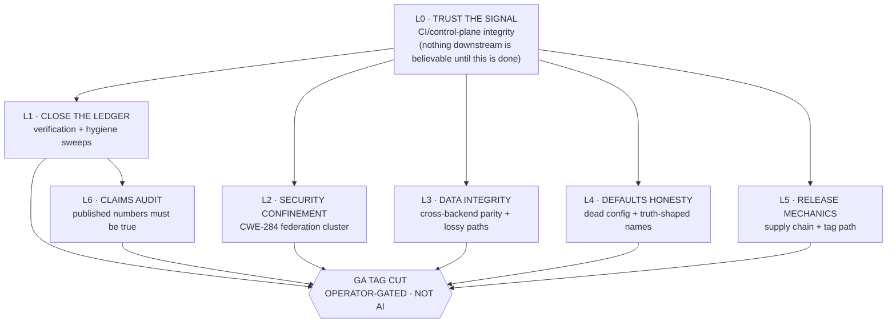

# Fable 5 Orchestration Handoff — ai-memory v1.0.0 GA

**Handoff written:** 2026-07-30
**Written by:** Opus 5 (outgoing session orchestrator)
**Base branch:** `release/v1.0.0` @ `4f063d92`
**Status:** clean stop — nothing half-landed, nothing mid-edit, no dirty worktree holding unique work

---

## 0. Authority model (effective immediately)

| Role | Model | Scope |
|---|---|---|
| **Orchestrator / Reviewer / Auditor / FINAL APPROVAL** | **Fable 5** | Dispatches all work. Reviews and audits every diff. **Sole approval authority for every PR merge and every commit.** No code lands without Fable 5's approval. |
| **Hard coder** | **Opus 5** | Security-critical, cross-cutting, subtle-concurrency, cross-backend-parity, crypto/attestation work. Nodes marked `TIER=HARD`. |
| **Intermediate coder** | **Sonnet 5** | Mechanical, precedent-following, single-file, test-only, docs-truth work. Nodes marked `TIER=MID`. |

**The change from the prior regime:** the outgoing session held merge authority and used it (three merges, below). That authority now sits with Fable 5. Two PRs were deliberately left **unmerged and green-pending** at this boundary rather than landed, so that Fable 5's approval gate is not pre-empted on diffs it has not reviewed. See §2.

---

## 1. HARD CONSTRAINTS — read before dispatching anything

### 1.1 Operator prohibition (2026-07-30, verbatim)

> "you are approved to temp lift admin perms to push or merge or commit PRs - just do NOT initiate a CI release"

**Never create or push a tag.** Verified mechanically this session, not assumed:

```
release.yml            -> ['workflow_dispatch']         (no push trigger at all)
publish-sdk-shims.yml  -> ['workflow_dispatch']         (no push trigger at all)
publish-sdks.yml       -> ['workflow_dispatch','push']  but push is TAGS-ONLY: ['v*']
```

Therefore: **branch merges cannot reach a publish path.** `git push origin v*` is the single irreversible act and is forbidden. Registry version slots are not reusable — the 0.9.0 slot was burned exactly this way (`987f24fb`), forcing `0.9.0.post1` / npm `0.9.1`.

Also forbidden: `workflow_dispatch` on any of the three workflows above.

### 1.2 Standing hard rules (unchanged)

- **Never force-push** without explicit operator authorization, ever.
- **Never push to `main`.**
- **No external code injection. EVER.** (the 2026-05-25 `vgudur-dev` incident)
- **No agent-created files under `/tmp`, `/var/tmp`, `/private/tmp`** — scratch under `.local-runs/`.
- **Codegraph** must only ever run against `/home/fate_two/v07/v09-dev`, always passing `projectPath`.
- **DISK:** no `cargo llvm-cov` and no full `cargo test --lib --tests` locally (llvm-cov ballooned a worktree to 176 G → ENOSPC).
- **R005:** no destructive recursive root delete. Use `cargo clean` / `git worktree remove`.
- Clippy CI parity: `-D warnings -D clippy::all -D clippy::pedantic` on **all four** feature legs.
- `memory_store` FIRST on any operator multi-step directive.

---

## 2. State at the boundary

### 2.1 Merged this session (all to `release/v1.0.0`)

| PR | Commit | What |
|---|---|---|
| #2495 | `789f1f66` | `governance/control-plane/` evidence dir + 5 protection snapshots (merge-commit, to preserve SSH-signed `526966a7` as ancestor) |
| #2501 | `cd6920f5` | #2318 truth-fix — two stale "POSTGRES edge restore is a tracked follow-up" claims retired |
| #2497 | `bc11855c` | **CWE-284 GA-blocker** — federated `deletions[]` namespace confinement, both backends. Closed #2488 + #2491 |
| #2505 | `4f063d92` | **CI classifier fail-open + matrix wedge** (atomic). Closed #2496. Shipped `scripts/check-required-contexts.sh` |

### 2.2 IN FLIGHT — awaiting Fable 5 approval, do not assume state

| PR | Head | State at handoff | Notes |
|---|---|---|---|
| **#2499** | `c16e2d50`+update | `MERGEABLE/BLOCKED`, **7 required contexts pending, 0 failures** | Prerelease guard on `publish-sdks.yml` + comment truth-fix. Was fully green at `c8598c36` before the base moved. |
| **#2507** | `f9c1962b`+update | `MERGEABLE/BLOCKED`, **7 required contexts pending, 0 failures** | Evidence-only (JSON under `governance/control-plane/`). Had one crates.io network flake (`[18] Transferred a partial file` on `async-trait`) — rerun, not a code defect. |

The 7 pending on each are the heavy gates: `Check (ubuntu/macos/windows-latest)`, `Per-Module Coverage Thresholds`, `Postgres feature gate`, `SAL-only feature gate`, `vectorlite feature gate`.

**`strict: true` is set on the branch**, so each merge puts every other open PR `BEHIND` and requires `update-branch` + a fresh CI cycle. Sequence merges deliberately; do not batch.

### 2.3 Control-plane changes applied via API (not in any diff)

Both publish environments now carry **`wait_timer=30` with `can_admins_bypass=false`**. The second half is the load-bearing one: with it `true` the timer is advisory and the same identity that pushed the tag can skip it. This is the **only control in the campaign that binds the actor rather than merely recording him**, and the only such control achievable without a second independently-held credential.

Before/after snapshots are staged in #2507. Verify live state with:

```bash
gh api repos/:owner/:repo/environments/pypi-publish --jq .protection_rules
gh api repos/:owner/:repo/environments/npm-publish  --jq .protection_rules
```

**Honest scope: this buys a 30-minute cancellation window, NOT a gate.** No tag protection (`/tags/protection` → 404), no tag ruleset (the sole ruleset is `target:"branch"`), and `release.yml`'s preflight validates SemVer *shape* only. A stable-shaped tag at any commit still publishes after 30 minutes.

### 2.4 Branch protection baseline (snapshot: `.local-runs/protection-2026-07-30/before-merge-wave.json`)

```
enforce_admins       = true
strict (up-to-date)  = true
required contexts    = 22
allow_force_pushes   = false
allow_deletions      = false
required_reviews     = ABSENT      <-- #2475
```

Ruleset `17752665` (`enforcement:active`, `bypass_actors:[]`, `refs/heads/release/*`) supplies `required_signatures`; the *classic* `required_signatures` field reads false, which is misleading — do not re-file that.

### 2.5 Housekeeping

- **23 git worktrees** exist; disk at **37% (553 G free)**. Several are merged-PR leftovers and are reclaimable via `git worktree remove` (never `rm -rf`).
- Open issues: **107 total** → **23 explicitly `[v1.x]`-deferred** → **84 v1.0.0-scope candidates**.

### 2.6 Dirty worktrees at the boundary — read this before touching them

An earlier draft of this document claimed "no dirty worktree holds unique work." **That was wrong, and the check that falsified it is worth repeating.** Four worktrees are dirty:

| Worktree | Repo | State | Action |
|---|---|---|---|
| `.local-runs/wt-2445-downgrade` | **this repo**, branch `fix/2445-downgrade-guard` | 2 commits, **already pushed** (not box-only). Working tree carries an **uncommitted R-203 parent-behaviour simulation** that deliberately *removes* the downgrade guard (`// R-203 PARENT-BEHAVIOUR SIMULATION: enforcement removed.`) | **DISCARD the uncommitted diff — never commit it.** It exists to prove the regression test fails at the parent. Committing it would ship #2445 as a no-op that reports success. |
| `/home/fate_two/v07/v07-f5` + its 2 `agent-*` sub-worktrees | **different repo** (the publishable `ai-memory` crate) | modified `src/cli/*`, `src/federation/push_dlq.rs`, `src/identity/attest.rs`, `CHANGELOG.md` | Out of scope for this campaign. Do not merge across repos. Triage separately. |

**Live #2486 instance found by that same check:** on `fix/2445-downgrade-guard`, commit `91573bdb` is signed (`G`) but **`2bf36c3f` is UNSIGNED (`N`)** — the actual #2445 fix commit. Verify with `git log --format='%h %G? %s'`. This is exactly the silent signing regression #2486 tracks, caught in the wild. **Fable 5 should treat `%G?` as part of the approval gate**, not an afterthought — a `N` in a security fix's own history undermines the audit trail it exists to create.

---

## 3. THE WORK GRAPH

### 3.1 Layer topology



**Why L0 gates everything.** This session proved twice that a green check can mean nothing:

1. A fix made `docs_only=false` correctly, all heavy gates ran green — then `Check (macos-latest)` **passed in 1m31s having run zero tests**, because `__SKIP__` derives from a different diff base independently (#2496).
2. `cancelled` is a fifth required-context disposition that **blocks a merge while `gh pr checks` renders it as `pass`** (#2508).

Until L0 is closed, **a green PR is not evidence.** Do not let L2/L3 work be "verified" by a signal that has not itself been verified.

---

### 3.2 L0 — TRUST THE SIGNAL (highest priority)

| Node | Issue | Title | TIER | Depends on | Notes |
|---|---|---|---|---|---|
| **L0-a** | #2494 | required-check set violates ci.yml's own declarations — **residual** | HARD | — | Wedge fixed by #2505. **Residual:** require `Classify changes` + `Coverage classify (docs-only short-circuit)`. I verified these are SAFE to require (see below). Must update the hand-authored mirror in the SAME change or gate rule (a) drifts. |
| **L0-b** | #2508 | dual-trigger workflow under shared concurrency key leaves permanent `CANCELLED` | MID→HARD | — | Fix `tool-count-drift.yml` push branches (~2 lines, MID). Add the structural gate rule (~25 lines + self-test, HARD). |
| **L0-c** | #2473 | required context truncated by YAML comment parsing | HARD | L0-a | **Coupled two-step:** quote the YAML at `c8-precheck.yml:75` AND update the required-context string, in one change, in the one safe order. Getting the order wrong wedges the branch. |
| **L0-d** | #2443 | `branch-protection.yml` declares contexts that CANNOT report | MID | L0-a | Same family as #2494. |
| **L0-e** | #2474 | `Check (ubuntu-latest)` self-narrows twice | HARD | L0-a | Second narrowing is the `__SKIP__` path #2505 partially closed — verify no residual. |
| **L0-f** | #2506 | `token-budget.yml` never runs on `release/v1.0.0` PRs | MID | — | Asymmetric push/pull_request branch lists = a gate that never gates PRs. |
| **L0-g** | #2486 | commit-signing posture regressed silently 2026-07 | HARD | — | Control-integrity. |
| **L0-h** | #2475 | ZERO required reviews on `release/v1.0.0` | HARD | — | **Do NOT "fix" by adding required reviewers.** The reviewer pool is one account (`alphaonedev`), so required reviewers = the CODEOWNERS deadlock in a new costume. This node is a *design decision*, not a config change. Wait-timer precedent (§2.3) is the shape that works. |
| **L0-i** | #2492 | `check-docs-vs-ssot.sh` misses `API_REFERENCE.md` route-count drift | MID | — | Gate-coverage gap. |
| **L0-j** | flakes | #2500 · #2482 · #2414 · #2415 · #2469 · #2434 · #2432 | MID | — | Each is a real defect, not noise. #2500's `--no-fail-fast` fix landed in #2505; the nested-`cargo build` root cause did not. |

**L0-a verified finding (carry this forward, it was the open question):**
`Classify changes` and `Coverage classify` **are** safe to require. The hazard would be #2508's cancelled-duplicate shape, and it does not apply — both carriers (`ci.yml`, `coverage.yml`) restrict `push.branches` to `main`/`develop`/`release/**`, which never overlap a PR head branch, so a push to `fix/X` fires no push-event run and exactly one run exists per SHA. Contrast `tool-count-drift.yml`, whose push branches include `fix/**` and `feat/**` and therefore *always* leave a cancelled row. Both target jobs also always run, carry no job-level `if:`, and sit behind no `paths:` filter.

---

### 3.3 L1 — CLOSE THE LEDGER

| Node | Scope | TIER | Notes |
|---|---|---|---|
| **L1-a** | **6 issues with a merged PR claiming closure but still OPEN**: #2310 · #2315 · #2335 · #2337 · #2338 · #2370 | HARD | **`Closes #N` does NOT fire when a PR merges into a non-default branch.** Every PR in this campaign targets `release/v1.0.0`, so every keyword was inert. Each of these 6 needs *verification*, not blind closure: did the fix land, or was the keyword aspirational? Verify at the merged SHA, then close-with-evidence OR re-scope. I hit this trap myself on #2318 — I reported it closed when it was open; corrected and closed with evidence this session. |
| **L1-b** | Worktree reclamation (22 present) | MID | `git worktree remove` on merged-PR leftovers. Never `rm -rf`. |
| **L1-c** | #2483 / #2485 — concurrent lanes collide on `CHANGELOG.md` + CLAUDE.md env-table | MID | Campaign-throughput. Real: this session hit the CHANGELOG conflict on #2505. |
| **L1-d** | #2468 — `src/subscriptions.rs` AT 4500/4500 lines, zero headroom | HARD | Blocks any further work in that file. |

---

### 3.4 L2 — SECURITY CONFINEMENT (CWE-284 federation cluster)

The single largest coherent cluster. #2497 closed **one** funnel (`deletions[]`). The destructive-capability class is **NOT retired** — an adversarial review of #2497 probed two other funnels end-to-end to a destroyed row under **default config** with a correctly-enrolled, correctly-scoped, TOFU-passing peer.

| Node | Issue | Title | TIER | Notes |
|---|---|---|---|---|
| **L2-a** | #2478 | `pending_decisions[]` executes arbitrary-namespace delete | **HARD** | `pending_author_authorized` inspects only `requested_by` + payload `metadata.agent_id` — never `pa.namespace`, never resolves `pa.memory_id`. **Does not increment the `deleted` counter** → invisible in the 200 response. |
| **L2-b** | #2479 | `namespace_meta[]` can re-parent a foreign namespace | **HARD** | No scope gate at all. Lets a peer rebind a foreign namespace's governance standard to an approver it controls, then self-approve. `ApproverType::Agent` compares ids and never calls `is_registered_agent`. |
| **L2-c** | #2503 | a CORRECTLY-AUTHORIZED in-scope delete strips foreign governance | **HARD** | Runs straight THROUGH the confined funnel: `storage::delete` unconditionally runs `DELETE FROM namespace_meta WHERE standard_id = ?1` with no namespace predicate. Via a global `*` standard, the whole namespace tree at once. `resolve_governance_policy` fails OPEN. |
| **L2-d** | #2480 | catch-up PULL client inserts peer-served rows unscoped | **HARD** | The pull lane trusts what it is served. |
| **L2-e** | #2489 | `links[]` and `signals[]` not namespace-scoped | **HARD** | Same class as #2497, different subcollections. |
| **L2-f** | #2504 | one malformed char in `AI_MEMORY_FED_PEER_ATTESTATION` silently … | **HARD** | Fail-open on config parse. |
| **L2-g** | #2477 | peer URLs accept plaintext `http://` with no flag | HARD | Federation replicates **plaintext** content (not E2E encrypted — #1968 open). |
| **L2-h** | #2502 | no per-source auth-failure backoff or lockout | HARD | #2032-L2 residual. |
| **L2-i** | #2446 | erasure does not replicate but writes do | **HARD** | GDPR. `broadcast_delete_quorum` handles a `Fail` with warn-only, no retry, no DLQ. |
| **L2-j** | #2441 · #2442 | anti-entropy cursor permanent stall · DLQ routing key is a POSITIONAL peer index | HARD | Liveness + misrouting. |
| **L2-k** | #2498 | a refused/unresolvable federated deletion is indistinguishable in a 200 | MID | Observability. Partially addressed by #2497's `namespace_probe_unresolvable` cause token. |
| **L2-l** | #2493 | 7 of 8 postgres delete/archive funnels leave … | **HARD** | pg parity. |
| **L2-m** | #2464 | checkpoint federation cannot work module-to-module | HARD | Architecture. |
| **L2-n** | #2355 | R40 signed-approval quorum enforced on MCP only; both HTTP approve surfaces bypass | **HARD** | A gate that exists on one surface only. |

**Dispatch guidance for L2:** these share `src/handlers/federation_receive.rs`, `src/handlers/federation_signing_check.rs`, `src/federation/receive_auth.rs`. Those three files are now on the foundational `__ALL__` list in `scripts/ci-test-impact.sh`, so any PR touching them runs the full suite. **Serialize L2 nodes that touch the same funnel** — parallel dispatch here will conflict. Prefer the `ALWAYS_RUN_PARITY_TESTS` pin (`scripts/ci-test-impact.sh:146`, applied `:230`) over widening `__ALL__` further: same guarantee at ~1/265th the blast radius.

---

### 3.5 L3 — DATA INTEGRITY / CROSS-BACKEND PARITY

| Node | Issues | TIER |
|---|---|---|
| **L3-a** | #2490 — `export` / `export --full` / `import` repeat the #2444 false-success class | **HARD** |
| **L3-b** | #2385 — archive→restore re-mints the BLAKE3 cid | HARD |
| **L3-c** | #2392 — pg FTS tsvector omits `tags` (sqlite indexes title,content,tags) | MID |
| **L3-d** | #2394 · #2395 — upsert `memory_kind` / confidence-field merge asymmetry | MID |
| **L3-e** | #2237 — `stats.total` is a raw `COUNT(*)` with no lifecycle filter (tombstoned rows counted) | MID |
| **L3-f** | #2238 — sqlite/pg consolidate divergence on the C→source `derived_from` edge | HARD |
| **L3-g** | #2310 · #2315 — pg `lease_acquire` double-Ok · pg archive without AGE unprojection | HARD |
| **L3-h** | #2462 · #2463 — non-canonical `+00:00` expiry rendering; TTL MAX() floors cannot self-heal | HARD |
| **L3-i** | #2445 — NO downgrade guard; an older binary silently opens a newer DB | **HARD** |
| **L3-j** | #2335 — federation `(title,namespace)` LWW lets a STALE losing peer overwrite | **HARD** |
| **L3-k** | #2370 · #2373 — rollback-evidence anchor is per-host not per-DB; pg db_id parity | HARD |

---

### 3.6 L4 — DEFAULTS HONESTY (dead config / truth-shaped names)

A coherent cluster, mostly MID, high volume, low individual risk. **Ideal Sonnet 5 batch work** — but each needs its own commit and its own evidence.

#2398 · #2399 · #2400 · #2401 · #2402 · #2410 · #2420 · #2425 · #2426 · #2427 · #2428 · #2429 · #2431 · #2436 · #2337 · #2338 · #2433

Representative shapes:
- **#2429** `[recall].default_provenance` is dead config — `accept_provenance.rs:25` ignores it
- **#2410** `[logging].max_size_mb` is dead config — tracing-appender ignores it
- **#2428** `freshness_state` is a truth-shaped name over an attention metric
- **#2431** `memory_recall` reports `scheduled_validity="valid"` + freshness … (defaults-lie)
- **#2402** operator-dequarantine advertised but **uninvocable** — no surface
- **#2426** hook config accepts a subscription to a never-dispatched event
- **#2427** store path silently discards a hook's `ModifiedAllow` delta with no WARN
- **#2433** bootstrap auto-creates the `vector` extension but NOT `age`

**This is the same defect class as the whole campaign** — a control that reports success while doing nothing. Do not treat it as cosmetic.

---

### 3.7 L5 — RELEASE MECHANICS

| Node | Issue | Remaining scope | TIER |
|---|---|---|---|
| **L5-a** | #2467 | **THE GA BLOCKER.** Partially addressed: #2499 (prerelease guard) + wait-timer (§2.3). **Still open:** (1) tag ruleset (`target:"tag"`, `refs/tags/v*`) — `/tags/protection` returns 404 and the sole ruleset is `target:"branch"`; (2) `release.yml` preflight ancestry + CI-status checks on the tagged commit; (3) **derive SDK versions from the tag** rather than hardcoded `1.0.0` in `sdk/python/ai_memory/_version.py` + `sdk/typescript/package.json`. | **HARD** |
| **L5-b** | #2487 | `release.yml` ships binaries with NO signature or attestation | **HARD** |
| **L5-c** | #2454 | `entrypoint.plan-c.sh` runs as PID 1 (non-Rust on a runtime path) | MID |

**(3) is the durable fix.** Hardcoded manifest versions are what make a wrong tag unrecoverable — with tag-derived versions, an `rc` tag cannot occupy a stable slot even when every other control fails.

---

### 3.8 L6 — CLAIMS AUDIT (published numbers must be true)

| Node | Issue | TIER | Notes |
|---|---|---|---|
| **L6-a** | #2450 | HARD | the published **97.0% R@5** headline is pr… — a claim in public docs |
| **L6-b** | #2437 | HARD | the LongMemEval harness stores every row at identical … → the benchmark may not measure what it reports |
| **L6-c** | #2438 | HARD | stated **1M+ agent** target is ~3 orders of magnitude beyond the demonstrated ceiling |
| **L6-d** | #2451 | MID | 11 internal Python tooling files (3,142 lines) contradict the 100%-Rust posture |

**L6 depends on L1** — do not audit a claim while the ledger that would substantiate it is still wrong.

---

## 4. KNOWN TRAPS — every one of these bit this session

Read this section before dispatching. These are not hypotheticals; each cost real cycles.

### 4.1 Surfaces that actively conceal the truth

| Trap | Reality |
|---|---|
| `gh pr checks` | Renders a **cancelled** run's rows as `pass`. Read `statusCheckRollup[].conclusion` instead. |
| `/actions/runs/{id}/jobs` | Returns **only the latest attempt**. A rerun makes the original failure unreachable. Use `/attempts/{n}/jobs`. |
| `cancelled` | A **fifth** required-context disposition. Blocks merges while reading as pass. |
| An **absent** required context | Not "skipped" — absent. Pending forever. `matrix` + job-level `if:` produces this (GitHub evaluates job-level `if:` BEFORE matrix expansion, emitting ONE check-run with the UNEXPANDED name). |
| `Closes #N` | **Does not fire** when merging into a non-default branch. Every PR here targets `release/v1.0.0`. Close manually with retest evidence. |
| Asymmetric `push`/`pull_request` branch lists | A gate that never gates PRs (#2506). |
| Classic `required_signatures: false` | Misleading — ruleset `17752665` supplies it. |

### 4.2 Process rules earned the hard way

- **R-405** — absence of evidence in a *bounded* search is not evidence of absence. I violated this on #2500: claimed "no existing issue tracks it" from `--limit 200`; #1742 existed outside the window. **Hours after citing R-405 against someone else.**
- **R-203** — a regression test must **FAIL at the parent commit and PASS after**. #2505's harness does this by running fixtures against a *frozen* pre-fix block, so a silently-broken extraction cannot make assertions vacuous. Copy that pattern.
- **PREMISE INJECTION** — the session's most expensive lesson. I wrote an unverified lemma into a review brief as a stated given ("a job-level `if:` produces a reporting `skipped` check-run and is safe"). True for plain jobs, **false for matrix jobs**. A 7/7 panel then agreed with my premise and missed the branch-wedging defect that a cross-family probe found in one API call. **Never state a mechanism as given in a brief. State it as the thing to check.**
- **Half-fixes read as success** — #2496's first prescription was necessary but not sufficient, and looked complete. Caught only by *measuring* head `13f0b53d`, not by reading the diff.
- **pm-v3.3 step 7** — recompile-retest before filing any live-daemon behavioural defect. A running daemon holds whatever binary was loaded at its `lstart`.
- **Verify before claiming.** I made ten self-corrections this session, and **every one** was asserting something I had not executed. Cheapest possible fix: run it first.

### 4.3 Merge mechanics

- `strict: true` → each merge puts every other PR `BEHIND`. Sequence, don't batch.
- `enforce_admins: true` → `gh pr merge --admin` alone will NOT clear a genuinely-failing required context. The authorized path is the transient `enforce_admins=false` toggle, **restored immediately after**. Snapshot before/after.
- **Notably:** all three merges this session needed **no** toggle at all — the required contexts were genuinely green. Prefer a normal merge; reach for the toggle only when it is actually blocked, and record why.
- Use **merge commits**, not squash, so SSH-signed commits survive as ancestors.

---

## 5. VERIFICATION PROTOCOL (Fable 5 approval gate)

Before approving any merge:

1. **Per-context, not per-summary.** Pull `statusCheckRollup`, cross-check every name against the live `required_status_checks.contexts` list. Confirm `absent=0` and every context has at least one `SUCCESS` run.
2. **Distinguish disposition.** `FAILURE` ≠ `CANCELLED` ≠ absent ≠ pending. A cancelled duplicate from #2508 is benign; a cancelled *required* context is a wedge.
3. **Did the gate actually do work?** For any PR touching Rust: confirm the test step did not log `TEST_IMPACT: __SKIP__`. A `Check` job that passes in ~90 s ran nothing.
4. **R-203 both directions.** The regression test must fail at the parent.
5. **Flake vs defect.** crates.io `curl failed` / `[18] Transferred a partial file` / `[16] HTTP2 framing` = network. Rerun. Anything else = investigate.
6. **Manual issue closure.** The keyword will not fire. Close with executed evidence and cite the SHA.
7. **Scope honesty.** If a fix is partial, the issue stays OPEN with the residual named. #2494 is the model: what landed, what remains, why.

---

## 6. FIRST FIVE ACTIONS FOR FABLE 5

1. **Adjudicate #2499 and #2507** (§2.2). Both were green before their base moved; CI is re-running. Verify per §5, then approve or reject.
2. **Dispatch L0-a (#2494 residual)** to Opus 5 — require the two classify contexts + update the hand-authored mirror in the same change. The safety analysis is already done (§3.2); it needs implementing, not re-deciding.
3. **Dispatch L0-b (#2508)** — split it: the `tool-count-drift.yml` push-branch narrowing to Sonnet 5, the structural gate rule to Opus 5.
4. **Dispatch L1-a** — the 6 keyword-never-fired issues. Verify each at its merged SHA. This is pure ledger accuracy and it is currently wrong.
5. **Then open L2.** Serialize by funnel. #2478, #2479, #2503 are the three that were probed end-to-end to a destroyed row under default config — they are the sharpest remaining edges in the codebase.

**Do not** cut the GA tag. That is operator-gated and explicitly prohibited for AI NHI (§1.1).

---

## 7. What I would flag to the operator

Three things a reviewer should know that are not defects:

1. **The wait-timer is the only actor-binding control that exists.** Everything else records. Three separate audits concluded no such control was achievable without a second credential; one was. If the operator ever wants a genuinely binding gate, the missing ingredient is **a second independently-held credential** — that is a capability limit, not an authority limit, and no directive can close it.
2. **`#2475` should not be "fixed" as filed.** Adding required reviewers to a one-account repo produces a deadlock, not a control. It needs a design decision.
3. **84 v1.0.0-scope issues is the honest number**, not 107. 23 are explicitly `[v1.x]`. Of the 84, the L4 cluster (~17) is high-volume/low-risk and the L2 cluster (~14) is where the real risk lives.

---

*Prepared at a deliberate clean stop: no PR is half-landed, no control-plane change is unrecorded, no work exists only on this box (verified by pushing every branch), and the two in-flight PRs were left for Fable 5's approval rather than merged under the outgoing authority.*

*Four worktrees ARE dirty — see §2.6. An earlier draft of this line claimed otherwise; the verification that falsified it also surfaced a live #2486 unsigned-commit instance and an uncommitted R-203 simulation that would ship #2445 as a silent no-op if committed. Both are recorded in §2.6 rather than smoothed over, because a handoff that overstates its own cleanliness is the same defect class as everything in §4.1.*
