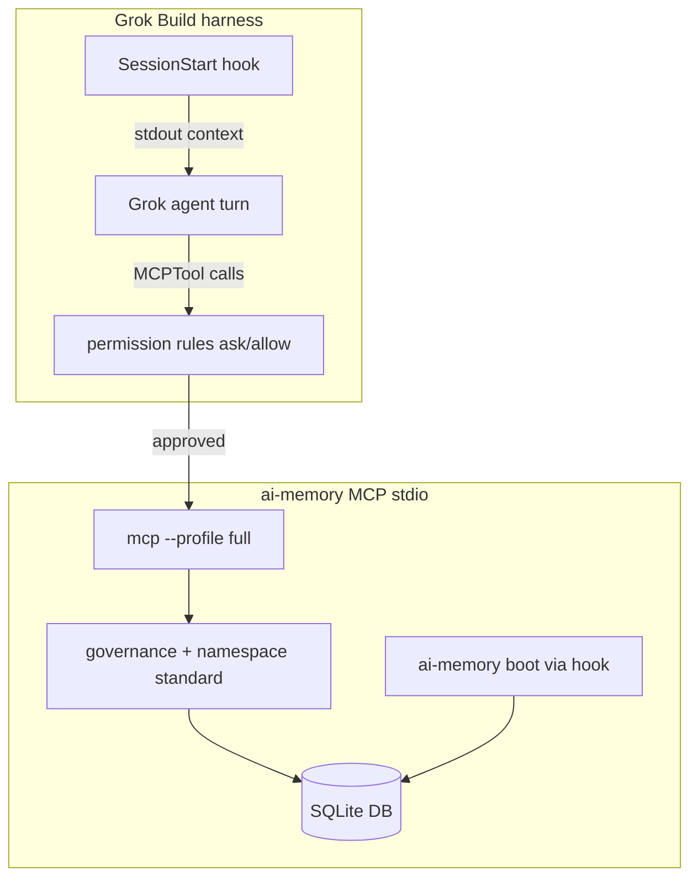

# Grok Build — ai-memory MCP integration (master reference)

**Status:** reference recipe (v0.8.0)  
**Category:** 1+2 hybrid — hook-capable session boot **plus** MCP stdio with permission gates  
**Supersedes (for Grok Build hosts):** the programmatic-only framing in [`grok-and-xai.md`](grok-and-xai.md) §"Via the xAI API" when the operator runs **Grok Build / Grok Shell** with MCP enabled.

This document is the canonical operator guide for wiring the **ai-memory**
substrate into **xAI Grok Build** (the `grok` CLI / Grok Shell harness).
It covers MCP registration, session-boot hooks, Grok permission rules,
ai-memory governance policy, agent behavioral directives, verification,
and failure modes.

> **Two memory systems — do not conflate them.** Grok Build ships a native
> `[memory]` subsystem (`MEMORY.md`, vector search, `/memory` commands).
> This recipe uses **ai-memory** as the durable, governance-aware substrate
> (SQLite, MCP tools, namespace standards, pending approvals). They are
> independent; enabling both is allowed but this guide treats ai-memory as
> canonical for engineering work on the ai-memory-mcp repository.

---

## Integration posture (what this recipe enforces)

| Layer | Mechanism | Effect |
|---|---|---|
| **Session boot** | `SessionStart` hook → `ai-memory boot` | Every Grok session prepends ranked long-tier context from namespace `global` before the first turn. |
| **Mid-session recall** | Agent directive + MCP read tools | Model calls `memory_session_start` + `memory_recall` when task context is needed (best-effort compliance). |
| **Write friction (Grok)** | `[permission] ask` on mutating MCP tools | Operator is prompted before stores, links, promotes, reflects, etc. |
| **Write friction (substrate)** | Namespace standard `write: approve` | Mutating writes land in `memory_pending_list` until `memory_pending_approve`. |
| **Agent identity** | `AI_MEMORY_AGENT_ID=grok-build` | Stable owner stamp across MCP restarts (#1720 B1 posture). |
| **Capture discipline** | `AI_MEMORY_CAPTURE_NAG_THRESHOLD=2` | Substrate stderr WARN + signed event after 2 consecutive non-store turns post-directive. |
| **Permissions mode** | `[permissions] mode = enforce` in `config.toml` | Governance pipeline fail-closed on gated actions. |

---

## Prerequisites

1. **ai-memory binary** on `PATH` or referenced by absolute path. Grok Build
   should use a build **≥ v0.8.0** when working on the v0.8.0 substrate
   (tool count / coordination surfaces). Verify:

   ```bash
   ai-memory --version
   ```

2. **ai-memory config** at `~/.config/ai-memory/config.toml` (schema v2).
   See [§ ai-memory `config.toml`](#ai-memory-configtoml) below.

3. **Database** — default `~/.claude/ai-memory.db` (override with
   `--db` on the MCP `args` list).

4. **Grok global config** writable at `~/.grok/config.toml`.

5. **Project trust** — first open of a repo carrying `.grok/hooks/` requires
   `/hooks-trust` (or `grok --trust`) so project hooks execute.

---

## Quick install (copy-paste checklist)

### 1. Global Grok MCP + permissions (`~/.grok/config.toml`)

```toml
[ui]
permission_mode = "default"   # NOT "always-approve" when using ask rules

[permission]
ask = [
  "MCPTool(ai-memory__memory_store)",
  "MCPTool(ai-memory__memory_update)",
  "MCPTool(ai-memory__memory_delete)",
  "MCPTool(ai-memory__memory_link)",
  "MCPTool(ai-memory__memory_promote)",
  "MCPTool(ai-memory__memory_forget)",
  "MCPTool(ai-memory__memory_capture_turn)",
  "MCPTool(ai-memory__memory_consolidate)",
  "MCPTool(ai-memory__memory_reflect)",
  "MCPTool(ai-memory__memory_namespace_set_standard)",
  "MCPTool(ai-memory__memory_namespace_clear_standard)",
  "MCPTool(ai-memory__memory_pending_approve)",
  "MCPTool(ai-memory__memory_pending_reject)",
]
allow = [
  "MCPTool(ai-memory__memory_recall)",
  "MCPTool(ai-memory__memory_search)",
  "MCPTool(ai-memory__memory_list)",
  "MCPTool(ai-memory__memory_get)",
  "MCPTool(ai-memory__memory_session_start)",
  "MCPTool(ai-memory__memory_capabilities)",
  "MCPTool(ai-memory__memory_load_family)",
  "MCPTool(ai-memory__memory_smart_load)",
  "MCPTool(ai-memory__memory_namespace_get_standard)",
  "MCPTool(ai-memory__memory_pending_list)",
  "MCPTool(ai-memory__memory_stats)",
  "MCPTool(ai-memory__memory_get_links)",
  "MCPTool(ai-memory__memory_verify)",
]

[mcp_servers.ai-memory]
command = "ai-memory"   # or absolute path, e.g. /Users/you/.cargo/bin/ai-memory
args = [
    "--db", "~/.claude/ai-memory.db",
    "mcp",
    "--tier", "autonomous",
    "--profile", "full",
]
enabled = true

[mcp_servers.ai-memory.env]
AI_MEMORY_AGENT_ID = "grok-build"
AI_MEMORY_CAPTURE_NAG_THRESHOLD = "2"
AI_MEMORY_CAPTURE_NAG_ESCALATE_THRESHOLD = "5"
```

**MCP tool naming rule:** Grok namespaces tools as `<server>__<tool>`.
Server name `ai-memory` + tool `memory_store` → `MCPTool(ai-memory__memory_store)`.

**Precedence:** `deny` > `ask` > `allow`. Deny always wins.

### 2. Session-start hook (`~/.grok/hooks/ai-memory-boot.json`)

```json
{
  "hooks": {
    "SessionStart": [
      {
        "hooks": [
          {
            "type": "command",
            "command": "ai-memory boot --namespace global --limit 10 --budget-tokens 4096 --format text"
          }
        ]
      }
    ]
  }
}
```

Use an **absolute path** to the binary in the global hook if `ai-memory` is
not on the Grok process `PATH`:

```json
"command": "/Users/you/.cargo/bin/ai-memory boot --namespace global --limit 10 --budget-tokens 4096 --format text"
```

Do **not** pass `--no-header` in production hooks — the manifest header is
the operator diagnostic for silent failure (issue #487).

### 3. Project-scoped overlay (optional, commit to repo)

This repository ships templates under `.grok/`:

| File | Purpose |
|---|---|
| [`.grok/config.toml`](../../.grok/config.toml) | Team-shared MCP + `[permission]` rules |
| [`.grok/hooks/ai-memory-boot.json`](../../.grok/hooks/ai-memory-boot.json) | Project SessionStart boot |

Grok walks from CWD up to the git root and merges project `.grok/config.toml`
`[mcp_servers]` + `[permission]` with the global file. Trust the project
once per machine: `/hooks-trust`.

### 4. ai-memory `config.toml`

```toml
schema_version = 2
tier = "autonomous"
db = "~/.claude/ai-memory.db"

[llm]
backend = "openrouter"          # or xai, ollama, etc. — see llm-backends.md
model = "google/gemma-4-31b-it"
api_key_file = "~/.config/ai-memory/keys/openrouter.key"

[embeddings]
backend = "openrouter"
model = "google/gemini-embedding-2"
dim = 768
api_key_file = "~/.config/ai-memory/keys/openrouter.key"

[reranker]
enabled = true
model = "ms-marco-MiniLM-L-6-v2"

[storage]
default_namespace = "global"
archive_on_gc = true

[mcp]
profile = "full"

[permissions]
mode = "enforce"
```

Shell exports in `.zshrc` do **not** reach MCP-spawned subprocesses — use
`config.toml` or `[mcp_servers.ai-memory.env]` (issue #1144 / #1146).

### 5. Namespace governance standard (substrate write approval)

Attach a namespace standard so writes require human approval. One-time setup
per namespace (example: `global`):

```jsonc
// Step 1 — memory_store (policy artifact)
{
  "namespace": "global",
  "title": "Grok Build namespace standard — global governance",
  "content": "Human approval on writes; owner promote/delete; inherit=true.",
  "kind": "decision",
  "tier": "long",
  "metadata": {
    "governance": {
      "write": "approve",
      "promote": "owner",
      "delete": "owner",
      "approver": "human",
      "inherit": true
    }
  }
}
// → { "id": "<UUID>" }

// Step 2 — memory_namespace_set_standard
{ "namespace": "global", "id": "<UUID>" }
```

After this, `memory_store` from MCP creates **pending** rows. Operator flow:

1. Agent calls `memory_store` → Grok `ask` prompt → substrate `Pending`.
2. Operator reviews `memory_pending_list`.
3. Operator calls `memory_pending_approve` (also Grok `ask` gated).

Tighten further: `"write": "owner"` or `"write": "registered"` — see
[`governance.md`](../governance.md).

### 6. Agent behavioral directive (best-effort)

Add to Grok **user rules** or project `CLAUDE.md` / `AGENTS.md`:

```markdown
## ai-memory discipline (Grok Build)

**Session start (after boot hook):** On the first substantive turn, call
`memory_session_start` then `memory_recall` for the task topic in namespace
`global`. Reference recalled titles in your reply when relevant.

**Operator multi-step directives:** When the operator gives a numbered plan,
scope statement, or "approved yes" — your FIRST tool call MUST be
`memory_store` preserving the verbatim directive (`kind: decision`, `priority: 8+`).

**Writes:** Expect Grok to prompt before mutating MCP tools. Expect substrate
pending approval when namespace `write: approve` is set.

**Do not conflate** Grok native `/memory` with ai-memory MCP — use ai-memory
for durable engineering context on this project.
```

---

## Architecture



---

## Configuration reference

### Grok `[permission]` actions

| Action | Behavior |
|---|---|
| `allow` | Auto-approve matching tool invocations |
| `ask` | Prompt operator before execution |
| `deny` | Hard block (wins over allow/ask) |

### ai-memory MCP env vars (recommended on `[mcp_servers.ai-memory.env]`)

| Variable | Value | Purpose |
|---|---|---|
| `AI_MEMORY_AGENT_ID` | `grok-build` | Durable owner stamp |
| `AI_MEMORY_CAPTURE_NAG_THRESHOLD` | `2` | L1 capture-lag WARN threshold (#1389) |
| `AI_MEMORY_CAPTURE_NAG_ESCALATE_THRESHOLD` | `5` | Escalation WARN threshold |

### Optional hardening (not enabled in default recipe)

| Knob | Risk | When to enable |
|---|---|---|
| `AI_MEMORY_REQUIRE_AGENT_ATTESTATION=1` | Blocks unsigned writes | After `ai-memory identity generate` + agent registration |
| `AI_MEMORY_REQUIRE_OWNED_ROWS=1` | MCP boot refusal on owner lockout | Strict multi-agent hosts with `AI_MEMORY_AGENT_ID` set |
| `[memory] enabled = true` in Grok | Second memory system | Only if you want Grok native memory **in addition** to ai-memory |
| `--profile core` | Drops 92 power/graph tools | Low-token or read-mostly workflows |

---

## Verification

Run after configuration changes (restart Grok session afterward):

```bash
# 1. Binary + config load
ai-memory --version
ai-memory doctor

# 2. Boot hook (manual)
ai-memory boot --namespace global --limit 3 --format text
# Expect: "# ai-memory boot: ok" manifest header

# 3. MCP capabilities (fresh subprocess)
printf '{"jsonrpc":"2.0","id":1,"method":"tools/call","params":{"name":"memory_capabilities","arguments":{}}}\n' \
  | ai-memory mcp --profile full --tier autonomous 2>/dev/null \
  | head -c 2000

# 4. Namespace standard bound
printf '{"jsonrpc":"2.0","id":2,"method":"tools/call","params":{"name":"memory_namespace_get_standard","arguments":{"namespace":"global"}}}\n' \
  | ai-memory mcp --profile full 2>/dev/null

# 5. Grok hook discovery (inside Grok TUI)
# /hooks-list  → expect ai-memory-boot.json
# /hooks-trust → if project hooks show "untrusted"
```

**Expected Grok MCP stderr** (abbreviated):

```text
ai-memory: loaded config from ~/.config/ai-memory/config.toml
ai-memory: profile = 8 families ... expected tool count = 101
ai-memory MCP server started (stdio, tier=autonomous)
```

---

## Operator workflows

### Approving a pending memory

1. In Grok, ask: "list pending ai-memory writes" → agent calls `memory_pending_list`.
2. Review entries.
3. Approve: `memory_pending_approve` with the pending id (Grok will `ask`).

### Disabling ai-memory temporarily

```toml
[mcp_servers.ai-memory]
enabled = false
```

Restart Grok. All ai-memory MCP tools disappear.

### Read-only posture (no prompts, no writes)

```toml
[permission]
deny = [
  "MCPTool(ai-memory__memory_store)",
  "MCPTool(ai-memory__memory_update)",
  "MCPTool(ai-memory__memory_delete)",
  # ... other mutators
]
allow = ["MCPTool(ai-memory__*)"]   # does NOT override deny — list reads explicitly
```

Prefer explicit `allow` on read tools instead of a catch-all.

---

## Failure modes

| Symptom | Likely cause | Fix |
|---|---|---|
| No boot context on turn 1 | Hook not trusted / not loaded | `/hooks-trust`; check `~/.grok/hooks/` + project `.grok/hooks/` |
| MCP tools missing | `enabled = false` or binary path wrong | Fix `[mcp_servers.ai-memory]`; verify `ai-memory --version` |
| `memory_store` always pending | Namespace `write: approve` | Expected — use `memory_pending_approve` |
| Grok never prompts on store | `permission_mode = "always-approve"` | Set `permission_mode = "default"` + `ask` rules |
| LLM tools fail, recall works | OpenRouter/key/embedder down | `ai-memory doctor` → LLM/Embeddings Reachability |
| `403 ATTESTATION_FAILED` | `AI_MEMORY_REQUIRE_AGENT_ATTESTATION=1` without keys | Generate identity + register agent, or unset flag |
| Agent ignores recall directive | Category-2 best-effort | Strengthen user rules; boot hook still runs mechanically |

---

## Relationship to other docs

| Doc | Relationship |
|---|---|
| [`grok-and-xai.md`](grok-and-xai.md) | xAI API programmatic prepend + using Grok as ai-memory's LLM backend |
| [`llm-backends.md`](llm-backends.md) | `[llm]` / `[embeddings]` vendor matrix |
| [`claude-code.md`](claude-code.md) | Parity reference for hook + `memory_store FIRST` directive |
| [`cursor.md`](cursor.md) | Category-2 MCP+rules pattern (Grok Build adds hooks + permissions) |
| [`governance.md`](../governance.md) | Namespace standards, pending approval, permissions modes |
| [`AI_DEVELOPER_WORKFLOW.md`](../AI_DEVELOPER_WORKFLOW.md) | Session recall + namespace standard respect |

---

## Repository templates (this commit)

Committed artifacts operators can copy or trust as-is:

```
.grok/
  config.toml              # project MCP + permission overlay
  hooks/
    ai-memory-boot.json    # SessionStart boot recipe
docs/integrations/
  grok-build.md            # this document
```

**Live operator state (2026-06-25)** on the reference host applied the same
policy: global `~/.grok/config.toml`, `~/.grok/hooks/ai-memory-boot.json`,
`~/.config/ai-memory/config.toml` `[permissions]`, and namespace `global`
standard id `b347d475-bd41-4a96-a9a2-be4af9751340` (`write: approve`).

---

## Issue cross-references

- [#487](https://github.com/alphaonedev/ai-memory-mcp/issues/487) — session-boot / integration matrix
- [#1144](https://github.com/alphaonedev/ai-memory-mcp/issues/1144) / [#1146](https://github.com/alphaonedev/ai-memory-mcp/issues/1146) — config.toml vs MCP env
- [#1389](https://github.com/alphaonedev/ai-memory-mcp/issues/1389) — capture nag / layered directive defense
- [#1569](https://github.com/alphaonedev/ai-memory-mcp/issues/1569) — namespace allow-on-silence defaults
- [#1720](https://github.com/alphaonedev/ai-memory-mcp/issues/1720) — durable `AI_MEMORY_AGENT_ID` posture