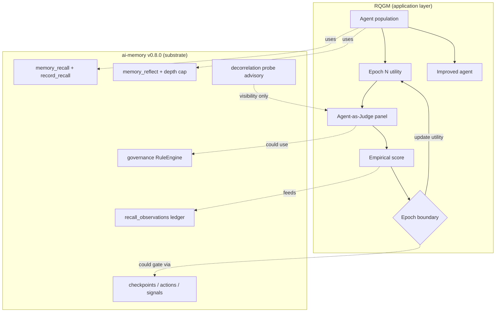

# RQGM (arXiv 2606.26294) vs ai-memory v0.8.0

**Assessment date:** 2026-06-27  
**Paper:** [The Red Queen Gödel Machine: Co-Evolving Agents and Their Evaluators](https://arxiv.org/abs/2606.26294) (Iacob et al., arXiv:2606.26294, submitted 24 Jun 2026) — [PDF](https://arxiv.org/pdf/2606.26294)
**Substrate:** `release/v0.8.0` @ `c85b9c56`  
**Method:** CodeGraph structural exploration + source review (846 files indexed)

---

## Executive summary

| Question | Answer |
|----------|--------|
| Does v0.8.0 implement RQGM? | **No** — it stores and gates; RQGM searches and evolves |
| Does v0.8.0 anticipate RQGM? | **Yes, partially** — observations ledger, hooks, decorrelation, coordination |
| Biggest gap vs paper? | **No utility evolution loop + no co-evolving evaluator search** |
| Biggest strength vs paper? | **Safety substrate** — bounded depth, provenance, fail-closed governance |
| Live deployment (grok-build MCP stdio)? | **No RSI loop running** — near-empty corpus, write-gated `global` |

**Overall:** ai-memory v0.8.0 is **substrate-ready (~55–65%)** for RQGM-style loops, **not an RQGM implementation (~10–15%)**.

---

## What RQGM claims

RQGM targets recursive self-improvement when the **evaluation criterion is not stationary** — the Red Queen problem where agents and environments co-evolve.

| Mechanism | Paper intent |
|-----------|--------------|
| **Epoch-bound utilities** | Fixed scorer within an epoch; utility may change only at epoch boundaries |
| **Co-evolving evaluators** | Graders/reviewers evolve alongside writers/coders |
| **Agent-as-Judge** | Cheaper complementary signal (code review, paper review) atop verifiable tests |
| **Adversarial objectives** | Discover evaluators that fix systematic bias (e.g. over-accepting AI papers) |
| **Empirical refutation** | Search commits to measurable outcomes per epoch, not static benchmark worship |

Results span verifiable coding (+test pass via review signal), scientific writing/reviewing, and Olympiad proof grading — with co-evolved panels beating static baselines.

---

## What ai-memory v0.8.0 actually is

CodeGraph and the codebase agree: ai-memory is a **memory/governance substrate**, not an RSI search loop.

From `docs/RECURSIVE_LEARNING.md`:

> ai-memory v0.7.0 ships a **substrate-native primitive for recursive refinement**: an agent reads one or more memories, synthesises a higher-order reflection (a lesson, pattern, contradiction-resolution, etc.), and persists it with cryptographic-grade provenance back to each source it reflects on. Reflection depth is bounded by a substrate-enforced cap. **No autonomous goal modification, no model fine-tuning loops, no unbounded recursion** — the substrate refuses runaway recursion before any write opens.

**RQGM improves agents; ai-memory stores, gates, and audits what agents write.** That boundary is load-bearing for this assessment.

---

## Mechanism-by-mechanism map

### 1. Non-stationary / epoch-bound utilities

**RQGM:** Utility evolves at epoch boundaries; within-epoch guarantees hold.

**v0.8.0:**

| Surface | Behavior | RQGM fit |
|---------|----------|----------|
| `max_reflection_depth` | Static per-namespace cap | Fixed utility, not epoch-evolving |
| Governance `RuleEngine::evaluate` | Static signed rules until operator changes | Fixed evaluator |
| `ReflectionPassConfig` | `enabled: false` by default | Loop dormant |
| Coordination `Checkpoint` | Human/condition gates (#1709) | Epoch *infrastructure*, not utility scheduler |

`RuleEngine::evaluate` (`src/governance/agent_action.rs`) implements first-refusal-wins over static rules: `Refuse` / `Escalate` / `Warn` / `Allow`. Rules change only when the operator signs new governance packs.

**Verdict:** Infrastructure for epoch gates exists (checkpoints, actions, signed events). **No controlled utility-evolution loop** — the paper's core algorithm is absent.

---

### 2. Co-evolving agents + evaluators

**RQGM:** Writers and graders co-evolve; evaluator panel diversity matters.

**v0.8.0:** Closest analogue is the decorrelation probe — explicitly **visibility-only** because producer identity is CLAIMED, not attested (`src/curator/decorrelation_probe.rs`):

- No model-family provenance primitive at v0.8.0 (`agent_id`, `source`, `metadata` are caller-claimed strings).
- N≥3 model-family-distinct REFUSAL would be security theater without attestation (#1719 / #1171).
- `run_decorrelation_probe` degrades `AI_MEMORY_REFLECT_DECORRELATION_MODE=enforce` → advisory with a one-shot WARN (5-agent vote `4d3ea1c5`).

**Curator `AutonomyLlm`** (reflection pass, `classify_kind`, contradiction) is a **stateless per-call judge**, not a co-evolved population. CodeGraph: 24 production callers; no evolution/search layer.

**Verdict:** The substrate **names** the monoculture risk RQGM solves, but ships **honest non-enforcement**. Co-evolution is a v0.9+ story (#1719, #1171).

---

### 3. Agent-as-Judge signal

**RQGM:** Judge signal is cheaper and complementary to verifiable tests (coding: review + tests; reviewing: multi-judge panel).

**v0.8.0 analogues:**

| Judge-like path | Role | Closed loop? |
|-----------------|------|--------------|
| `AutonomyLlm` / curator reflection pass | Proposes reflections from corpus clusters | Opt-in; default off |
| `detect_contradiction` | LLM flags conflicts | Post-store hook; not utility driver |
| `RuleEngine` + `memory_check_agent_action` | Policy judge on writes | Static rules |
| `reflect_with_hooks` + `PreReflect` | Veto before reflect | MCP hooks not fully wired at v0.8.0 (v0.9 P0) |

**Verdict:** Judge **primitives exist**; they are **not composed** into an RQGM-style search with empirical utility updates. Typical grok-build deployment: 0 reflections, `global` write=approve — judges are not running in the hot path.

---

### 4. Adversarial objectives (fixing evaluator bias)

**RQGM:** Adversarial objective discovers reviewers equally strict on AI vs human work.

**v0.8.0:**

- **Governance `Escalate`** → human review (PE-5), not adversarial grader search
- **Decorrelation dominance WARN** → detects monoculture, does not evolve counter-evaluators
- **Contradiction links** (`contradicts` relation) → stores conflict, does not run adversarial search

**Verdict:** Fail-closed **governance** yes; **adversarial evaluator evolution** no.

---

### 5. Empirical utility / feedback surveillance

**RQGM:** Utility is measured empirically each epoch (pass rates, acceptance rates, grading accuracy).

**v0.8.0:** Strongest alignment is Gap 3 — `recall_observations` (`src/observations/mod.rs`):

- `record_recall` — one ledger row per recall candidate (recall_id, memory_id, retriever, rank, score)
- `mark_consumed` — flips `consumed` when a later store/link cites the recall_id

This is **utility surveillance infrastructure** — the kind of signal RQGM needs — but:

- Ledger is **write-only telemetry**; it does **not** feed reranker weights at v0.8.0
- v0.9 roadmap **DEFERs** live recall wire (#1707); **MUSTs** shadow feedback (#1706) first

**Verdict:** Substrate is ~70% of the **measurement layer** RQGM assumes; the **optimization loop** that consumes those measurements is not shipped.

---

## Structural fit diagram



Solid boxes = shipped. Dashed = possible wiring, not closed at v0.8.0.

---

## Scorecard

| RQGM pillar | v0.8.0 grade | Evidence |
|-------------|--------------|----------|
| Epoch-bound utility evolution | **D** | Static caps/rules; no epoch scheduler |
| Co-evolving evaluators | **D+** | Decorrelation names problem; enforce inert |
| Agent-as-Judge | **B−** | LLM curator + contradiction; not composed |
| Adversarial objective search | **F** | Not in scope |
| Empirical utility measurement | **B+** | `recall_observations` + confidence shadow |
| Bounded RSI safety | **A−** | Depth cap, provenance, governance refuse |
| Multi-agent coordination substrate | **B** | Actions/signals/checkpoints v0.8.0 Pillar-1 |

---

## Live deployment reality (grok-build MCP stdio)

Integration path:

```toml
# ~/.grok/config.toml
[mcp_servers.ai-memory]
command = "/opt/homebrew/bin/ai-memory"
args = ["--db", "/Users/fate/.claude/ai-memory.db", "mcp", "--tier", "autonomous", "--profile", "full"]
```

Observed posture (2026-06-27 session):

- 1 memory, **0 reflections**
- `global` namespace: write requires human approval
- Curator not in the MCP stdio hot path
- Compaction `enabled=false`

Even if the codebase were RQGM-complete, **this integration is not running any co-evolution loop today**. The paper's results assume an active search process; this node has a gated, nearly empty corpus.

---

## v0.9.0 roadmap alignment

`docs/v0.9.0/RECURSIVE-LEARNING-A-PLUS-ROADMAP.md` tracks RQGM concepts more directly than v0.8.0 ships:

| RQGM need | v0.9 voted task | Priority |
|-----------|-----------------|----------|
| Attested evaluator identity | D3-012 family attestation | **P0** |
| Diverse judge panel | D3-002 #1171 panel | **P0** |
| Epoch-like empirical utility (safe) | D4-015 shadow feedback #1706 | **P2** |
| N≥3 distinct reflection quorum | D3-021 enforce gate (after 012) | **P2** |
| Live utility → ranking | D4-017 #1707 | **DEFER** |
| CUT: enforce on CLAIMED metadata | D3-001 | **CUT** |

The 11-agent vote's "attestation before enforce" and "shadow before live wire" are **architecturally consonant with RQGM's epoch-bound utility discipline** — do not mutate the objective mid-epoch without attested measurement.

---

## Honest procurement framing

**What you can claim today:**

> ai-memory v0.8.0 provides **bounded recursive memory**, **governance gates**, **recall-consumption telemetry**, and **coordination primitives** that an RQGM-style outer loop could orchestrate — with explicit refusal of unbounded recursion and honest CLAIMED-vs-ATTESTED limits.

**What you cannot claim:**

> ai-memory implements RQGM, co-evolving evaluators, or controlled utility evolution. Those require an **outer agent/search process** plus v0.9 attestation, panel, and shadow-feedback closure.

`docs/RECURSIVE_LEARNING.md` draws the training-layer vs storage-layer line (Ortega & de Freitas delusion amplification). RQGM sits **above** that boundary too — it is an **improvement search**, not a memory schema.

---

## RQGM-on-ai-memory sketch (mapping exercise only)

Not a product commitment:

1. **Epoch =** curator cycle boundary gated by `Checkpoint` resolution + namespace policy version stamp
2. **Within-epoch utility =** shadow recall-consumption rate + reflection acceptance rate (human or panel)
3. **Epoch-boundary utility update =** operator-signed governance rule pack OR attested panel manifest (#1171)
4. **Co-evolved evaluators =** heterogeneous `AutonomyLlm` panel with attested `model_family` + decorrelation enforce
5. **Agent population =** external (Grok/Claude agents using MCP) — ai-memory stays substrate

That outer loop is **application code**, not something v0.8.0 runs autonomously.

---

## CodeGraph references (key symbols)

| Symbol | Location | RQGM relevance |
|--------|----------|----------------|
| `reflect` / `reflect_with_hooks` | `src/storage/reflect.rs` | Bounded recursive write primitive |
| `RuleEngine::evaluate` | `src/governance/agent_action.rs:782` | Static policy judge |
| `run_decorrelation_probe` | `src/curator/decorrelation_probe.rs:254` | Monoculture visibility (enforce inert) |
| `record_recall` | `src/observations/mod.rs:65` | Empirical consumption telemetry |
| `ReflectionPassConfig` | `src/curator/reflection_pass.rs:199` | Autonomous loop (default disabled) |
| `Checkpoint` | `src/models/checkpoint.rs` | Coordination epoch gates |
| `AutonomyLlm` | `src/autonomy.rs` | Agent-as-judge LLM surface |

---

## Bottom line

The paper validates the **direction** of the v0.9 roadmap (panel, attestation, shadow utility, epoch discipline) more than it validates v0.8.0 as a finished RSI system. ai-memory is the **audit trail and gatekeeper** RQGM would need; RQGM is the **evolutionary engine** you would still build around it.

---

## Related documents

- [RQGM paper (arXiv:2606.26294)](https://arxiv.org/abs/2606.26294) — [PDF](https://arxiv.org/pdf/2606.26294)
- [`docs/RECURSIVE_LEARNING.md`](../RECURSIVE_LEARNING.md) — substrate primitive primer
- [`docs/v0.9.0/RECURSIVE-LEARNING-A-PLUS-ROADMAP.md`](../v0.9.0/RECURSIVE-LEARNING-A-PLUS-ROADMAP.md) — voted execution plan
- [`docs/v0.9.0/RECURSIVE-LEARNING-A-PLUS-DEVELOPMENT-PATH.md`](../v0.9.0/RECURSIVE-LEARNING-A-PLUS-DEVELOPMENT-PATH.md) — full task inventory

**AI involvement:** Assessment authored by Grok agent with CodeGraph structural exploration against `release/v0.8.0`.