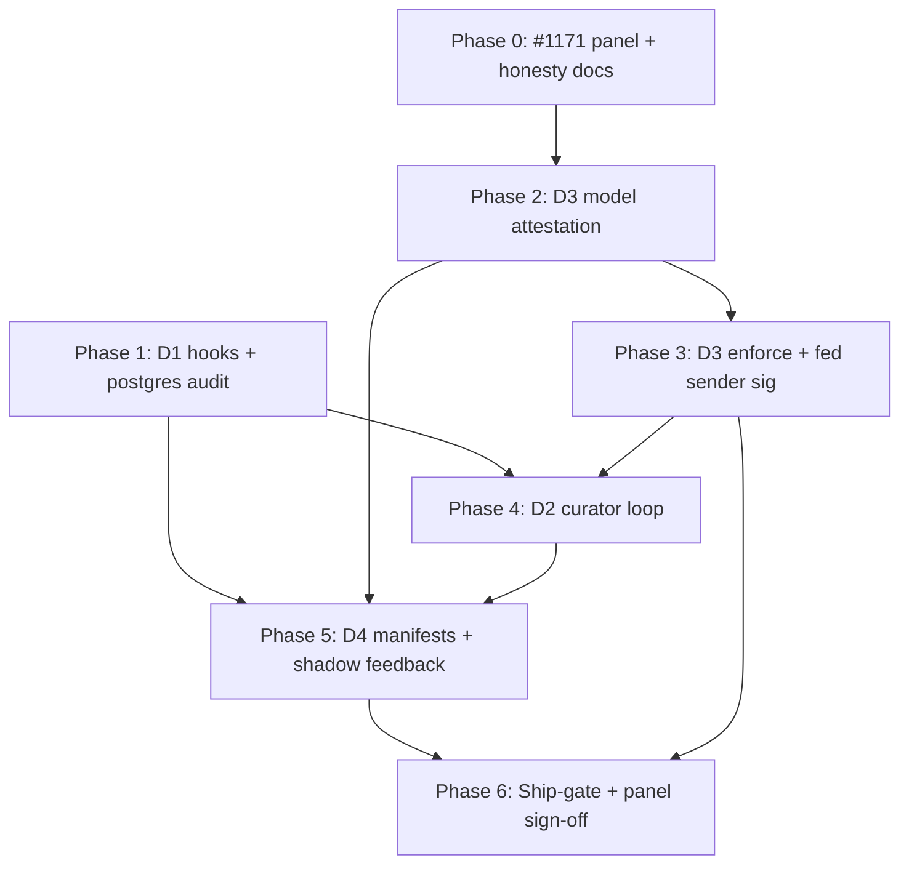

# Recursive Learning & Self-Improvement — Full-Spectrum Development Path (v0.9.0)

**Status:** Multi-agent assessment (4 dimension agents + 11 adversarial lenses)  
**Base:** `release/v0.8.0` @ `c85b9c56` (git pull + codegraph reindex 2026-06-26)  
**Companion:** [`RECURSIVE-LEARNING-A-PLUS-ROADMAP.md`](RECURSIVE-LEARNING-A-PLUS-ROADMAP.md) (11-agent voted execution plan)

---

## 1. Purpose

This document is the **detailed engineering path** to raise the first four dimensions of recursive learning and recursive self-improvement from their v0.8.0 grades to **A+** in ai-memory **v0.9.0**.

It synthesizes:

- Live substrate probe (`memory_capabilities`, `doctor`, MCP stdio) on Homebrew `ai-memory 0.8.0`
- Codegraph-indexed codebase review on `release/v0.8.0`
- Four parallel dimension assessments (D1–D4)
- Cross-reference to `docs/RECURSIVE_LEARNING.md`, `ROADMAP.md` §5/§6, `#1171`, `#1719`, `#1698`

---

## 2. The Four Dimensions (assessment rubric)

| ID | Dimension | v0.8.0 Grade | A+ Definition (substrate-realistic) |
|----|-----------|--------------|-------------------------------------|
| **D1** | **Recursive Learning Primitive** | A− | Depth-bounded `memory_reflect` with provenance, hooks, audit, and **proven** sqlite+postgres parity on all surfaces |
| **D2** | **Autonomous Self-Improvement Loop** | B | Default curator closes observe→reflect→consolidate→recall-boost→skill without operator choreography; governance-safe |
| **D3** | **Structural Safety / Decorrelation** | C+ | Write-time + consolidation-time refusal on **attested** model-family diversity (N≥3 quorum); no CLAIMED-as-ATTESTED theater |
| **D4** | **AGI-Scale Recursive Self-Improvement** | C | Bounded RSI envelope: composition manifests, shadow feedback loop, integrity policy rules, coordination gates — **without** claiming weight-level AGI or cognition safety |

**Explicit non-goals (all dimensions):** model fine-tuning, unbounded recursion, intra-session hallucination prevention, "substrate refuses unsafe AGI ideas."

---

## 3. v0.8.0 baseline (what ships today)

### 3.1 D1 — Primitive (strong foundation)

| Capability | Evidence |
|------------|----------|
| `reflection_depth` + `reflects_on` atomic writes | `src/storage/reflect.rs` |
| Substrate depth cap (default 3) | `GovernancePolicy::effective_max_reflection_depth` |
| `REFLECTION_DEPTH_EXCEEDED` + `signed_events` audit | Task 5/8 |
| `PreReflect` / `PostReflect` in-substrate | Task 6 — **MCP path uses `ReflectHooks::empty()`** |
| MCP + HTTP + SAL `reflect` | `src/mcp/tools/reflect.rs`, `src/handlers/route_1111.rs`, `src/store/postgres.rs` |
| Federation depth sovereignty | `src/federation/reflection_bookkeeping.rs` |
| L2 ecosystem (curator pass, invalidation notify, skill promote, reranker boost) | `docs/RECURSIVE_LEARNING.md` |

**Gaps:** G7+ `hooks.toml` bridge; postgres depth-refusal audit **untested**; `auto_export` only on MCP sqlite; composition manifests declaration-only.

### 3.2 D2 — Loop (fragmented runtime)

| Stage | Ships | Default-on? |
|-------|-------|-------------|
| `memory_capture_turn` | ✅ | Governance-gated (`write=approve`) |
| Curator reflection pass | ✅ | ❌ (`curator --reflect` only; default `run_once` skips) |
| Compaction (Pillar 2.5) | ✅ | ❌ (`AI_MEMORY_COMPACTION_ENABLED=false`) |
| Skill auto-promote | ❌ | Manual MCP only |
| Invalidation triage | ❌ | Notify-only, no curator consumer |
| Transcript classify | ✅ | ❌ (chained to `--reflect` only) |

### 3.3 D3 — Decorrelation (honest visibility)

| Capability | Status |
|------------|--------|
| `decorrelation_probe` advisory | ✅ opt-in (`AI_MEMORY_REFLECT_DECORRELATION_MODE=advisory`) |
| `enforce` mode | **INERT** — degrades to advisory (5-agent vote `4d3ea1c5`) |
| Attested `model_family` | ❌ CLAIMED strings only |
| N≥3 multi-reflector quorum | ❌ Documented, unsized |
| Federation sender `write_signature` | ❌ Receive verify only (#1464) |

### 3.4 D4 — AGI-scale RSI (foundation only)

| Capability | Status |
|------------|--------|
| Reflection→skill bridge | ✅ `memory_skill_promote_from_reflection` |
| `composes_with_reflections` | ✅ Declaration only (L2-7) |
| `recall_observations` ledger | ✅ v0.8 #1705 identity binding; **no production scoring reads `consumed`** |
| Policy engine audit (#697) | ✅ Closed; **no integrity-rule pack for substrate self-modification** |
| Coordination ↔ reflect integration | ❌ Orthogonal primitives |

---

## 4. Master task inventory (deduplicated)

Tasks use prefix `V09-RL-D{n}-{NNN}`. Cross-dimension tasks appear once with primary owner.

### Phase 0 — Design lock & panel (gates D3/D4 claims)

| ID | Title | Owner | LOE | Deps |
|----|-------|-------|-----|------|
| V09-RL-D3-001 | Complete #1171 Phase 1 (GPT 5.5 + Grok 4.3 isolated reports) | D3 | 2–3 sess | — |
| V09-RL-D3-002 | #1171 Phase 2 `synthesis.md` — §5 mechanism adjudication | D3 | 1 sess | 001 |
| V09-RL-D3-003 | ROADMAP/CHANGELOG doc drift sweep (#1764 shipped, §5 committed) | D3 | 0.5 sess | 002 |
| V09-RL-D4-036 | `honest-limitations.md` RL boundary addendum | D4 | 0.5 sess | — |
| V09-RL-D4-038 | Moonshot marketing scrub / claim-discipline gate | D4 | 0.5 sess | 036 |

### Phase 1 — D1 primitive hardening (A− → A+ spine)

| ID | Title | Files | LOE |
|----|-------|-------|-----|
| V09-RL-D1-001 | Wire `hooks.toml` `PreReflect` sync gate on MCP `memory_reflect` | `src/mcp/mod.rs`, `src/mcp/tools/reflect.rs`, `src/hooks/chain.rs` | L |
| V09-RL-D1-002 | Wire `PostReflect` observer on MCP success path | same + `src/hooks/post_reflect/` | M |
| V09-RL-D1-003 | Plumb Pre/PostReflect on HTTP + SAL reflect paths | `src/handlers/route_1111.rs`, `src/store/{sqlite,postgres}.rs` | L |
| V09-RL-D1-004 | Shared `build_reflect_hooks_bundle()` (auto_export + keypair + HookChain) | new `src/hooks/reflect_dispatch.rs` | M |
| V09-RL-D1-005 | PE-1 required-event presence for `PreReflect` | `src/hooks/enforce.rs` | S |
| V09-RL-D1-006 | Postgres `signed_events` audit parity tests for depth refusal | `tests/recursive_learning_task5_audit_record.rs` | M |
| V09-RL-D1-007 | Extend `recursive_sal_coverage.rs` (refusal + audit + origin) | `tests/recursive_sal_coverage.rs` | M |
| V09-RL-D1-008 | Upgrade `reproduce-recursive-learning.sh` (audit assertion) | `scripts/reproduce-recursive-learning.sh` | S |
| V09-RL-D1-009 | Postgres federation cross-peer reflect audit test | `tests/federation_reflection_postgres.rs` (new) | L |
| V09-RL-D1-015 | Hook-veto `signed_events` channel (`reflection.hook_veto`) | `src/storage/reflect.rs` | M |

**D1 A+ acceptance:** Three-surface hook parity green; postgres audit proven; `REFLECTION_HOOK_VETO` reachable in production MCP.

### Phase 2 — D3 provenance foundation (prerequisite for enforce)

| ID | Title | Files | LOE |
|----|-------|-------|-----|
| V09-RL-D3-010 | `model_attestations` schema v71+ (sqlite + postgres lockstep) | `migrations/`, `src/store/postgres.rs` | 1 sess |
| V09-RL-D3-011 | Loader digest capture on LLM init | `src/llm.rs`, `src/config.rs` | 1 sess |
| V09-RL-D3-012 | `ReflectInput.model_family` + attestation stamp on write | `src/storage/reflect.rs`, `src/mcp/tools/reflect.rs` | 1.5 sess |
| V09-RL-D3-013 | Federation family attestation sanitization on merge | `src/federation/`, `src/store/postgres.rs` | 1 sess |
| V09-RL-D3-014 | `ai-memory model-attest --evidence` CLI | `src/cli/` | 0.5 sess |
| V09-RL-D4-035 | `postgres_schema_parity.rs` extension for v71+ artifacts | `tests/postgres_schema_parity.rs` | 0.5 sess |

### Phase 3 — D3 enforcement (C+ → A+)

| ID | Title | Files | LOE |
|----|-------|-------|-----|
| V09-RL-D3-020 | Quorum config knobs (`QUORUM_N`, agreement semantics) | `src/config.rs` | 0.5 sess |
| V09-RL-D3-021 | `DecorrelationRefused` gate in `reflect_with_hooks` | `src/storage/reflect.rs` | 2 sess |
| V09-RL-D3-022 | Wire `enforce` on MCP/HTTP reflect (non-inert) | all reflect entry points | 1 sess |
| V09-RL-D3-030 | Consolidation corpus dominance (attested families) | `src/curator/decorrelation_probe.rs` | 1 sess |
| V09-RL-D3-031 | `consolidate()` decorrelation gate | `src/storage/mod.rs`, `src/curator/compaction.rs` | 1.5 sess |
| V09-RL-D3-050 | Federation sender `write_signature` emit | `src/federation/`, sync push path | 1.5 sess |
| V09-RL-D3-060 | `decorrelation_enforcement_invariants` ship-gate | `tests/` (new) | 1 sess |
| V09-RL-D3-062 | Probe: dual `claimed_dominance` + `attested_dominance` metrics | `src/curator/decorrelation_probe.rs` | 0.5 sess |

**D3 A+ acceptance:** `enforce` refuses monoculture on attested families; federation mesh signs outbound writes; #1171 synthesis on file.

### Phase 4 — D2 autonomous loop (B → A+)

| ID | Title | Files | LOE |
|----|-------|-------|-----|
| V09-RL-D2-001 | Unify reflection pass into default `curator run_once` | `src/curator/mod.rs`, `src/cli/curator.rs` | L |
| V09-RL-D2-002 | Apply `reflection_namespace_enabled` to SAL daemon sweep | `src/cli/curator.rs` | S |
| V09-RL-D2-003 | Curator invalidation triage pass | new `src/curator/invalidation_triage_pass.rs` | L |
| V09-RL-D2-005 | Transcript classify in default curator cycle | `src/curator/mod.rs` | M |
| V09-RL-D2-007 | Tier-aware compaction default for `autonomous` | `src/config.rs` | S |
| V09-RL-D2-008 | Capabilities compaction honesty (`planned=false`) | `src/mcp/tools/capabilities.rs` | S |
| V09-RL-D2-009 | Archive link preservation on consolidation rollback (#1771) | `src/curator/compaction.rs` | XL |
| V09-RL-D2-011 | `memory_reflect` standard `write=approve` governance gate | `src/mcp/tools/reflect.rs` | M |
| V09-RL-D2-012 | Curator reflection governance (`bypass_governance` default false) | `src/curator/reflection_pass.rs` | L |
| V09-RL-D2-013 | Invalidation walker Postgres/SAL parity | `src/notification/invalidation.rs` | L |
| V09-RL-D2-014 | Operator-configurable reflection boost resolver | `src/config.rs`, `src/reranker.rs` | S |
| V09-RL-D2-016 | Fire Pre/PostReflect in curator reflection pass | `src/curator/reflection_pass.rs` | M |
| V09-RL-D2-018 | Stale doc reconciliation (reflection pass wiring) | `src/curator/reflection_pass.rs`, `ROADMAP.md` | S |
| V09-RL-D2-019 | LongMemEval autonomous-curator-on re-benchmark | `benchmarks/longmemeval_reflection/` | M |

**New config (proposed):**

```toml
[curator.autonomous_loop]
mode = "off"   # off | supervised | autonomous
```

| Mode | Behavior |
|------|----------|
| `off` | v0.8.0 byte-identical default |
| `supervised` | Reflect + classify; skill promote → `Pending` when `promote=approve` |
| `autonomous` | Full cycle + invalidation triage + capped auto-promote + decorrelation enforce |

**D2 A+ acceptance:** `curator --daemon` runs reflection for configured namespaces without `--reflect`; governance honored; LongMemEval row published.

### Phase 5 — D4 RSI envelope (C → A+)

| ID | Title | Files | LOE |
|----|-------|-------|-----|
| V09-RL-D4-001 | `CompositionManifest` model + canonical CBOR + schema | `src/models/composition_manifest.rs` | 2 sess |
| V09-RL-D4-002 | Promote path emits manifest rows | `src/mcp/tools/skill_promote.rs` | 2 sess |
| V09-RL-D4-004 | MCP `memory_composition_verify` + CLI parity | `src/mcp/tools/`, `src/cli/` | 2 sess |
| V09-RL-D4-005 | Ed25519 manifest attestation + `signed_events` | `src/signed_events.rs` | 1 sess |
| V09-RL-D4-009 | Integrity seed rules R005–R008 | `src/governance/`, migrations | 1 sess |
| V09-RL-D4-010 | `AgentAction::GovernanceRuleMutate` wiring | `src/governance/agent_action.rs` | 2 sess |
| V09-RL-D4-015 | #1706 shadow: `recall_consumption_aggregates` sweep | `src/observations/`, `src/curator/` | 2 sess |
| V09-RL-D4-017 | #1707 opt-in reranker consumption factor (bounded) | `src/reranker.rs`, `src/config.rs` | 2 sess |
| V09-RL-D4-021 | Optional lease gate on `memory_reflect` | `src/mcp/tools/reflect.rs`, coordination | 2 sess |
| V09-RL-D4-022 | Checkpoint approval on skill promote (depth≥2) | `src/mcp/tools/skill_promote.rs` | 2 sess |
| V09-RL-D4-026 | Pillar 2.5 opt-in cascade rollback verb | `src/storage/reflect_rollback.rs` (new) | 3 sess |
| V09-RL-D4-029 | Paradigm-shift operator runbook | `docs/compliance/` | 1 sess |
| V09-RL-D4-030 | Audit-not-storage positioning doc | `docs/RECURSIVE_LEARNING.md` | 1 sess |
| V09-RL-D1-010 | Recall ledger SAL promotion (#1705 completion) | `src/store/`, `src/handlers/recall.rs` | 2 sess |
| V09-RL-D1-011 | Authenticated `mark_consumed` only path | `src/observations/` | 1 sess |
| V09-RL-D1-012 | HTTP/MCP ledger population both backends | `src/handlers/recall.rs`, MCP recall | 1 sess |

**D4 A+ acceptance:** Manifest verify round-trip; shadow feedback published; integrity rules refuse governance tamper; NHI-D4 playbook green.

### Phase 6 — Verification & release

| ID | Title | LOE |
|----|-------|-----|
| V09-RL-D4-001-matrix | Extend `grand_slam_recursive_learning.rs` A+ matrix | 2 sess |
| V09-RL-D4-029-packet | Procurement evidence packet for RL A+ | 1 sess |
| V09-RL-D4-030-perf | `PERFORMANCE.md` p95 gates for RL paths | 1 sess |
| V09-RL-D4-035 | NHI playbook scenarios NHI-D4-1..7 | 2 sess |
| V09-RL-D4-036 | Panel sign-off (#1171) before tag-cut | 1 sess |

---

## 5. Dependency DAG (critical path)



**Longest pole:** D2-009 (link rollback, XL) ∥ D3-021 (enforce gate) — run in parallel after Phase 1.

---

## 6. Effort estimate

| Phase | Sessions | Parallel lanes |
|-------|----------|----------------|
| 0 | 4–5 | 1 |
| 1 | 8–10 | 2 |
| 2 | 5–6 | 1 |
| 3 | 8–10 | 2 |
| 4 | 12–15 | 2 |
| 5 | 18–22 | 3 |
| 6 | 6–8 | 1 |
| **Total** | **~55–70** | 4-lane peak |

Aligns with `docs/v0.8.0/GOAL-EPIC-KICKOFF.md` (~58.5 core + 4–8 §5 decorrelation).

---

## 7. Per-dimension A+ checklist

### D1 — Recursive Learning Primitive

- [ ] `hooks.toml` Pre/PostReflect wired MCP + HTTP + SAL
- [ ] Postgres depth-refusal audit test green
- [ ] Three-surface `auto_export` parity
- [ ] `reproduce-recursive-learning.sh` asserts audit row
- [ ] Federation postgres cross-peer audit test

### D2 — Autonomous Self-Improvement Loop

- [ ] Default curator runs reflection for enabled namespaces
- [ ] `compaction.enabled` true on autonomous tier (with LLM reachable)
- [ ] Invalidation triage pass consumes `_invalidations`
- [ ] `memory_reflect` honors `write=approve`
- [ ] Curator respects governance unless `bypass_governance=true`
- [ ] LongMemEval autonomous-curator-on row within 0.5% R@5 budget

### D3 — Structural Safety / Decorrelation

- [ ] `model_attestations` + loader digest shipped
- [ ] `ReflectInput` stamps attested `model_family`
- [ ] `enforce` refuses monoculture (non-inert)
- [ ] N≥3 quorum at reflect + consolidate (panel-adjudicated semantics)
- [ ] Federation sender emits `write_signature`
- [ ] `decorrelation_enforcement_invariants` CI green
- [ ] #1171 `synthesis.md` on file

### D4 — AGI-Scale Recursive Self-Improvement

- [ ] `CompositionManifest` + verifier tooling
- [ ] Shadow recall feedback (#1706) — **no live wire unless shadow proves signal**
- [ ] Integrity rules R005+ refuse governance tamper
- [ ] Optional lease/checkpoint gates on reflect/promote
- [ ] Cascade rollback verb (opt-in)
- [ ] Paradigm-shift runbook published
- [ ] NHI-D4 playbook + procurement packet

---

## 8. Risk register

| Risk | Mitigation |
|------|------------|
| `enforce` on CLAIMED metadata (security theater) | **Block:** D3-012 before D3-021; 5-agent vote `4d3ea1c5` |
| Postgres ledger empty in production | D1-010/011/012 before D4-015 claims |
| `compaction.enabled` default-on without link rollback | D2-009 before D2-007 default flip |
| #1751 attestation flip before federation sender emit | Defer #1751 default to v0.9.1 |
| Live recall wire breaks p95 | Shadow-only in v0.9.0; #1707 conditional |
| Scope creep (coordination swarm in v0.9) | CUT `memory_reflect_swarm` to v0.9.1 unless panel mandates |

---

## 9. References

- [`docs/RECURSIVE_LEARNING.md`](../RECURSIVE_LEARNING.md)
- [`ROADMAP.md`](../ROADMAP.md) §5, §6.4–6.6
- [`docs/v0.8.0/GOAL-EPIC-KICKOFF.md`](../v0.8.0/GOAL-EPIC-KICKOFF.md) Phase 7
- Issues: #655, #666–#673, #1171, #1464, #1698, #1705–#1707, #1719, #1764
- Repro: `scripts/reproduce-recursive-learning.sh`
- Ship-gate: `tests/ship_gate/grand_slam_recursive_learning.rs`

---

*Generated 2026-06-26. Base SHA `c85b9c56`. Codegraph index refreshed post-pull.*