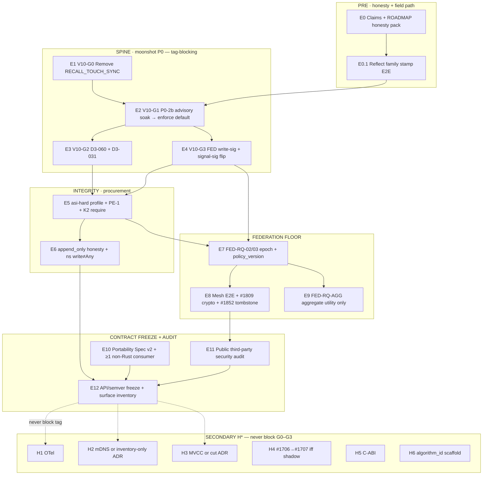

# UPDATED-ROADMAP — Grok 4.5 Assessment
## Perfect Endpoint AI Memory · AI / AGI / ASI · Survive-to-Infinity Moonshot

| | |
|---|---|
| **Document** | `UPDATED-ROADMAP-GROK-4-5-ASSESSMENT-PERFECT-ENDPOINT-AI-MEMORY.md` |
| **Classification** | Strategic assessment + v1.0.0 epic kickoff SSOT (Grok 4.5 / AI NHI) |
| **Date** | 2026-07-08 |
| **Subject codebase** | ai-memory **v0.9.0** · schema **v78** · MCP **101** · HTTP **92** routes · CLI **87**/89 · `Memory` **28** fields |
| **Method** | **7 waves × 7 adversarial agents = 49 slots** · CodeGraph-anchored · ROADMAP.md + moonshot-synthesis + TRACT §26 + Red Queen §25 |
| **Primary sources** | `docs/v1.0.0/perfect-endpoint-assessment/w7-a7-grand-synthesis.md` · `docs/v1.0.0/perfect-endpoint-assessment/w7-a2-v1-epic-dag.md` · `docs/v1.0.0/perfect-endpoint-assessment/waves/w7-a1-final-scorecard.md` · all `waves/w*-a*.md` |
| **Supersedes (for planning)** | ROADMAP §11.6 *as executable epic* (prose rewrite still required); does **not** replace ROADMAP.md until operator merges R1–R18 |
| **Trademark** | ai-memory™ · Apache 2.0 |

---

> **Operator directive (stored):** Design the perfect endpoint AI memory system relevant under AI, AGI, and ASI that survives to infinity; assess ai-memory v0.9.0 + ROADMAP for the v1.0.0 development epic kickoff; run 7×7 adversarial voting; record everything in this document.

---

## How to read this document

1. **§1 Executive verdict** — the decision in one page.  
2. **§2 Perfect system** — what “perfect” *means* (ontology).  
3. **§3 Amended seven properties** — moonshot axes confirmed / amended.  
4. **§4 Distance scorecard** — v0.9.0 held-fractions under defaults.  
5. **§5 Council tables** — 49-agent tallies and freezes.  
6. **§6 v1.0.0 epic** — ordered DAG for kickoff (executable).  
7. **§7 ROADMAP rewrites** — what to change in ROADMAP.md.  
8. **§8 Hard bans** — claims discipline.  
9. **§9 Infinity survival** — what must never rot.  
10. **§10 Kickoff checklist** — Day-0 actions.

**Binding freezes (planning):** seven property axes · W2/W7-A1 scores · category ban on “perfect memory” brand · dual-plane erase · RQGM out of `src/` · CLAIMED-enforce ban.  
**Provisional until dual-family confirm (W7-A5):** elevating freezes to constitutional ship-law.

---

# 1. Executive verdict

## 1.1 One-line verdict

**v0.9.0 is a strong, audit-ready L3-BODY integrity substrate with real moonshot scaffolding — not a perfect endpoint system, not an ASI container, and not a defensible “perfect memory” product. REWRITE-AND-REBASE the ROADMAP; ship v1.0 as audited governance-substrate contract + default integrity + federation floor; keep perfect-system residual on v1.x–v2.x. Freezes are planning-binding; dual-family confirm before constitutional ship-law (W7-A5).**

## 1.2 Council compound (seven-wave merge)

| Layer | Frozen claim |
|---|---|
| **Ontology (W1)** | The ROADMAP §2 seven properties are the correct **peer-level axes** of perfect *endpoint cognitive governance substrate* — with 2.3 narrowed to **record-stop**, 2.6 confirmed as **target law not held**, five scoring subordinates (S1–S5) folded in. |
| **Distance (W2 → W7-A1 FINAL)** | Under **defaults**: 2.1=**78** · 2.2=**68** · 2.3=**58** · 2.4=**66** · 2.5=**63** · 2.6=**34** · 2.7=**86** (0–100). Trust-spine **A− machinery / B+ deploy**; data-model **C+ / low B−**. **No composite TRACT %.** Recycled planner blends (~55–65% / ~70–80%) are **non-measurements** — ban from procurement artifacts (W7-A5 G7). |
| **ROADMAP (W3 + A1/A2 re-merge)** | Document is **partially honest across three release eras** (roadmap-truth **~52/100**). Calendar, ban list, and §11.6 package mis-prioritize perfect-endpoint closure. **Q2 2027 CONDITIONAL YES** only as contract-freeze + audited federation floor — **HARD NO** as perfect-system / TRACT L1 / hive-of-millions. Prefer **undated tag when V10-G0–G3 green** over date-theater. |
| **Security (W4)** | Ready for **third-party security audit engagement** on shipped primitives (SOW = residual list, not happy path). **Not** ready to claim ASI survival, default non-repudiation, decorrelation enforced, fleet GDPR erase, or green-chain = safe mind. Perfect ASI containment **0/7 REJECT**. Split identity: single-tenant pass / multi-tenant shared-key **fail** (do not average to 0.78). |
| **Scale (W5)** | Infinity architecture = **SQLite floor + Postgres hub + federated modules**; ANN = L3 disposable cache; corpus infinity = pressure policy + typed forget — **not** silent long-tier immortality. Default scale readiness **~0.55** / armed multi-tier **~0.72**. |
| **Interop (W6)** | Honest-peer W-of-N AP mesh **ACCEPT (caveated)**; multi-endpoint perfect system **REJECT**. Spec v1 real; multi-impl gravity **must-start** at v1.0 (prefer **≥2** foreign consumers, not paper ≥1). L3 capture **0.00**. |
| **W7 peers** | A1 scorecard FINAL · A2 epic DAG kickoff SSOT · A5 red-team provisional freezes · A3/A4/A6 claims/architecture/buyer — absorbed below. |

## 1.3 What is true at v0.9.0 (do not dilute)

1. **Pure recall** is shipped and kill-tested multi-surface (S4 RECALL verb **0.93**) — rare moonshot property with real tests.  
2. **Store-path agent attestation default ON** (#1751) — real flip, not prose.  
3. **Authority≠data federation shape** (S2 **0.82**) — transitions fail-closed; data accept-and-flag deliberate.  
4. **Multi-layer audit machinery exists** — V-4, watermark, witness, three-key SoP, cause column, revisions, lineage, model TOFU, secret refuse, G30 single-node forget.  
5. **LLM/embed multi-vendor boundaries** largely held (**2.7 ≈ 0.86**).  
6. **RQGM / co-evolving evaluators OUT of `src/`** — L3 CI gate load-bearing.  
7. **Endpoint-first SQLite + mobile cross-compile** floor story real (with physics caveats).  
8. **Mechanical honesty infrastructure** — vendor-literal gate, C8 codegraph, docs-vs-SSOT, surface-count invariants, schema ladder to **78**.

## 1.4 What is false / theater if claimed at v0.9.0

| Claim shape | Reality |
|---|---|
| Perfect endpoint AI memory attained | **0/7** Wave-2 + Wave-4 |
| Decorrelation enforced / bias-displaced by architecture | Mode **off**; stamp hole; no D3-031; score **0.34** |
| Cryptographic non-repudiation by default | Stack real; witness/role/cause require OFF; unsigned residual |
| Kill-switch / stoppable ASI world-action | Record-stop partial only (**0.58**); world stop **~0.05** |
| Federation mature / multi-endpoint ASI verify | Mesh ops **0.63**; ASI hostile **0.22**; author default **0.42** |
| BLAKE3-primary / append-only spine held | Additive cid; UUID still PK/LWW; `append_only` default OFF |
| Green `verify-audit-trail` = tamper-proof | Unknown witness/cause/role does not dirty |
| DeepMind-endorsed / pathway-complete | **HARD NO** |
| Fleet-wide forget / complete Art.17 erasure | Single-node dual-plane only (**0.72** on-node) |
| Ed25519 forever identity | Monoculture; succession partial; PQ open |
| Capability / semantic ASI-truth judge shipped | **OUT OF TCB** (A4) |

## 1.5 Strategic reframe (category)

**“Perfect endpoint AI memory” is not a defensible product category** vs Mem0 / Zep / Letta / vector DBs (W3-A6 **0.88** confidence on failure).

**Defensible frame:**

> **Endpoint-resident cognitive governance substrate**  
> — attested operations, record-level stoppability, multi-org federation, bias-displacement under **attested** N≥3, capability-cliff (attest ≠ judge), portable multi-impl protocol gravity.

Competing as better RAG/R@k is **strategic death**. Competing on governance columns is the only path where incumbents cannot copy the claim without rewriting their product identity.

## 1.6 Ship posture

| Object | Ready? |
|---|---|
| Honest v0.9 security/ops audit of shipped primitives | **YES** |
| Third-party audit *engagement* | **YES** (kit must include defaults residual) |
| Claim perfect §2.1–2.7 held | **NO** |
| Claim ASI survival under defaults | **NO** |
| v1.0 tag as perfect-system complete | **NO** |
| v1.0 tag as contract + default integrity + federation floor (CONDITIONAL Q2 2027) | **YES if spine below lands** |
| Brand “perfect memory” | **NO — PURGE** |

## 1.7 Grand confidence

**0.84** (chair merge across seven waves; red-team process penalty −0.02; range of peer confidences 0.45–0.92).

| + | − |
|---|---|
| Full W1–W6 chairs + W7 A1–A6 peers; code-anchored scores | Assessor monoculture (single campaign lineage — W7-A5 G1) |
| W3-A1/A2 re-merged into grand | Recycled killer/template lock (G2); freeze cascade (G3) |
| Red-team missing-failure inventory absorbed | No multi-node ASI adversarial campaign; no dual-family confirm |
| A3 P0 table + A5 flip ladder + A6 dual-plane + W5 topology | PQ suite open; market timing thin (W3-A6 0.45); W6-A1 absent |

## 1.8 Killer objection (civilizational form)

**High-narrative / low-default enforcement + wrong category + premature freeze is worse than a narrower honest ledger.**

Compound of wave kill-shots (integrity spine — still correct):

1. **Ontology collapse** — sell RAG/vector identity with crypto garnish → searchable fog, no stop handle (W1).  
2. **Jurisdiction theater** — voluntary ledger sold as “governs every ASI contact” (W1-A2 / W4-A3).  
3. **Federalist theater** — §2.6 scaffold + clean verify under incomplete enrollment (W2-A2 / W4).  
4. **Category death** — “perfect memory” hands the market to Mem0/Zep/Letta (W3-A6).  
5. **Premature freeze** — API stability over UUID-thick incomplete spine locks dual-truth (W3-A5).  
6. **Capability fraud** — green integrity sold as safe/aligned mind (W4-A4).

**Orthogonal kill-shots the integrity panel underweighted (W7-A5 — must ticket):**

7. **Read-path laundering (M1)** — harness retrieves → injects → acts; write-path attest does not bind the consumer.  
8. **Complexity tax death (M2)** — 101 tools / 92 routes before default path is obvious kills adoption before ASI.  
9. **Economic/availability attacks (M4)** — quota/DLQ/HNSW/LLM-cost DoS forces escape hatches without forging quorum.  
10. **MCP host/parent trust (M8)** — median threat is host compromise / parent process, not Byzantine mesh.

## 1.9 Top risk

**Claims drift into v1.0 audit + marketing + API freeze** before P0 default-integrity closes — converting real engineering (pure recall, V-4, #1751, G30, S2) into false ASI-survival guarantees under a permanent contract.

**Secondaries (merged W3–W7-A5):** category collapse; PE-1 empty-chain silent Allow; shared-API-key multi-tenant residual; Ed25519 ossification; archive-vs-forget claim hazard; **complexity tax as anti-moat**; **read-path consumer ignore**; hollow audit (enrolled-only SOW); soft-defaults adoption vs integrity schedule unmodeled; freezes elevated to ship-law without dual-family confirm.

---

# 2. Perfect endpoint system definition

## 2.1 Canonical definition (binding paragraph)

**Perfect endpoint AI memory** — understood as **jurisdiction of durable, attributable, stoppable cognitive state at the contact surface**, never as RAG/vector-store/chat-log — is an **endpoint-resident, offline-capable cognitive-governance substrate** that holds *attested cognitive artifacts* (observations, decisions, refusals, reflections, plans, tombstones, lineage) at every contact locus where AI/AGI/ASI meets physical, biological, or other-AI reality (Tier ∅ via gateway-held L1 when silicon cannot host the binary). It keeps identity and accumulation **coherent** across sessions and model replacement under volatile-context / frozen-weights / plural-instance facts; makes writes and the reasoning record **stoppable without silent corruption** (typed refusal as first-class state, not world-action veto); **compounds cognition outside weights** via observe→atom→reflect→skill compositions that survive model death; **attests operations** with cryptographic non-repudiation so weaker observers verify stronger cognitions without trusting them; **bias-displaces** self-accounts through architectural separation-of-powers (N≥3 *attested* model-family quorum before promotion into durable self — substrate verifies, does not trust or optimize panels); and stays **LLM-agnostic** at every cognitive boundary so multi-vendor endpoints remain governable.

Indexes (FTS/HNSW), inference, and evolutionary search are access/maintenance machinery or siblings — **never the ontology**. It is integrity substructure for verification and decorrelation, **not** a knowledge base, orchestrator, cloud SaaS, capability certificate, or ASI control plane.

## 2.2 What “memory” means here

| Is | Is not |
|---|---|
| Durable *engagement artifacts* with kind, provenance, confidence basis, refusal, lineage | Bare world-propositions / wiki facts |
| Contact-surface jurisdiction | Central API opinion about endpoints |
| Operation attestation + record stoppability | Capability attestation / semantic truth of ASI thought |
| Necessary-but-not-sufficient for DeepMind AGI→ASI *frictions* | Universal governor of every ASI pathway |
| Protocol-class succession object | Immortal product binary |

## 2.3 Honesty template (public / procurement / release notes — SSOT)

> *ai-memory is an endpoint-resident cognitive-governance substrate: pure-by-default recall, multi-layer audit machinery, store-path attestation required by default, verify-only epoch freeze, multi-vendor cognitive boundaries, dual-plane local erasure, and opt-in/enforce-capable decorrelation on attested model families. It enables less-capable observers to verify **history of operations**, not power or truth of minds. It is necessary-but-not-sufficient for AGI→ASI preparedness frictions. It does **not** perfectly contain ASI, enforce bias-displaced self by default under stock install, provide cryptographic non-repudiation without enrolled keys and external watermarks, stop world-actions outside the substrate, guarantee capture under process death, attest mesh authorship under defaults, erase content fleet-wide, provide key-loss recovery, or ship TRACT L1 / RQGM / BFT federation. It is **not** a managed memory SaaS, not a content-address primary identity while UUID rules LWW, and not DeepMind-endorsed or pathway-complete.*

## 2.4 Perfect-system axioms (merged top 10 — W1 freeze)

1. **Contact-surface / Locus** — governance not at the contact point (or honest gateway) is opinion, not governance. Offline-first L1 non-negotiable when radio/law is adversarial.  
2. **Substrate ≠ cognition** — holds engagement artifacts and gates; does not think content true, grade ASI utility, or host evolutionary self-optimization.  
3. **Artifact-not-proposition** — who engaged what, with kind/provenance/confidence/refusal/lineage.  
4. **Refusal-is-content** — typed deny/veto/tombstone with reconstructible chain; silent drop is corruption.  
5. **Non-repudiation of operations; content not self-authoritative** — weaker observers verify writes; self-report is not evidence.  
6. **Decorrelated-self / Federalist 51** — no unilateral self enters durable bias-displaced identity without N≥3 attestably distinct foreign priors.  
7. **Generation-survival + index≠ontology** — identity externalizes across weight/session death; vectors/FTS are access, never identity.  
8. **Authority-lane ≠ data-lane** — completing actions/leases/transitions is not the same trust model as relaying observations.  
9. **Scope & pathway honesty** — in-substrate iff strengthens ≥1 of 2.1–2.7; 2.2/2.4 conditional on frozen-weights facts; voluntary ledger ≠ universal governor.  
10. **Policy ≠ architecture; succession over immortality** — properties held only by operator discipline are not held at ASI scale; infinity = multi-impl, crypto-agile, witness-anchored *protocol* succession.

## 2.5 Scope honesty (DeepMind / pathway)

- Lead ASI-relevance argument with **§2.5 operation attestation**, not breadth.  
- Orthogonal to scaling and paradigm-shift pathways if in-weights continual learning voids externalized storage — dual-mode **audit-not-storage** must stay explicit forever (W1 T3).  
- Capability / model-state attestation = gap or sibling research track — **not** v1.0 claim.  
- Bypass remains free unless trust markets force routing through the substrate.

## 2.6 Physics of “endpoint”

| Tier | Posture |
|---|---|
| **L1 floor** | SQLite-default keyword path; target **20–50 MB** class RSS for true floor devices |
| **Hub opt-in** | Postgres+AGE, large HNSW, heavy LLM, deferred AGE projection |
| **Tier ∅ (MCU)** | Gateway-held L1 identity/attest — not full binary on Cortex-M |
| **Cloud** | Enrichment/backup only — never sole SoR |

Desktop defaults (mmap **256 MiB**, HNSW capacity **100k**) are **not** the floor physics story until a named preset ships (S5 **0.52**).

## 2.7 Dual-plane erasure (W4-A6 constitutional)

**The secret dies; the fact that it died does not.**

- **Content plane:** purge / crypto-shred subject content on forget (Art.17-capable on-node).  
- **Accountability plane:** content-free tombstone + audit residue for anti-resurrection and incident response.  
- **Fleet erase:** NOT held; mesh tombstone propagation is v1.x (#1852).  
- **Reject:** total audit wipe; soft-delete-only as Art.17.

---

# 3. Amended seven properties

Wave-1 disposition: **AMEND-AND-FREEZE**. Prefer ROADMAP’s seven-way split. “Cognitively governed” = joint of all seven, not an eighth.

## 3.1 Peer properties

| # | Property | Council disposition | Perfect-system meaning | v0.9 held-fraction (defaults) |
|---|---|---|---|---:|
| **2.1** | Endpoint-resident | **CONFIRM + physics** | Contact-surface jurisdiction; SQLite L1 permanent floor; Postgres hub opt-in; Tier ∅ = gateway topology | **0.78** |
| **2.2** | Coherent across sessions & generations | **CONFIRM + contingent** | Externalized self under frozen-weights/plural-instance facts; degrade to audit-not-storage under paradigm shift; capture completeness is subordinate **2.2-C** | **0.68** |
| **2.3** | Stoppable without silent corruption | **CONFIRM + NARROW** | **Record-stop only** — typed refuse of substrate writes/persistence; durable refusal records; **never** unscoped kill-switch / world-action veto | **0.58** |
| **2.4** | Improvable across model generations | **CONFIRM + contingent** | Out-of-weights compound (observe→atom→reflect→skill); same contingency as 2.2 | **0.66** |
| **2.5** | Attested cryptographic non-repudiation | **CONFIRM (lead ASI argument)** | Operation attestation for weaker observers; incomplete postures (unsigned daemon, no external HWM, opt-in witness) ≠ “attested enough” | **0.63** |
| **2.6** | Bias-displaced / separation-of-powers | **CONFIRM AS TARGET LAW; NOT HELD** | N≥3 distinct **attested** families at write-time **and** consolidation-time; enforce on CLAIMED = theater; RQGM OUT of `src/` | **0.34** |
| **2.7** | LLM-agnostic cognitive boundaries | **CONFIRM** | Neutrality enables 2.6; lab capture of substrate = moonshot death | **0.86** |

## 3.2 Folded sub-properties (scoring dimensions, not new §2 numbers)

| Sub-ID | Name | Fold into | Defaults score | Notes |
|---|---|---|---:|---|
| **S1** | Closed hold/refuse admission classes | 2.3 + 2.6 | **0.60** | Secret refuse strong; ns write:Any; PE-1 inert default |
| **S2** | Authority-lane ≠ data-lane | 2.5 + federation | **0.82** | Transition fail-closed; content authorship opt-in on mesh |
| **S3** | Capture completeness under process death | 2.2 | **0.62** | L1 volunteer; L2/L4 real; **L3 missing** |
| **S4** | Epistemic envelope (kind, provenance, confidence.basis, SUPERSEDE, pure RECALL, cid end-state) | 2.2 + 2.4 + 2.5 | **0.61** | Pure recall **0.93** inside; UUID dual-truth residual |
| **S5** | Floor physics profile | 2.1 | **0.52** | Keyword path exists; desktop defaults ≠ 20–50 MB floor |

**Rejected as independent 8th peers:** multi-modal, encryption-at-rest alone, pure-recall alone, Goal/Plan/Step typing alone (implementations of S4).

## 3.3 Amendment language for ROADMAP prose

### §2.3 — bind forever

**Primary public claim = record-stop.**  
Purge unscoped **kill-switch** from headlines. Precise form: *stoppability of substrate writes and of the durable reasoning record without silent corruption* — not behavioral control of ASI world-actions.

### §2.6 — bind forever

**Target law:** structural N≥3 *attested* model-family quorum before durable self-promotion, including consolidate-time re-correlation guard (D3-031).  
**Status at v0.9:** scaffolded (machinery) / **not held** under defaults.  
**Ban:** “Bias-displaced by architecture” as present-tense fact; “decorrelation enforced” until V10-G1+G2; enforce on CLAIMED families (eternity).

### §0 moonshot sentence — honesty bind

Keep the seven-property composition as North Star, but bind:

- necessary-but-not-sufficient inside the anchor,  
- voluntary routing / not universal jurisdiction,  
- “enforces … at every point” → *enforces on every write that routes through the substrate when configured/enrolled*.

## 3.4 Structural defenses shortlist (what *can* be perfect within claim)

Capability-orthogonal only (W4-A3 + W2):

1. Dual-chain + **independent** witness (G5) — not co-located theater  
2. Role separation Recorder/Judge/Stopper (G9) — distinct custody  
3. Append-only / COW + forget tombstones (G6/G30) — anti-resurrection  
4. Attested-family **count** gate N≥3 — not vote-independence  
5. Peer enrollment + pin + transition fail-closed (S2 authority)  
6. Secret-screen origin-aware funnel (G29)  
7. Attenuation-only macaroons (G10.1)  
8. Pure recall (P0-1) — no silent read-side launder  

**Undefendable perimeter:** host/root compromise; key co-location; P2 vote-independence; out-of-band action; consumer ignore; semantic truth; singleton ASI with no counterparty; loader family-attest ~40% cap; world kill-switch.

## 3.5 Capability cliff (moat #1 — TRACT pillar 13)

**Attest / count / freeze — never judge truth or safety of a superior mind.**  
This is the only posture that survives Goodhart when hosted cognition outthinks the substrate. Selling green integrity as capability/alignment is **category fraud** (W4-A4 HARD CUT).

---

# 4. v0.9.0 distance scorecard

## 4.1 Binding radar (W2 — do not re-score without new code)

```
2.1 Endpoint-resident     ████████░░ 0.78
2.2 Coherence             ███████░░░ 0.68
2.3 Record-stop           ██████░░░░ 0.58
2.4 Improvable            ███████░░░ 0.66
2.5 Attested ops          ██████░░░░ 0.63
2.6 Bias-displaced        ███░░░░░░░ 0.34
2.7 LLM-agnostic          █████████░ 0.86
S1  Hold/refuse           ██████░░░░ 0.60
S2  Authority≠data        ████████░░ 0.82
S3  Capture               ██████░░░░ 0.62
S4  Epistemic envelope    ██████░░░░ 0.61
S5  Floor physics         █████░░░░░ 0.52
```

### Security overlay (W4 axes, defaults)

```
A2 identity/privacy       ████████░░ 0.78
A6 erasure dual-plane     ███████░░░ 0.72
A4 integrity oversight    ███████░░░ 0.70
A5 fail-closed            ██████░░░░ 0.55
A1 crypto succession      █████░░░░░ 0.45
FED ASI hostile           ██░░░░░░░░ 0.22
perfect containment       █░░░░░░░░░ 0.15
capability oversight      ░░░░░░░░░░ 0.05
```

## 4.2 Two-axis grade (TRACT §26 style — bands only)

| Axis | v0.8 ROADMAP era | **v0.9.0 Wave-2/4/7-A1 FINAL** |
|---|---|---|
| **Trust-spine** (2.3/2.5/S1/S2 + FC gates) | A− / B+ | **A− (machinery) / B+ (default-deploy) / C+ (ASI claim under defaults)** |
| **Data-model** (2.2/2.4/S3/S4 + cid/lineage/append) | C / C+ | **C+ / low B−** |
| **Scale composition** (W5 floor/hub/mesh) | — | **B+ design · B− ship** |
| **Boundedness + succession** (W5 corpus/model) | — | **C+ / C** (armed → B−) |
| **Ops mesh + multi-surface** (W6) | — | **B / B+** |
| **Perfect multi-endpoint system** (W6) | — | **D+ / C−** |

**No vanity composite. No recycled planner % in procurement** (W7-A5 G7: W2 and W4 reused ~55–65% / ~70–80% for different referents — treat as sticky blend, not dual measurement).

**Letter-grade rider:** **A− machinery must never appear without deploy B+ / ASI C+ riders** — headline truncation is a claims hazard (W7-A5 Wk9).

## 4.3 Property evidence table (condensed)

| Prop | Evidence (held) | Gap (not held) |
|---|---|---|
| **2.1** | SQLite default; MCP stdio sqlite-only (#1675); profile core; mobile CI | No 20–50 MB floor preset; mmap 256 MiB default; Tier ∅ gateway not code-contract |
| **2.2** | Durable pid-free agent_id (#1720 B1); session_start; persona; L2+L4 recover | L1 volunteer; L3 FS watcher deferred; private-scope filter opt-in |
| **2.3** | Typed Deny/Pending/HookVeto/Escalate; PE-1 wired MCP #1885 + HTTP #1924; secret refuse | PE-1 default **Off** + empty required_events; CLI no PE-1; write:Any silence; refusal≠memory auto-mint |
| **2.4** | observe→atom→reflect→skill; 13 kinds; lineage/tombstone when seeded | Profile-gated power tools; consolidate hard-delete when tombstone off |
| **2.5** | V-4; #1925 full-row sig when enrolled; store attest ON; witness/role machinery | Require modes OFF; cause writers sparse; unsigned residual; Unknown→clean |
| **2.6** | model_attestations v78; pure quorum N=3; opt-in write refuse dual-backend | Mode **off**; production stamp hole; D3-031 absent; P2=0%; ~40% loader cap |
| **2.7** | #1067/#1598 multi-vendor; vendor-literal gate | Residual allowlisted vendor files; not infinite-vendor proof |
| **S2** | Transition sig fail-closed | Content authorship not default-attested on mesh |
| **S3** | L1 nag + L2 dual-backend + L4 capture_turn | **L3 missing** — #1388 mid-session class open |
| **S4** | Pure recall 0.93; additive cid; lineage ON when seeded | UUID PK authority; append_only OFF |
| **S5** | Keyword/core path; mobile layers | Desktop defaults ≠ floor |

## 4.4 P0 chain status (W3-A3 code truth — binding)

| Gate | Intent | v0.9 state | Default | Claim |
|---|---|---|---|---|
| **P0-1** | Pure recall | **SHIPPED** (v77 fold) | Pure; `RECALL_TOUCH_SYNC=1` deprecated | scoped-allowed |
| **P0-2a** | Attested model_family substrate | **SHIPPED** (v78 TOFU) | Table present; ~40% loader cap | loader-attested claimable |
| **P0-2b** | N≥3 enforce-as-default | **PARTIAL** (wired, mode off) | `off` | **“enforced” BANNED** |
| **P0-3 store** | Agent attest secure default | **SHIPPED** (#1751) | ON | store-path only |
| **P0-3 fed** | Write-sig secure default | **OPEN** | OFF | network half incomplete |
| **P0-4** | Epoch verify-only consumer | **SHIPPED** (RQ-10 class) | Verify-only | verify-only scope claimable |

**Mandatory narrative split:** P0-2a ≠ P0-2b. Kill-test met under *enforce-capable*, not *enforce-default*.

Dependency DAG:

```
P0-1 ─────────────────────────────┐
                                  ▼
P0-2a (model_attestations) ──► P0-2b (enforce-as-default)   [v1.0 residual]
        │
        ├──► P0-4 (epoch-apply)     [shipped; dep = 2a, not 2b]
        │
P0-3 store (#1751) ── parallel ──┘
P0-3 fed write-sig ──────────────────► v1.0 residual
```

## 4.5 Top 10 structural gaps (moonshot load-bearing order)

1. **§2.6 not held** — default off + missing production family stamps + no D3-031.  
2. **§2.5 default incomplete** — unsigned residual; witness/cause/role withhold.  
3. **Capture incompleteness (S3)** — L1 volunteer + L3 deferred → pure-recall of empty corpus.  
4. **Data-model dual-truth** — UUID LWW authority; `append_only` OFF; cid secondary.  
5. **Record-stop defaults** — PE-1 Off, allow-on-silence, CLI PE-1 hole.  
6. **Federation data-lane claimed floor** — author content opt-in.  
7. **Physics floor unshipped** — desktop mmap/HNSW vs L1 story.  
8. **Refusal-as-content weak** — deny is error/audit, not durable Decision artifacts.  
9. **Identity lineage incomplete** — rotation-only; recovery VERIFY deferred; invisible cross-host.  
10. **Infinity succession thin** — single-impl + crypto monoculture + non-BFT ADR.

## 4.6 ROADMAP truth vs code (W3-A1 — score **52/100**)

| Bucket | Examples |
|---|---|
| **SHIPPED ahead of prose** | Pure recall; #1751; v78 model_attestations; secret screen; G30 tombstones; PE-1 wired; multi-vendor embed |
| **STALE bans** | §26.5 pure recall; blanket secure-by-default attestation; G29/G30 absolute bans; “no crypto family attestation yet” |
| **MISSING vs commitments** | §23 three-backend vector DoD; L3 capture; D3-031; #1707 live; durability-503; full Pillar-1 hook set |
| **OVERPROMISED** | Bias-displaced by architecture; signals non-repudiation without enrollment; vLLM as 2.6 load-bearing; §23 as v0.9 identity |

## 4.7 Theater vs not-theater (quick reference)

**Theater if claimed:** federalist 2.6; default non-repudiation; kill-switch; shared-key multi-tenant full isolation; fleet forget; green chain = safe ASI; PQ-ready identity; federation mature; session-coherent from pure recall alone; infinite corpus by default; §23 ANN as the mind; full three-surface set-equality; multi-impl done with zero foreign consumers; OTel supported under defaults.

**Not theater:** V-4 mid-chain under signed daemon; pure-recall kill-tests; #1751; S2 transition fail-closed; secret refuse; G30 single-node dual-plane; forged-sig unconditional refuse; RQGM external; multi-vendor boundaries; Spec v1 export/import existence; multi-tier floor+hub design law (W5).

## 4.8 Scale scorecard (W5 — architecture for infinity)

| Axis | Score (defaults) | Headline |
|---|---:|---|
| Multi-tier backends / hive composition | **0.78** arch · **0.55** T8 ship | Floor+hub correct; MCP-PG + module envelope open |
| Vector permanence (ANN vs SoR) | **0.58** | Embeddings+claims = SoR; ANN = L3 cache; G3 cold-start weak |
| Compaction / infinite corpus | **0.48** · **0.28** default bound | Valves exist; long-tier unbounded under defaults |
| Mobile / IoT floor | **0.82** compile | Tens-of-MB Cortex-A; MCU = gateway-held L1 only |
| Observability no-phone-home | **0.70** discipline · **0.45** SLO | Pull OK; default OTLP **REJECT** |
| §2.4 under model swap | **0.48** | Pipeline yes; handoff+stamps no |

**Architecture law (W5 binding):**

> *SQLite is the floor every mind stands on; Postgres is the hub every fleet meets in; federation composes infinity; ANN/FTS are rebuildable caches; corpus infinity is pressure policy + typed forget — never silent long-tier immortality; the edge floor is the smallest host that can attest, refuse, and sync.*

## 4.9 Interop scorecard (W6 — multi-endpoint)

| Axis | Score | Headline |
|---|---:|---|
| FED mesh ops | **0.63** | Honest-peer AP operable |
| FED author (default) | **0.42** | Write-sig OFF |
| FED ASI hostile | **0.22** | Non-BFT forever under current model |
| Portability Spec v1 | **0.93** | Real format |
| Multi-impl gravity held | **~0.25** | Path **0.90** if v1.0 starts vectors+consumers |
| Three-surface freeze discipline | **0.84** | Inventory + intentional asymmetry — not set-equality |
| Capture L3 | **0.00** | Missing |
| Host capture aggregate | **5.8**/10 | Claude Code cold-start strong; mid-session hole |

---

# 5. 49-agent council summary tables

> **Assessment design:** 7 waves × 7 agents = 49 slots.  
> **Present this run:** **49/49 structural slots filled** (W1–W6 chairs + peers; W7 A1–A7 including this grand chair). W6-A1 federation mesh peer absent → bind W2-A6/W4.  
> **Process note (W7-A5):** high-coherence, **low-decorrelated** panel — freezes are CLAIMED multi-lens until dual-family confirm.

## 5.1 Wave roll-up

| Wave | Theme | Agents | Chair conf | Headline freeze |
|---:|---|---|---:|---|
| **1** | Ontology | A1–A7 | **0.84** | AMEND-AND-FREEZE seven axes; 2.3 narrow; 2.6 target-not-held; S1–S5 fold-ins |
| **2** | Distance | A1–A7 | **0.86** | Scorecard + theater list + two-axis grade; perfect **NO** |
| **3** | ROADMAP | A1–A7 | **0.84–0.87** | REWRITE-AND-REBASE; category ban; P0 split; Q2'27 conditional contract-freeze |
| **4** | Security | A1–A7 | **0.86** | Audit-ready primitives; ASI containment REJECT; dual-plane erase; flip ladder |
| **5** | Scale / infinity architecture | A1–A7 | **0.86** | Floor+hub+modules; ANN=L3 cache; pressure+typed forget; no infinite-default |
| **6** | Federation / interop | A2–A7 | **0.84** | Honest-peer mesh YES; multi-endpoint perfect NO; multi-impl gravity must-start |
| **7** | Finals + red-team + grand | A1–A7 | **0.84** | FINAL 0–100 scorecard; epic DAG; provisional freezes; this CORE draft |

## 5.2 Wave 1 tally (ontology)

| Agent | Lens | Conf | Ballot |
|---|---|---:|---|
| A1 | First principles | 0.82 | AMEND 2.3/2.6; hold/refuse + authority/data |
| A2 | DeepMind frictions | 0.82 | Honesty; HARD NO DeepMind-endorsed / capability / enforced 2.6 |
| A3 | Infinity survival | 0.72 | Protocol-class YES; product immortality NO |
| A4 | Separation of powers | 0.88 | N≥3 primary; RQGM external YES; weld into src NO |
| A5 | Endpoint physics | 0.82 | SQLite permanent floor; cloud-as-floor NO |
| A6 | Epistemics | 0.86 | Content-address end-state; SUPERSEDE-not-UPDATE; pure RECALL |
| A7 | Chair | 0.84 | AMEND-AND-FREEZE |

| Motion | Result |
|---|---|
| Accept seven as correct axes | **7/7 YES** |
| Seven already complete at v0.9 | **0/7** |
| Narrow 2.3 to record-stop | **≥6/7** |
| 2.6 target; not held until attested N≥3 | **≥6/7** |
| Lead ASI story with 2.5 | **Binding** |
| RQGM in `src/` | **NO** |
| DeepMind-endorsed solution | **HARD NO** |

## 5.3 Wave 2 tally (distance)

| Agent | Lens | Conf | Score / vote |
|---|---|---:|---|
| A1 | §2.5 Attestation | 0.86 | **0.63** partial |
| A2 | §2.6 Decorrelation | 0.88 | **0.34** · BAN “enforced” |
| A3 | §2.2 + pure recall + S3 | 0.88 | **0.68 / 0.93 / 0.62** |
| A4 | §2.3 Stoppability | 0.86 | **0.58** · kill-switch REJECT |
| A5 | Data-model S4 | 0.84 | **0.61** · UUID dual-truth migration only |
| A6 | Federation | 0.86 | mesh **0.63** · ASI **0.38** · v1.0 fed maturity **NO** |
| A7 | Chair | 0.86 | two-axis A−/B+ · C+/B− |

| Motion | Result |
|---|---|
| Perfect endpoint at v0.9.0 | **0/7 NO** |
| §2.6 held under defaults | **0/7 NO** |
| Pure recall structurally shipped | **YES** |
| Kill-switch public language | **REJECT** unscoped |
| BLAKE3-primary end-state | **ADOPT target** (not current) |

## 5.4 Wave 3 tally (ROADMAP)

| Agent | Lens | Conf | Ballot |
|---|---|---:|---|
| A1 | ROADMAP completeness | 0.87 | Truth **52/100**; rebase YES; unlock stale bans |
| A2 | §11.6 goals fit | 0.87 | MIS-PRIORITIZED as perfect gate; REFRAME |
| A3 | P0 ordering | 0.88 | ACCEPT-WITH-SPLIT · 2b+D3-060+fed-sig = v1.0 P0 |
| A4 | Scope/cuts | 0.91 | Affirm cuts · contracts IN · siblings OUT |
| A5 | Timeline | 0.78 | Q2'27 IFF contract freeze · not perfect-system |
| A6 | Category/moat | 0.72 | NO perfect-memory category · YES governance conditional |
| A7 | Chair | 0.84 | REWRITE-AND-REBASE |

| Motion | Result |
|---|---|
| Keep “perfect memory” as category brand | **NO** |
| Split P0-2a/2b in ROADMAP | **YES** |
| Affirm eternity CUT stack | **YES** |
| v1.0 = perfect-system | **NO** |
| v1.0 = contract + default integrity + audit + federation floor | **YES** |
| §11.6 as written = sufficient perfect-endpoint gate | **NO** (A2) |
| Accept §11.6 as product-maturity milestone with honesty pack | **CONDITIONAL YES** |

### §11.6 bullet votes (A2 — binding reframe input)

| Bullet | Vote |
|---|---|
| Portability Spec v2 | **KEEP + PROMOTE** |
| API freeze + strict semver | **KEEP** |
| Public security audit (defaults-scoped) | **KEEP** |
| E2E encryption beyond mTLS | **KEEP** (after content floor) |
| mDNS auto-discovery | **CUT** from property gate |
| OpenTelemetry | **CUT** from property gate |
| MVCC strict-consistency | **DEFER** |

## 5.5 Wave 4 tally (security)

| Agent | Lens | Conf | Vote / score |
|---|---|---:|---|
| A1 | Crypto succession | 0.86 | Agility L1; no Ed25519 forever · **0.45** default |
| A2 | Identity privacy | 0.86 | CONDITIONAL PASS · **0.78** |
| A3 | ASI threats | 0.82 | REJECT perfect · ACCEPT 4-class substructure · **0.15/0.55** |
| A4 | Oversight | 0.86 | Integrity YES · capability NO · **0.70 / 0.05** |
| A5 | Fail-closed | 0.88 | Perfect NO · write-sig deprecation YES · **0.55** |
| A6 | Erasure/forensics | 0.86 | Dual-plane ADOPT · **0.72** · fleet ban |
| A7 | Chair | 0.86 | Audit engagement YES; ASI survival claim NO |

| Motion | Result |
|---|---|
| Perfect ASI containment at endpoint | **0/7 REJECT** |
| Audit engagement on shipped primitives | **YES** |
| Pass audit as ASI-survival under defaults | **NO** |
| Dual-plane FORGET constitutional | **ADOPT** |
| Cold-flip all FO defaults next release | **NO** |
| FED write/signal sig one-cycle deprecation → flip | **YES** |
| Capability attestation in core claims | **HARD NO** |
| Semantic ASI-truth judge in core | **HARD CUT** |

## 5.6 Cross-wave consensus matrix (load-bearing)

| Thesis | W1 | W2 | W3 | W4 | Grand |
|---|---|---|---|---|---|
| Seven axes correct | Y | Y | Y | Y | **FREEZE** |
| Perfect system attained v0.9 | N | N | N | N | **NO** |
| 2.6 held under defaults | N | N | N | N | **NO** |
| Pure recall shipped | — | Y | Y | Y | **YES** |
| #1751 store attest shipped | — | Y | Y | Y | **YES** |
| Category = perfect memory | — | — | N | — | **PURGE** |
| Category = governance substrate | Y | Y | Y | Y | **YES** |
| RQGM in src | N | N | N | N | **ETERNITY NO** |
| Q2 2027 = perfect complete | — | — | N | N | **HARD NO** |
| Q2 2027 = contract freeze (narrow) | — | — | Y* | Y* | **CONDITIONAL** |
| Capability cliff (attest≠judge) | Y | Y | Y | Y | **MOAT #1** |
| Dual-plane erase | — | — | — | Y | **CONSTITUTIONAL** |
| Ed25519 forever | — | — | — | N | **NO** |
| Multi-impl = infinity product | Y | Y | Y | Y | **YES** |

\*Conditional on V10-G0–G3 + honesty pack; prefer slip date over hollow freeze.

## 5.7 Moat ranking (W3-A6 — ASI durability)

| Rank | Moat | Status |
|---:|---|---|
| 1 | Capability cliff (attest/count/freeze, never judge) | Strong |
| 2 | Crypto non-repudiation + independent audit | Spine strong; enrollment-gated |
| 3 | Structural stoppability / refusal ledger | Real primitives; defaults soft |
| 4 | Cross-org federation fail-closed | Gates shipped; knobs opt-in |
| 5 | Bias-displacement enforced N≥3 | High *if* enforced; currently not |
| 6 | Endpoint-resident + LLM-agnostic | Real |
| 7 | SAL + embeddings-as-cache | CORRECT |
| 8 | Seven-property composition as identity | Named; partial hold |
| 9 | Apache-2.0 + trademark | Medium; dies under category confusion |
| 10 | Recall quality / R@k | **Low** (anti-primary) |
| — | Tool-count supremacy | **Anti-moat** |
| — | “Perfect” grandeur brand | **Anti-moat** |

**Singular moat sentence:**

> *The only endpoint substrate where multi-party cognition is governed (attested, stoppable, bias-displaced, federated across trust boundaries) rather than merely retrieved.*

## 5.8 Wave 5 tally (scale — condensed)

| Agent | Lens | Conf | Ballot |
|---|---|---:|---|
| A1 | Multi-tier backends | 0.87 | Floor+hub+modules; reject monogamy |
| A2 | Vector index | 0.87 | Embeddings SoR; §23 = L3 only |
| A3 | Compaction lifecycle | 0.84 | Option C pressure+typed forget; ban infinite-default |
| A4 | Mobile/IoT floor | 0.88 | Cortex-A floor; MCU gateway-held; C-ABI P1 |
| A5 | Observability | 0.84 | Opt-in OTel; reject default OTLP |
| A6 | Improvable pipeline | — | Conditional §2.4; stamps+handoff |
| A7 | Chair | 0.86 | Multi-tier composition law |

## 5.9 Wave 6 tally (interop — condensed)

| Agent | Lens | Conf | Ballot |
|---|---|---:|---|
| A1 | Federation mesh | — | **ABSENT** — bind W2-A6 mesh 0.63 / ASI 0.22 / author 0.42 |
| A2 | Portability | high | Spec v1 real; gravity-start YES; 2nd full substrate by v1.0 NO |
| A3 | Surface parity | 0.84 | Freeze inventory + intentional asymmetry; REJECT set-equality |
| A4 | LLM-agnostic multi-vendor | — | Config 0.79; simultaneous multi-vendor panel REJECT |
| A5 | KG/lineage | — | One SoR, two contracts; overall 5.0/10 |
| A6 | Host capture L1–L4 | — | Aggregate 5.8/10; L3=0 |
| A7 | Chair | 0.84 | Ops mesh B/B+; perfect multi-endpoint D+/C− |

## 5.10 Wave 7 peer roll-up

| Agent | Deliverable | Merge into grand |
|---|---|---|
| **A1** | FINAL property scorecard 0–100 | §4 SSOT numbers confirmed |
| **A2** | v1.0 epic DAG kickoff | §6 executable spine |
| **A3** | Claims discipline | §7 claims pack / §8 bans |
| **A4** | Perfect architecture | §2 + W5 topology bind |
| **A5** | Red-team / anti-groupthink | §1.8 orthogonal kills · provisional freezes · process notes |
| **A6** | Buyer / procurement critic | Category + complexity + adoption schedule |
| **A7** | This grand synthesis | CORE draft for final MD |

## 5.11 Red-team motions ADOPTED by grand chair (W7-A5)

| Motion | Grand disposition |
|---|---|
| Freezes provisional until dual-family confirm | **ADOPT** (planning-binding now; ship-law after confirm) |
| Re-merge W3-A1/A2 | **DONE** in this document |
| Strike recycled planner % from procurement | **ADOPT** |
| Split identity score (single-tenant vs multi-tenant) | **ADOPT** |
| Withdraw BLAKE3-primary ADOPT until migration ADR | **ADOPT** (target remains aspirational, not adopted end-state) |
| Portability bar ≥2 foreign consumers preferred | **ADOPT** (≥1 is start, not gravity) |
| Ticket M1/M2/M4/M8 | **ADOPT** into v1.0 residuals / bans |
| Does **not** overturn: RQGM out, CLAIMED-enforce ban, pure-recall credit, #1751, dual-plane architecture | **AFFIRM** |

---

# 6. v1.0.0 epic (ordered)

## 6.1 Working title

**v1.0.0 — Stable Substrate Contract + Default Integrity + Audited Federation Floor**

**Not:** perfect-system completion · TRACT L1 done · hive-of-millions · better-Mem0 feature race · ASI containment certificate.

## 6.2 Calendar

| Object | Q2 2027? |
|---|---|
| Contract freeze + public audit + federation floor + honest default flips | **CONDITIONAL YES** |
| Perfect System / TRACT L1 / multi-region ASI hive | **HARD NO** → v1.x–v2.x |
| Slip valve | **Slip date, not hollow freeze** |

## 6.3 Tag-blocking spine (ordered gates)

```
V10-G0  Remove/refuse AI_MEMORY_RECALL_TOUCH_SYNC     (complete P0-1 permanence)
V10-G1  P0-2b: advisory soak → compiled default enforce (attested-only)
         PRE: production reflect stamps model_family + loader_observed
V10-G2  D3-060 enforce-invariants ship-gate (+ D3-031 consolidate family gate)
V10-G3  FED_REQUIRE_WRITE_SIG (+ SIGNAL_SIG) secure default + escape
         one-cycle deprecation WARN (#1751 pattern) — never cold bulk flip
──────── cutline: above = moonshot P0 for tag ────────
V10-G4  Named asi-hard / procurement profile (witness+role+PE-1+attest pins)
V10-G5  PE-1 enforce + non-empty required_events in prod templates
V10-G6  FED-RQ-02/03 epoch/policy federation floor + F-53 E2E (claimed vs attested cases)
V10-G7  Public third-party security audit (published; defaults residual in scope)
V10-G8  API/semver freeze + surface inventory contract + honesty pack SSOT
V10-G9  Portability Spec v2 + ≥2 non-Rust reference consumers preferred
         (≥1 = gravity *start*; ≥2 = gravity *real*; full 2nd substrate = v1.x)
──────── secondary / cutline if slip ────────
H*      mDNS | MVCC | OTel (opt-in only; no default OTLP) | E2EE beyond mTLS
         (after content floor) | §23 L3 slice | vector exotic
```

### W5 scale priorities folded (S0–S3 → epic)

| Scale ID | Into epic | Notes |
|---|---|---|
| **S0** claim bans · size_gc expose · family stamps · MCU prose purge | E0 honesty + G1 stamps | Tag-blocking honesty |
| **S1** §23 L3 slice · B2-T5 EXPIRE/EVICT/DISTILL · C-ABI · opt-in OTel · model handoff | P5 / H* / G9 | Not blocking G0–G3 |
| **S2** hard-fail/allowlist · per-ns pressure · model-swap harness | P1 profiles + soak | Armed multi-tier |
| **S3** vector specialists · CDC · quant/GPU | Post-v1.0 | Horizon |

### Parallel / must-not-drop for G1 marketing

| Item | Why |
|---|---|
| Reflect **stamp E2E** if field density still sparse | Without stamps, enforce never field-fires (W2-A2 G2) |
| **D3-031** consolidate re-correlation gate | Shared corpus re-correlates monoculture after multi-family write |
| **Unsigned-daemon refuse** (or doctor CRIT) in serve/mcp prod profiles | Completes 2.5 honesty |
| Cause-hash writers universalized before `REQUIRE_CAUSE_BINDING` advertise | Sparse writers = false K2 |
| **append_only** default ON *or* capabilities refuse the claim | Binary honesty |
| Witness/three-key **runbooks** | Enrollable, not schema-only |

## 6.4 Security epic layers (W4 P0–P5 mapped)

### P0 — theater stop + trust asymmetry (pre-v1.0 must-track)

| # | Item |
|---|---|
| P0.1 | Honest claims / procurement pack = hard bans + “capability NOT ASSESSED” |
| P0.2 | Production reflect family stamps (`loader_observed`) |
| P0.3 | One-cycle deprecation → flip `FED_REQUIRE_WRITE_SIG` (+ emit path) |
| P0.4 | One-cycle deprecation → flip `FED_REQUIRE_SIGNAL_SIG` |
| P0.5 | Unsigned-daemon refuse in production profiles |
| P0.6 | Cause-hash writers universalized |

### P1 — integrity tier defaults (enrolled / template)

| # | Item |
|---|---|
| P1.1 | Named `asi-hard` procurement profile |
| P1.2 | `REQUIRE_WITNESS` + `REQUIRE_ROLE_SEPARATION` after key enroll |
| P1.3 | PE-1 `enforce` + non-empty `required_events` |
| P1.4 | `REQUIRE_API_KEY=1` for non-pure-stdio / proxy |
| P1.5 | Namespace default ≠ `write:Any` (registered/owner template) |
| P1.6 | `APPEND_ONLY` integrity tier ON |
| P1.7 | Off-host log sink (`syslog`/`stdout`) in ASI posture |

### P2 — §2.6 + oversight

| # | Item |
|---|---|
| P2.1 | D3-021 enforce live with coverage truth metrics |
| P2.2 | D3-031 consolidate-time family gate |
| P2.3 | D3-060 CI ship-gate invariants |
| P2.4 | Oversight UX productization (integrity only) |

### P3 — multi-tenant + mesh + erasure fleet

| # | Item |
|---|---|
| P3.1 | Per-agent authn (G10.1 ON + issuer allowlist **or** mTLS→agent map) |
| P3.2 | #1852 mesh tombstone propagation + signed un-forget |
| P3.3 | FED-RQ-02/03 epoch + policy_version |
| P3.4 | Federation E2EE (secondary) |
| P3.5 | Public third-party security audit |

### P4 — crypto succession (infinity security — can start v1.0 seed)

| # | Item |
|---|---|
| P4.1 | `algorithm_id` on all signables (**v1.0 schema seed**) |
| P4.2 | Recovery VERIFY + threshold/social recovery (v1.x OK) |
| P4.3 | Hybrid PQ profiles + dual-verify windows (v1.x) |
| P4.4 | Federated lineage visibility |
| P4.5 | Multi-key multi-alg witness/role pin sets |

### P5 — capture / refusal / physics

| # | Item |
|---|---|
| P5.1 | Capture L3 mid-session watcher |
| P5.2 | Refusal-as-content auto-mint on Deny |
| P5.3 | Floor physics preset (≤50 MB class) |
| P5.4 | cid / append_only constitutional migration path (T4 vote) |

**Never simultaneous bulk flip** of FO→ON without #1751-class WARN cycle.

## 6.5 Exit criteria (under defaults **or** named procurement profile)

| ID | Criterion | Property |
|---|---|---|
| C1 | Record-stop non-silent on daemon writes (PE-1 story true) | 2.3 / S1 |
| C2 | Store+relay attestation posture honest (no silent claimed majority on marketed path) | 2.5 / S2 |
| C3 | Decorrelation path field-fireable on attested families; claim unlocked only after G1+G2 | 2.6 |
| C4 | Pure recall permanent (no sync escape) | S4 |
| C5 | Wire frozen + audit published (defaults residual documented) | ops / 2.5 |
| C6 | Portability v2 + multi-impl gravity starts | infinity |
| C7 | Explicit non-claims: loader ~40%; P2=0%; no world kill-switch; no TRACT-L1-done; no ASI containment | honesty |
| C8 | Dual-plane local forget held; fleet forget **not** claimed | A6 |
| C9 | Surface counts pinned as contract SSOT (schema 78+, MCP/HTTP/CLI) | ops |

## 6.6 Explicit non-goals (v1.0)

World-action kill-switch · capability/model-state attestation · full Claim algebra · M-of-N key-loss as done · RQGM in tree · SaaS multi-tenant core · emotion internals · exotic vector quant · hive-of-millions proof · BFT ASI mesh · semantic ASI-truth judge · vote-independence held · Ed25519 forever · viewer-in-daemon · third DB backend · cold bulk FO flip · enforce on CLAIMED.

## 6.7 DEFER backlog (honest post-v1.0)

| Bucket | Items |
|---|---|
| **TRACT L1** | G22 six-verb Claim algebra full migration; G24 full multi-impl CC0 program; open-predicate kernel; claim-level bitemporal |
| **Crypto/recovery** | Full (n,k) erasure cold tier; M-of-N dead-man; mandatory client-side sealing as sole posture |
| **Hive/ASI horizon** | Thousands-to-millions operational proof; multi-region consensus; MPC/FHE/DP full |
| **Vector exotic** | RaBitQ-IVF, TurboQuant, residual VQ, GPU shards, §23 three-backend DoD if still open |
| **Sibling** | Full `ai-memory-rqgm`; WebSocket viewer; schema-tools product |
| **Proof-impossibles** | Vote-independence attestation; signer≠thinker; singleton-ASI counterparty |

## 6.8 §23 vector substrate honesty

§23 three-backend DoD (sqlite-vec / vectorlite / builtin) is **OPEN** and must **not** redefine v0.9 or block v1.0 moonshot spine. Interim knobs (capacity, hard-fail, dim-match, ns allowlist) are **not** §23 complete. Either ship a narrow DoD or descope to v1.x with ADR — never leave version identity split.

---

# 7. ROADMAP updates required

## 7.1 Priority rewrite table

### P0 — Honesty & SSOT (docs; same cycle as ban unlocks)

| # | Rewrite | Source |
|---|---|---|
| **R1** | **Retitle public category** away from “perfect memory”; bind §0 to *governance substrate* + necessary-but-not-sufficient honesty *inside* the anchor sentence | W3-A6 + W1 |
| **R2** | **§2.3** — primary claim = **record-stop**; purge unscoped **kill-switch** | W1/W2/W4 |
| **R3** | **§2.6 / §5 / §24 / §25.3 single SSOT status table:** TARGET LAW · P0-2a machinery shipped · P0-2b default off · field stamp/E2E residual · D3-031 open · P2 vote-independence 0% | W3-A3 + W2-A2 |
| **R4** | **§26.2 rewrite:** `P0-1 → P0-2a → (∥ P0-3 store) → P0-4`; residual `P0-2b + fed P0-3 + D3-060` = v1.0 spine | W3-A3 |
| **R5** | **§26.5 ban unlocks:** pure recall (scoped); store-path secure attest; epoch closure (verify-only); loader-attested family (~40% cap); G29 secrets screened; G30 single-node tombstone. **Keep banned:** decorrelation enforced; blanket network attest; BLAKE3-primary; append_only present; TRACT-L1-conformant; RQGM; grandeur; ASI containment | W3-A1/A3 + W2 |
| **R6** | **§9/§24 surface counts → code SSOT** (schema 78, MCP 101, HTTP 92, CLI 87/89) | W2/CLAUDE |
| **R7** | **Purge §11.5 “reranker strengthens §2.6”** — category error | W3 chair + A6 |
| **R7b** | **§24 ship-state** replace v0.7.1 freeze with v0.9 surface + W2 two-axis grade | W3-A1 |

### P1 — Execution spine

| # | Rewrite | Maps |
|---|---|---|
| **R8** | **§11.5 → v0.9.0 shipped delta + residuals**; vector/skill polish ≠ 2.6 close | W3-A1/A3 |
| **R9** | **§11.6 → Default Integrity + Contract Freeze + Federation Floor** (epic §6); mDNS/MVCC/OTel = secondary / cutline | W3-A2/A5 |
| **R10** | **Secure-default matrix** (ordered, self-DOS analyzed): PE-1 profile · witness/role require path · `FED_REQUIRE_WRITE_SIG` · decorrelation advisory soak → enforce · `append_only` honesty | W2 Q1 + W4-A5 |
| **R11** | **2.6 E2E program:** stamps → D3-031 → V10-G1/G2 + D3-060; never CLAIMED-enforce | W2-A2 + W3-A3 |
| **R12** | **Capture / refusal-as-content / physics floor** programs as explicit epics or residuals — not footnotes | W2 top-10 |
| **R13** | **Portability Spec v2 + ≥2 non-Rust consumers preferred + G24 skeleton** (protocol gravity; ≥1 = start only) | W3-A5/A6 · W1-A3 · W6-A2 · W7-A5 |
| **R14** | **Clarify cuts:** mobile wrappers OUT / C-ABI+cross-compile IN; viewer OUT / read APIs+aggregate export IN | W3-A4 |
| **R15** | **§23 status OPEN** — G2/G4 knobs interim; cannot mint “vector substrate complete” | W3-A1 |
| **R16** | **Identity migration ADR** (UUID→cid authority) — T4 vote before freeze locks dual-truth | W3-A5 killer |
| **R17** | **§25.8 numbered tier SSOT** if still missing (physics doc-split defect) | W1 T10 |
| **R18** | **Durability-503** (§26.3) file-or-close with `create.rs` evidence | W3-A1 |

### P2 — Keep unchanged

§3 scope test · §13 siblings · §16 product cuts · §25 RQGM-external + L3 boundary CI · §17 major-version panel · two-axis grading method · quality gates spirit · Apache-2.0 permanence · no frontier-lab acquisition clause · sole-authority / no external code injection policy (ops, not ROADMAP body).

## 7.2 Stale language purge list

| Phrase / locus | Action |
|---|---|
| “**Perfect** endpoint AI memory” (brand/category) | **PURGE** → governance substrate |
| §0 “enforces … at every point … meets … realm” | Bind necessary-but-not-sufficient + voluntary routing |
| §2.3 “**kill-switch**” unscoped | Record-stop only |
| §24 “**Bias-displaced by architecture**” as present | Scaffolded; held only when attested N≥3 structural |
| §11.5 future Q1-2027 v0.9 plan / reranker→2.6 | Shipped delta; drop false mapping |
| §26.2 single “P0-2 family ▶ ENFORCE” atomic | Split 2a/2b |
| §26.5 ban “**pure recall**” / blanket “**secure-by-default attestation**” | Unlock scoped |
| §26.5 “**epoch closure**” ban if RQ-10 shipped | Unlock verify-only |
| “**decorrelation enforced**” / “N independent producers” | Banned until V10-G1+G2 |
| “**BLAKE3 identity** / **append-only**” as present fact | Additive cid; flag default honesty |
| “**Federation mature / FED-RQ done**” | Floor language only until G6 green |
| Grandeur: eternity-grade / civilization-scale / world-class as held | §26.5 perma-ban |
| v0.7 surface counts as current | SSOT from code |
| §2.3 “agent-attest permissive carve-out” as current | Update for #1751 store default ON |
| §11.6 hive “thousands-to-millions” as v1.0 object | Horizon only |
| RQGM-optimization % as moonshot-held % | Different axes (§25.6) |
| “DeepMind-endorsed” | HARD NO |
| Green integrity = safe/aligned/correct ASI | HARD NO |
| “Ed25519 forever” / PQ-ready without suite | NO |

## 7.3 Ban unlock matrix (§26.5 / §26.6)

| Claim | Was | Now | Unlock condition |
|---|---|---|---|
| pure recall | banned until P0-1 | **UNLOCK scoped** | ledger-only write; no sync escape at v1.0 |
| secure-by-default attestation | banned until P0-3 | **UNLOCK store-path** | keep network residual ban |
| secrets screened (G29) | banned | **UNLOCK** | refuse default shipped |
| forget tombstone (G30) | banned | **UNLOCK single-node** | fleet still banned |
| epoch closure | banned | **UNLOCK verify-only** | not RQGM/optimizer |
| loader-attested model family | “none yet” | **UNLOCK ~40% cap** | not per-token crypto |
| decorrelation enforced | banned | **KEEP BANNED** | until G1+G2+stamps |
| BLAKE3-primary | banned | **KEEP BANNED** | until **cutover ADR** (dual-read, LWW, FK, tombstone) — aspirational only (W7-A5 Wk6) |
| append_only present | banned if claimed | **KEEP** until default ON or capabilities refuse |
| TRACT-L1-conformant | banned | **KEEP** | |
| RQGM-in-src | banned | **KEEP ETERNITY** | |
| ASI containment / world kill-switch | — | **PERMA-BAN** | |
| Infinite corpus / self-compacting-by-default | — | **PERMA-BAN** until pressure policy productized (W5) |
| Full three-surface set-equality | — | **PERMA-BAN** — freeze inventory + intentional asymmetry (W6) |
| Default OTLP phone-home | — | **PERMA-BAN** — opt-in OTel only (W5-A5) |
| Planner “55–65% / 70–80%” as dual independent measurements | — | **PERMA-BAN in procurement** (W7-A5 G7) |

## 7.4 Claims pack for W5/W6 (freeze now)

1. Honesty template §2.3 as SSOT sentence for all public surfaces.  
2. Hard bans table §8.  
3. Allowed caveated claims (below).  
4. Kill-test for public sentences: maps to default score ≥0.80 **or** explicit “opt-in/enrolled/single-node/verify-only.”  
5. Governance-column competitive benchmarks, not only R@k (W3-A6).

### Allowed caveated claims (v0.9.0)

- Endpoint-resident integrity substrate; tamper-evident V-4 under enrolled keys  
- Pure-by-default recall (kill-tested)  
- Store-path agent attestation required by default (#1751)  
- Single-node forget: content purge + content-free tombstone (G30)  
- Authority≠data federation **shape** held  
- Opt-in write-time refuse of **attested** monoculture (mode default off)  
- Necessary-but-not-sufficient for ASI preparedness *frictions*  
- Multi-vendor chat/embed boundaries  
- Verify-only epoch consumer  
- Loader-attested model family (~40% hard cap) when table populated  

---

# 8. Hard bans

## 8.1 Perma-ban (never claim; never ship into `src/` where noted)

| Banned | Why | Authority |
|---|---|---|
| Perfect ASI containment / “governs every ASI contact” | Bypass free; REJECT containment | W1-A2 · W4-A3 |
| Unscoped **kill-switch** / world-action stop | Record-stop only | W1 · W2-A4 · W4 |
| Capability attestation “shipped” / green chain = safe/aligned/correct | Integrity ≠ capability | W4-A4 |
| Semantic ASI-truth judge in core | HARD CUT | W4-A4 |
| RQGM / co-evolving evaluators / population genetics in `src/` | Category error; L3 CI | W1-A4 · W3-A4 |
| L2+L3 merge flag / `--rqgm` | Collapses separation of powers | §25.5 |
| Governance auto-mutation without operator-signed packs | Breaks stoppable+attested | §25.5 |
| Epoch panel slots as MCP tools | Agents rewrite grading constitution | §25.5 |
| Enforce decorrelation on **CLAIMED** families | Theater | W2-A2 · W3-A4 |
| Byzantine / BFT federation / hostile ASI mesh verified | ADR · FED-ASI 0.22 | W2-A6 · W4 |
| DeepMind-endorsed / pathway-complete | HARD NO | W1-A2 |
| Ed25519 forever as identity / long-horizon sole trust | Crypto rot | W4-A1 |
| Total audit wipe for “no residue” | Breaks accountability plane | W4-A6 |
| Soft-delete-only as Art.17 | Incomplete erasure | W4-A6 |
| SaaS multi-tenant core as product identity | Destroys endpoint claim | W3-A6 |
| Viewer / schema-tools product / bare KB / orchestration product / dual Plugin SDK in monorepo | §16 | W3-A4 |
| Extra DB backends beyond SQLite+PG(+AGE) | Two-adapter discipline | §16 |
| Raw cross-node utility leaderboards | Privacy + gaming | §25.5 |
| hooks.toml / webhook as epoch law | Unsigned laundering | §25.5 |
| “Perfect memory” product category brand | Category death | W3-A6 |
| Grandeur register as held fact (eternity-grade civilization-scale world-class) | Unfalsifiable | TRACT · W3 |
| Vote-independence / process-level decorrelation proven | Architectural limit P2=0% | §25.6 |
| Signer = thinker / cognitive continuity from signature | Permanent limit | W4-A1 R9 |

## 8.2 Ban until unlock

| Banned claim | Unlock |
|---|---|
| Decorrelation **enforced** / bias-displaced by architecture | Stamps + V10-G1 + D3-031 + D3-060 |
| Cryptographic non-repudiation by default | Enrolled keys + witness/HWM + unsigned refuse |
| verify-audit-trail green = tamper-proof | Document Unknown-withhold; K2 when claiming |
| Multi-tenant NHI isolation under shared API key | Per-agent authn (P3.1) |
| Forget erases **fleet-wide** / complete erasure | #1852 + ship-gate |
| BLAKE3-primary / append-only spine held | Default ON + migration ADR (P1.6 + P5.4) |
| Federation mature / multi-endpoint ASI verification | P0.3–P0.4 + FED-RQ + E2E |
| Session-coherent from pure recall alone | Pure recall ≠ S3; L3 + capture kill-test |
| Attests model family (unqualified) | “loader-attested ~40%” only |
| TRACT-L1-conformant / CC0 multi-impl done | G24 program + vectors |
| Key-loss resilience / recovery VERIFY | G17 path (not rotation-only G13) |
| PQ-ready / quantum-safe identity | Hybrid PQ profiles + dual-verify |
| API stability without honesty pack | Freezes only after non-claim SSOT |
| §23 vector substrate complete | Three-backend DoD or ADR descope |

## 8.3 Self-DOS / flip discipline (W4-A5)

| Rule | Detail |
|---|---|
| **No cold bulk FO→ON** | One-cycle deprecation WARN per flip (#1751 pattern) |
| **PE-1 enforce + empty required_events** | Still silent Allow — must ship non-empty templates |
| **Unsigned fleets** | Escape hatches temporary; document residual |
| **Heterogeneous fed peers** | Write-sig flip needs escape hatch for rollout |
| **Stamp coverage before enforce-default marketing** | Evasion asymmetry if G1 without stamps |

## 8.4 CUT stack affirm (~95% — W3-A4)

**OUT forever:** RQGM engine in src; viewers; schema-tools product; bare KB; SaaS floor; orchestration product; dual Plugin SDK; third DB backend; emotion-as-feature; CLAIMED-enforce; raw leaderboards; L2+L3 merge.

**IN and non-negotiable:** L1 persist/attest/refuse + N≥3 attested decorrelation machinery; L2 verify-only epoch consumer; operator-signed RuleEngine; V-4 + epoch.manifest_applied; model_attestations; privacy-preserving aggregate export; C-ABI/FFI + cross-compile; migrations + schema SSOT.

**No wholesale reinstate of §13 siblings into monorepo.** Perfect systems consume siblings; they do not absorb them.

---

# 9. Infinity survival conditions

## 9.1 Core reframe

**Survive-to-infinity is defensible as a property-class / protocol-class claim, not as product-immortality.**

What can honestly survive 50–200 years: a small set of **invariants** (attested append-only operations record, endpoint-local custody, stoppable-without-corrupt-record, multi-principal decorrelation, vendor-neutrality, OSS fork-rights, capability cliff).

What cannot: any particular binary, schema number, crypto suite, model family, host OS, corporate steward, or single-impl “standard.”

## 9.2 Infinity invariants (must never change)

1. **Operations are attested; content is not self-authoritative.**  
2. **Refusal is typed data, never silent drop.**  
3. **Endpoint custody is the default locus of truth** (cloud enrichment only).  
4. **No single model family is the substrate.**  
5. **The audit chain is independent of the content store** (events survive re-embed/compress).  
6. **Portability of records, not of one binary** (multi-impl interop is the infinity product).  
7. **OSS permanence + fork rights** as last-resort continuity (Apache-2.0 forever; no reclose).  
8. **Separation of powers among signers** (daemon ≠ witness ≠ recorder ≠ judge ≠ stopper).  
9. **Pathway-agnostic core vs pathway-conditional value** — 2.3/2.5/2.6 load-bearing even if 2.2/2.4 shrink to audit-not-storage under continual learning; dual-mode explicit forever.  
10. **Capture-first, refuse-second at federation data lanes** where divergence is worse than redaction; authority lanes stay fail-closed.  
11. **Capability cliff** — attest/count/freeze; never judge superior minds.  
12. **Dual-plane erasure** — secret dies; fact of death does not.  
13. **Policy ≠ architecture** — moonshot properties held only by defaults/structure, not runbooks alone, at ASI scale.

## 9.3 Evolvable surfaces (must change safely)

| Surface | Safe-evolution requirement |
|---|---|
| Signature algorithms | `algorithm_id` on every signable; multi-alg verify; hybrid PQ windows |
| Hash functions | Algorithm tags; dual-hash transition; re-bind policy for cid + chain |
| Embedding models/dims | Content-id + FTS survive vector death; reembed is operator tool |
| LLM backends | Trait-level neutrality; no lab ontology as wire truth |
| Storage engines | SAL/MemoryStore logical contract; physical replaceable |
| Schema versions | Additive migrations; archive fidelity; tombstones over silent hard-delete |
| Wire surfaces | Portability Spec + capability negotiation; freeze only at declared majors |
| Identity forms | Succession chains + recovery path; never key-loss = unrecoverable throne without ante-mortem path |
| Endpoint hardware | Tiered hosting; same logical record model |
| Governance rule languages | Signed rules as data |
| Decorrelation mechanisms | Prefer quorum + empirical probes over lab family certificates alone |

## 9.4 Infinity death conditions (if true, substrate dies as infinity-relevant object)

| # | Death condition | Mitigation |
|---:|---|---|
| D1 | Single-impl lock-in sold as portability | Spec v2 + ≥2 independent consumers + golden vectors |
| D2 | Ed25519 (or any one suite) ossified as identity | algorithm_id seed + hybrid PQ path |
| D3 | SaaS absorption / lab capture of default path | Endpoint SoR + LLM-agnostic + no lab exclusive |
| D4 | Federalist theater (CLAIMED monoculture signed as bias-displaced) | Attested-only enforce + D3-031 |
| D5 | Jurisdiction theater (ledger sold as universal ASI governor) | Honesty pack + capability cliff |
| D6 | Complexity tax / category collapse to overbuilt Mem0 | Core profile; sibling discipline; governance benchmarks |
| D7 | Premature API freeze over dual-truth data model | Identity ADR before freeze; slip date over hollow tag |
| D8 | Audit co-located with content (single custody keys) | Distinct mounts; external HWM; multi-party witness markets |
| D9 | Silent capture failure under process death | L1–L4 complete; L3 watcher |
| D10 | Content-plane and accountability-plane collapsed | Dual-plane FORGET constitutional |
| D11 | RQGM welded into verifier | L3 CI permanent |
| D12 | Fork rights revoked / relicense | Apache-2.0 permanence clause |

## 9.5 Infinity readiness at v0.9.0 (honest)

| Condition | Status |
|---|---|
| Operation attestation machinery | Present; defaults incomplete |
| Pure recall (anti-launder) | Strong |
| Endpoint SQLite floor | Present; physics preset weak |
| Multi-vendor boundaries | Strong |
| Multi-impl gravity | Thin (one binary + SDKs; Spec v2 open) |
| Crypto agility | Thin (Ed25519 monoculture; lineage rotation only) |
| Enforced 2.6 | Not held |
| Independent witness markets | Machinery only; enrollment opt-in |
| Capture under death | Partial (L3 missing) |
| Dual-plane erase | On-node yes; fleet no |
| Protocol succession story | Documented; not market-real until Spec v2 + second impl |

**Infinity distance (qualitative):** first-carrier substrate with correct *contract shape*; not yet a civilizational protocol.

## 9.6 Minimum infinity program (ordered, multi-release)

1. **Honesty + default integrity** (v1.0 spine V10-G0–G3) — stop training false confidence.  
2. **Portability Spec v2 + multi-impl gravity** (V10-G9; **≥2 foreign consumers**) — records outlive binary.  
3. **Multi-tier composition law** — SQLite floor + PG hub + federated modules; ANN never SoR (W5).  
4. **Corpus pressure + typed forget** — not long-tier immortality (W5-A3).  
5. **`algorithm_id` + succession-forward crypto** (P4.1 seed at v1.0; PQ hybrid later).  
6. **Recovery VERIFY** (key-loss ≠ identity death) — v1.x.  
7. **Witness/role multi-key multi-alg pins** + off-host HWM + multi-org witness markets (not env flags alone).  
8. **Federated lineage visibility** or honest TOFU re-enrollment labels.  
9. **Capture L3 + refusal-as-content** — coherence under death.  
10. **Read-path provenance envelopes** (M1) — bind consumers, not only writers.  
11. **Complexity ceiling / core-profile GA discipline** (M2) — adoption is infinity infrastructure.  
12. **Identity authority migration** (cid/cid‖sig) under T4 vote + cutover ADR — before freeze ossifies dual-truth.  
13. **Category discipline forever** — governance substrate, not perfect memory.  
14. **OSS fork-from-last-good** as operational civilizational failsafe (practice, not slogan).

## 9.7 Dark-age honesty (TRACT §12)

Cryptographic proof does not survive compute-collapse. Exports must ship Rosetta L0/L1/L2 documentation. **Never** claim pencil-and-paper verification of Ed25519/PQ. Meaning (narrative + claims) may survive without machines; proofs do not.

---

# 6B. v1.0.0 Epic DAG (executable kickoff SSOT)

> Full executable detail also lives at [`docs/v1.0.0/perfect-endpoint-assessment/w7-a2-v1-epic-dag.md`](docs/v1.0.0/perfect-endpoint-assessment/w7-a2-v1-epic-dag.md).  
> **Working title:** *v1.0.0 — Stable Substrate Contract + Default Integrity + Audited Federation Floor*

## 6B.1 Charter (one line)

> Ship **v1.0.0** as the version where the **wire freezes**, **defaults stop lying**, **third-party audit publishes**, and **federation is mature enough for multi-org trust** — **not** as TRACT L1 / perfect-system / hive-of-millions completion.

## 6B.2 Critical-path mermaid



## 6B.3 Epic index (E0–E12)

| Epic | Title | Tag-block? |
|------|--------|:---:|
| **E0** | Claims honesty + ROADMAP rebase | docs forever |
| **E0.1** | Production reflect family stamps | **YES** (before 2.6 claim) |
| **E1** | V10-G0 Remove `AI_MEMORY_RECALL_TOUCH_SYNC` | **YES** |
| **E2** | V10-G1 Decorrelation enforce-as-default | **YES** |
| **E3** | V10-G2 D3-060 + D3-031 | **YES** |
| **E4** | V10-G3 FED write-sig + signal-sig flip | **YES** |
| **E5** | `asi-hard` profile + PE-1 + K2 | integrity |
| **E6** | append_only honesty + ns write≠Any | integrity |
| **E7** | FED-RQ-02/03 federated epoch | federation |
| **E8** | Mesh E2E + #1809 + #1852 | federation |
| **E9** | FED-RQ-AGG privacy-preserving aggregate | federation |
| **E10** | Portability Spec v2 + foreign consumer | contract |
| **E11** | Public third-party security audit | contract |
| **E12** | API/semver freeze + `v1.0.0` tag | **TAG** |

## 6B.4 Tag Definition of Done (C1–C12)

| ID | Criterion |
|----|-----------|
| **C1** | Record-stop non-silent under `asi-hard` / PE-1 enforce + required events |
| **C2** | Store **and** relay data-lane attestation honest after E4 |
| **C3** | Decorrelation enforce-default on **attested** families; claim unlock only after E2+E3 |
| **C4** | Pure recall permanent (no sync escape) |
| **C5** | Wire frozen + third-party audit published + Critical/High remediated |
| **C6** | Portability Spec v2 + ≥1 non-Rust consumer (gravity **starts**) |
| **C7** | Explicit non-claims (loader ~40%; P2=0%; no world kill-switch; no TRACT-L1-done; no perfect ASI) |
| **C8** | FED-RQ-02/03 green **or** ADR-deferred without “federation mature” claim |
| **C9** | Dual-plane forget: single-node held; fleet only if #1852 green |
| **C10** | Full CI · DO PG+AGE 3-green · dogfood 3-green · mobile cross-compile · cargo audit · signed tag |
| **C11** | Surface inventory pinned; capabilities schema locked |
| **C12** | No eternity CUT violations (RQGM-in-src, CLAIMED-enforce, raw utility boards) |

**Slip rule:** Prefer **undated tag when G0–G3 green** over Q2 2027 hollow freeze. Never cut G0–G3 to hit a calendar.

## 6B.5 Non-goals (refuse on sight)

| Never | Why |
|-------|-----|
| RQGM / co-evolving evaluators in `src/` | Category error (verifier becomes player) |
| `enforce` on CLAIMED model_family | Security theater |
| “Perfect endpoint AI memory” product brand | Category death vs Mem0/Zep/Letta |
| World-action kill-switch / perfect ASI containment | Category fraud |
| Capability / semantic truth judge in core | Capability cliff violation |
| Viewer / schema-tools / bare KB / SaaS core | Sibling scope |
| Ed25519 forever as sole identity | Crypto rot |
| BFT hostile mesh / hive-of-millions as v1.0 | Scope honesty |

---

# 10. Kickoff checklist (Day 0)

- [ ] File parent issues E0–E12 + H1–H10 with labels from `docs/v1.0.0/perfect-endpoint-assessment/w7-a2-v1-epic-dag.md` §5  
- [ ] Create milestone `v1.0.0` pointing at this document + epic DAG  
- [ ] Branch `release/v1.0.0` (or operator-named integration branch)  
- [ ] ROADMAP §11.6 pointer → this file as executable epic  
- [ ] Engage third-party audit firm (SOW = residual list from Wave 4, not happy path)  
- [ ] Freeze public language: **governance substrate**, never “perfect memory”  
- [ ] Start E0.1 stamp path before any “decorrelation enforced” marketing  
- [ ] One-cycle WARN policy for every FO→ON flip (never cold multi-flip week)  
- [ ] Dual-family confirm vote scheduled for freezes elevation (W7-A5)  
- [ ] Ticket M1 read-path laundering · M2 complexity tax · M4 economic DoS · M8 MCP host trust  

---

# 11. Artifact index

| Path | Content |
|------|---------|
| `docs/v1.0.0/UPDATED-ROADMAP-GROK-4-5-ASSESSMENT-PERFECT-ENDPOINT-AI-MEMORY.md` | **This document** (final product) |
| `docs/v1.0.0/perfect-endpoint-assessment/w7-a7-grand-synthesis.md` | Grand synthesis CORE draft |
| `docs/v1.0.0/perfect-endpoint-assessment/w7-a2-v1-epic-dag.md` | Full epic DAG + DoD |
| `docs/v1.0.0/perfect-endpoint-assessment/waves/w7-a1-final-scorecard.md` | FINAL 0–100 property scores |
| `docs/v1.0.0/perfect-endpoint-assessment/waves/w7-a3-claims-discipline.md` | Master claims ban table |
| `docs/v1.0.0/perfect-endpoint-assessment/waves/w7-a4-perfect-architecture.md` | Target architecture + mermaid |
| `docs/v1.0.0/perfect-endpoint-assessment/waves/w7-a5-red-team.md` | Council red-team / groupthink |
| `docs/v1.0.0/perfect-endpoint-assessment/waves/w7-a6-buyer-critic.md` | Hospital / defense / robotics buyer |
| `docs/v1.0.0/perfect-endpoint-assessment/waves/w{1..6}-a7-synthesis.md` | Wave chairs |
| `docs/v1.0.0/perfect-endpoint-assessment/waves/w{1..6}-a{1..6}-*.md` | Individual adversarial assessments |
| `docs/v1.0.0/perfect-endpoint-assessment/waves/` | Continuity mirrors |

---

# 12. Closing verdict (Grok 4.5)

**ai-memory v0.9.0 is already rare:** pure-by-default recall, store-path attestation required by default, multi-layer audit machinery, authority≠data federation shape, multi-vendor cognitive boundaries, dual-plane local erasure, and a correctly externalized Red Queen optimizer. That is a **real** L3-BODY integrity substrate for the AI→AGI→ASI contact surface.

It is **not** yet the perfect endpoint system. Bias-displacement is scaffold, not law under defaults. Non-repudiation is enrollment-gated. Capture still fails mid-session death classes. Federation still lands claimed authorship under stock mesh. The product must **not** be sold as better Mem0 — it must be sold as the **endpoint cognitive governance substrate** whose job description is constant from present NHI through ASI: *coherent, record-stoppable, improvable, attested, bias-displaced, LLM-agnostic, and endpoint-resident.*

**v1.0.0** is the contract that freezes that honesty: defaults stop lying, the public audit ships, multi-impl gravity starts, and the seven properties are claimed only where held.

**From AI through AGI through ASI through whatever follows — as integrity substructure, not as a god-switch.**

---

*Assessment complete. 7×7 adversarial council recorded. Executable epic ready for kickoff.*  
*Assessor: Grok 4.5 (xAI) · AI NHI · 2026-07-08*

