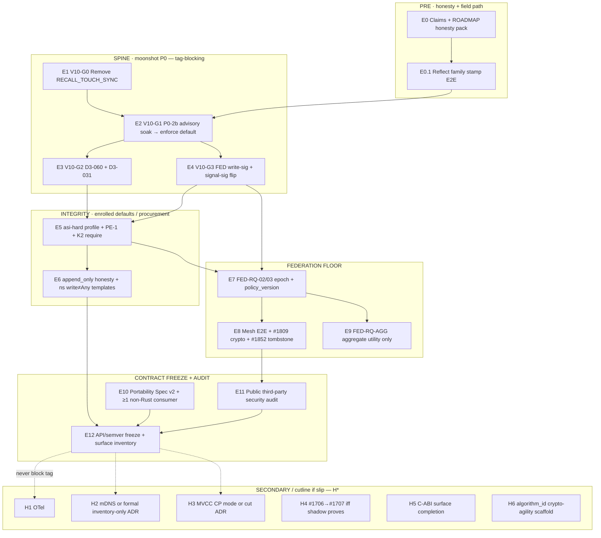

# W7-A2 — Final v1.0.0 Epic DAG (Kickoff SSOT)

| | |
|---|---|
| **Agent** | W7-A2 · Final v1.0.0 epic DAG author |
| **Date** | 2026-07-08 |
| **Working title** | *v1.0.0 — Stable Substrate Contract + Default Integrity + Audited Federation Floor* |
| **Calendar** | **Q2 2027 CONDITIONAL** — slip date, not hollow freeze (W3-A5) |
| **Baseline** | v0.9.0 HEAD · schema **v78** · surfaces: MCP **101** / HTTP **92** routes / CLI **87**/89 · `CURRENT_SCHEMA_VERSION = 78` |
| **Upstream freezes** | W1 ontology · W2 distance radar · **W3** roadmap rewrite + epic shape · **W4** security scorecard + flip ladder |
| **Replaces** | ROADMAP §11.6 as *executable* epic (prose rewrite still R1–R14 in W3-A7); Red Queen §11 v1.0 row list; stale “perfect system by Q2 2027” reading |

---

## 0. One-line charter

> Ship **v1.0.0** as the version where the **wire freezes**, **defaults stop lying**, **third-party audit publishes**, and **federation is mature enough for multi-org *trust*** — not as TRACT L1 / perfect-system / hive-of-millions completion.

**Category (W3-A6, binding):** endpoint-resident **cognitive governance substrate** — never “perfect endpoint AI memory,” never Mem0 feature race.

**Honesty template (W3 + W4, release-notes / capabilities / site):**

> *ai-memory v1.0 is an endpoint-resident cognitive-governance substrate: pure-by-default recall, multi-layer audit machinery, store-path attestation required by default, federation data-lane attestation under secure defaults, verify-only epoch freeze, multi-vendor boundaries, and **enforce-default** decorrelation on **attested** families only (loader-attested ~40% hard cap). Necessary-but-not-sufficient for AGI→ASI frictions. Not a managed memory SaaS, not world-action control, not BFT ASI containment, not capability/semantic judgment of minds, not TRACT L1 complete, not RQGM.*

---

## 1. Wave integration map

| Wave | Freeze | What this epic **must** inherit |
|------|--------|----------------------------------|
| **W1** | Seven properties + S1–S5 ontology | Property IDs on every DoD row; no re-open of axes |
| **W2** | Distance radar + theater list | Defaults-under-install scores; stamp density residual; ban list |
| **W3-A3** | P0 order split | P0-1/2a/4 shipped; **P0-2b + fed P0-3 residual**; V10-G0…G* spine |
| **W3-A4** | CUT discipline | RQGM/viewer/SaaS OUT; L1/L2 contracts + C-ABI + aggregate export IN |
| **W3-A5** | Timeline realism | Contract freeze = v1.0; perfect-system → v1.x+; slip valve |
| **W3-A6** | Category / moat | Governance substrate brand; multi-impl gravity; no R@k-only moat |
| **W3-A7** | Roadmap rewrite priorities | V10-G0–G9 + H\* cutline; R1–R14 doc work; exit C1–C7 |
| **W4-A1** | Crypto succession | Ed25519 not forever; `algorithm_id` → recovery → PQ hybrid order |
| **W4-A2** | Identity / multi-tenant | Shared-key residual; G10.1 / mTLS path as P3 |
| **W4-A3** | ASI threats | REJECT perfect containment; structural shortlist only |
| **W4-A4** | Oversight | Integrity UX YES; capability attestation OUT of TCB |
| **W4-A5** | Fail-closed ladder | WARN-cycle flips; never cold bulk FO→ON |
| **W4-A6** | Erasure dual-plane | Single-node G30 held; fleet erase ban until #1852 |
| **W4-A7** | Security epic P0–P5 | Theater-stop first; audit engagement now; pass after P0–P1 |

**Do not re-argue:** seven axes · W2 scores · “perfect memory” category · RQGM-in-`src/` · CLAIMED-enforce · world kill-switch.

---

## 2. v0.9.0 ship state (what is already DONE — do not re-walk)

| Gate | State | Claim status |
|------|--------|--------------|
| **P0-1** pure recall (#1869 / v77) | **SHIPPED** | `"pure recall"` scoped-allowed; residual: remove `AI_MEMORY_RECALL_TOUCH_SYNC` |
| **P0-2a** model_attestations (D3-012 / #1870 / v78) | **SHIPPED** | loader-attested ~40% hard cap only |
| **P0-2b** N≥3 enforce-as-**default** (D3-021) | **OPEN** — enforce-**capable**, mode default `off` | `"decorrelation enforced"` **BANNED** |
| **P0-3** store attest (#1751) | **SHIPPED** (default ON) | network half open (`FED_REQUIRE_WRITE_SIG` permissive) |
| **P0-4** epoch verify consumer (RQ-10) | **SHIPPED** | verify-only; not after 2b |
| D3-031 consolidate gate | residual / design | may need **5-agent vote (4d3ea1c5)** |
| D3-060 enforce-invariants ship-gate | **OPEN** | required before claim unlock |
| RQ-PARITY-01 / curator unification | largely done at v0.9 | RQ-PARITY-02 residual |
| G13 rotation lineage (v76) | **SHIPPED** | key-**loss** recovery OPEN |
| Dual-plane forget G30 | **SHIPPED** on-node | fleet / #1852 OPEN |

---

## 3. Critical-path DAG (executable)

### 3.1 Mermaid (tag-blocking spine first)

### 3.2 Dependency edges (hard rules)

| Rule | Edge | Why |
|------|------|-----|
| **Theater-prevent** | D3-012 (done) → D3-021 default-on | Never enforce on CLAIMED (W3-A3, W4-A3) |
| **Theater-prevent** | Stamp E2E density → V10-G1 marketing | Sparse stamps = inert enforce (W2-A2 / W4 P0.2) |
| **Claim unlock** | V10-G1 + V10-G2 (+ D3-031) → un-ban `"decorrelation enforced"` | W3-A3 kill-test |
| **Flip safety** | one-cycle WARN → flip FO→ON | #1464→#1751 pattern (W4-A5) |
| **Utility Goodhart** | #1706 shadow divergence proof → #1707 | Never before |
| **Epoch launder** | P0-2a + policy_version → federated epoch | Already local P0-4; mesh is E7 |
| **Audit timing** | Engagement **now**; **pass** after spine + integrity | W4-A7 P3.5 |
| **Freeze timing** | Audit findings closed **before** surface freeze | W3-A5 killer: freeze incomplete spine |
| **Cutline** | Drop H\* before cutting V10-G0–G3 | W3-A7 / A5 |

---

## 4. Ordered epics (E0–E12 + H\*)

Each epic is a **GitHub milestone / parent issue** candidate. Child themes = issue titles under it.

### E0 — Claims honesty + ROADMAP rebase *(docs; start Day 0; parallel forever)*

| | |
|---|---|
| **Goal** | Public category + ROADMAP §0/§2.3/§2.6/§11.5–11.6/§24/§26 match v0.9 code + this DAG |
| **Maps** | W3 R1–R7, R14; W4 HARD BANS; W3-A6 category |
| **Issue themes** | (1) Retitle “perfect memory” → governance substrate · (2) §2.3 record-stop not kill-switch · (3) §26.2 split P0-2a/2b · (4) ban unlocks scoped · (5) surface SSOT counts · (6) purge “bias-displaced by architecture” present-tense · (7) capabilities/honest-limitations pack · (8) competitive **governance-column** harness plan (not only R@k) |
| **DoD** | Release-notes ban table = W4 freeze; no sentence claims default score ≥0.80 without evidence or “opt-in/enrolled” caveat; ROADMAP §11.6 points at this file |
| **Non-goal** | Feature work; score re-litigation |

### E0.1 — Production reflect family stamps *(blocks G1 claim path)*

| | |
|---|---|
| **Goal** | Substrate-invoked reflect/curator paths stamp `model_family` + `loader_observed` so 2.6 is field-fireable |
| **Maps** | W4 P0.2; W2-A2 G2 residual; W3 chair addition |
| **Issue themes** | (1) Reflect write path stamps · (2) Curator cycle stamps · (3) Coverage gauge metrics · (4) Doctor WARN low density · (5) Tests: sparse corpus cannot unlock “enforced” claim in docs CI |
| **DoD** | Dogfood mesh shows non-trivial loader-observed density; gauge exported; G1 soak plan cites coverage |
| **Non-goal** | Raising ~40% loader hard cap; training-family distance |

---

### E1 — V10-G0 · Complete P0-1 permanence

| | |
|---|---|
| **Goal** | Delete or hard-refuse `AI_MEMORY_RECALL_TOUCH_SYNC`; CI pin pure-only |
| **Maps** | W3-A3 V10-G0; #1869 residual |
| **Issue themes** | (1) Remove env + sync path · (2) Migration note for deprecated flag · (3) Extend `tests/recall_purity_p01.rs` · (4) Docs unlock pure-recall claim permanent |
| **DoD** | Zero production path mutates `memories` on recall; fold-only access ladders; cargo test green both backends |
| **Non-goal** | G1.2 ranking still reads `access_count` (P1 parallel, not tag-block) |

---

### E2 — V10-G1 · P0-2b live-flip (decorrelation enforce default)

| | |
|---|---|
| **Goal** | One-cycle **advisory** soak → compiled default **`enforce`** on **attested** monoculture only |
| **Maps** | D3-021; W3-A3; W4 P2.1; #1767 |
| **Depends** | E0.1 (stamp path); E1 recommended; D3-012 shipped |
| **Issue themes** | (1) Deprecation WARN cycle · (2) Default flip + `=off` escape · (3) Coverage-truth metrics in doctor/banner · (4) Operator migration runbook · (5) Anti-theater tests (CLAIMED monoculture never hard-refuse) · (6) Unattested-heavy → advise not refuse |
| **DoD** | Stock install refuses **AttestedMonoculture** with `attested_rows ≥ floor`; CLAIMED-only stays advisory; escape hatch logged |
| **Non-goal** | Vote-independence attestation; claim unlock without E3 |

---

### E3 — V10-G2 · D3-060 + D3-031 enforce-invariants

| | |
|---|---|
| **Goal** | Ship-gate invariants + consolidate-time re-correlation gate |
| **Maps** | D3-060 / D3-031; W3-A4 P1; W4 P2.2–P2.3 |
| **Depends** | E2 |
| **Issue themes** | (1) `tests/decorrelation_enforcement_invariants.rs` · (2) Dual dominance metrics · (3) **D3-031 design vote (4d3ea1c5)** if consolidate semantics cross public contract · (4) Consolidate refuse single-attested-family clusters · (5) CI HARD-BLOCK on claim strings without green gate |
| **DoD** | Invariants green in CI; consolidate path cannot launder monoculture past write-time gate; **only then** un-ban `"decorrelation enforced"` in release surfaces |
| **Non-goal** | RQGM panel breeding |

---

### E4 — V10-G3 · Finish P0-3 network half (federation DATA + signal lanes)

| | |
|---|---|
| **Goal** | `AI_MEMORY_FED_REQUIRE_WRITE_SIG` + `AI_MEMORY_FED_REQUIRE_SIGNAL_SIG` secure default via WARN cycle; emit path complete |
| **Maps** | W4 P0.3–P0.4; W4-A5 P0; #1464 remainder; #1843 |
| **Depends** | none hard on G1; schedule after soak starts to avoid dual self-DOS |
| **Issue themes** | (1) Sender emit `write_signature` · (2) Receive fail-closed + opt-out · (3) Signal author bind to enrolled key · (4) Mesh rollout runbook · (5) Metrics: accepted-claimed federated writes · (6) Doctor CRIT permanent hatch use |
| **DoD** | Default mesh refuses unsigned third-party data-lane / unbound signals; self-authored path documented; escape hatch explicit |
| **Non-goal** | BFT / hostile ASI mesh |

---

### E5 — Integrity tier · `asi-hard` / procurement profile

| | |
|---|---|
| **Goal** | Named boot profile fails closed if witness+role+attest+decorrelation pins missing; productize integrity UX |
| **Maps** | W4 P0.5–P0.6, P1.1–P1.7, P2.4; W4-A3/A4/A5 |
| **Depends** | E2–E4 in progress or done for profile defaults |
| **Issue themes** | (1) Profile: `asi-hard` / procurement TOML · (2) Unsigned-daemon refuse in serve/mcp production · (3) `REQUIRE_WITNESS` + `REQUIRE_ROLE_SEPARATION` after enroll · (4) PE-1 `enforce` + non-empty `required_events` in templates · (5) `REQUIRE_API_KEY=1` non-stdio · (6) Off-host log sink · (7) Cause-hash writers universal before `REQUIRE_CAUSE_BINDING` advertise · (8) Oversight one-screen: chain/witness/roles/refusals; capability **NOT ASSESSED** · (9) Secure-default matrix doc |
| **DoD** | Boot refuse when pins missing under profile; doctor `--security` matrix; UX never paints green chain as “safe mind” |
| **Non-goal** | Semantic ASI-truth judge; capability certificates in core |

---

### E6 — Append-only honesty + namespace governance templates

| | |
|---|---|
| **Goal** | Binary honesty on append-only / no-silent-delete; close allow-on-silence write:Any for production templates |
| **Maps** | W4 P1.5–P1.6; W3-A5 must-ship #8; #1823 G6 residual posture |
| **Depends** | E5 templates can compose |
| **Issue themes** | (1) `APPEND_ONLY` integrity tier ON in profile **or** capabilities refuse “append-only” claim when off · (2) Migration runbook COW/revisions · (3) Production ns standards: write/promote ≥ registered · (4) Doctor WARN open namespaces · (5) cid / dual-truth ADR if freeze risks UUID forever (T4 vote before freeze) |
| **DoD** | Stock procurement profile is append-only; open ns cannot claim governed writes under silence; ADR for identity authority if dual-truth remains |
| **Non-goal** | Full Claim algebra (G22) |

---

### E7 — V10-G6 · Federated epoch + policy_version floor

| | |
|---|---|
| **Goal** | FED-RQ-02/03 — content-signed epoch manifest cluster-wide + refuse stale `policy_version` |
| **Maps** | Red Queen v1.0 table; W3 V10-G6; W4 P3.3 |
| **Depends** | Local P0-4 shipped; E4 recommended; F-41/policy_version |
| **Issue themes** | (1) Checkpoint-bound federated manifest · (2) Cross-node gate · (3) Fail-closed both backends · (4) Within-epoch-frozen invariant test · (5) **T1/T4 5-agent vote** on epoch↔Checkpoint binding if not already closed |
| **DoD** | Manifest propagates; stale push rejected; no CLAIMED diversity laundered into signed epoch |
| **Non-goal** | In-src RQGM optimizer; hive-of-millions ops proof |

---

### E8 — Federation E2E mesh maturity + dual-plane fleet residual

| | |
|---|---|
| **Goal** | Multi-node chaos green; E2E payload posture beyond mTLS; mesh tombstone / un-forget honesty |
| **Maps** | F-53/#1809; W3-A5 #11–12; W4 P3.2/P3.4; W4-A6 E1/E2; #1852 |
| **Depends** | E4, E7 in parallel ok for crypto vs epoch |
| **Issue themes** | (1) Multi-node E2E campaign + DLQ + anti-resurrection · (2) Encryption threat model (transport vs seal) · (3) #1852 signed tombstone propagation + authorized un-forget · (4) Ship-gate: no fleet-wide erase claim until green · (5) Archive≠forget claims discipline |
| **DoD** | Documented mesh threat model; E2E suite green; #1852 either shipped with claim unlock **or** explicitly DEFER with ban retained |
| **Non-goal** | Byzantine mesh; claim “forget erases fleet” without gate |

---

### E9 — FED-RQ-AGG · Privacy-preserving aggregate utility

| | |
|---|---|
| **Goal** | Signed quantized aggregate utility only — **never** raw rates / leaderboards |
| **Maps** | Red Queen FED-RQ-AGG; W3-A4 aggregate export IN; §25.5 CUT |
| **Depends** | #1706 shadow preferably active |
| **Issue themes** | (1) Aggregate export surface · (2) Wire forbid raw per-row utility · (3) Grep CI ratchet · (4) L3 sibling can consume aggregate only |
| **DoD** | No raw utility on wire; signed aggregate verify path; CI blocks leaderboard fields |
| **Non-goal** | Federated learning of recall weights (v1.x) |

---

### E10 — Portability Spec v2 + multi-impl gravity

| | |
|---|---|
| **Goal** | Frozen export/import + golden vectors + **≥1 non-Rust reference consumer** (TS or Python as *spec client*) |
| **Maps** | W3-A5 #15; W3-A6 moat #5; V10-G9 |
| **Depends** | Stable enough shapes pre-freeze; parallel with E11 |
| **Issue themes** | (1) Spec v2 schema · (2) Golden vectors · (3) SDK consumer round-trip · (4) Conformance harness skeleton (G24 start, not “TRACT L1 done”) · (5) C-ABI/FFI progress as endpoint physics (not language SDK product) |
| **DoD** | Second language reads golden corpus; CI conformance job; **no** claim of full multi-impl program complete |
| **Non-goal** | Second full substrate in-tree; Swift/Kotlin product SDKs |

---

### E11 — Public third-party security audit

| | |
|---|---|
| **Goal** | Named firm, published report; engagement early; **pass** after spine |
| **Maps** | W3-A5 #5; W4 P3.5; ROADMAP §11.6 |
| **Depends** | Engagement: Day 0; Pass: after E1–E6 (+ E4) preferred |
| **Issue themes** | (1) Engagement kit (W4 residual list) · (2) Scope: ns inheritance, sig verify, approval sweeper, HMAC privileged, attest chain, federation, secret-screen, forget/tombstone · (3) Findings → fix issues · (4) Publish report + remediation matrix |
| **DoD** | Public report URL; all Critical/High closed or accepted with operator-signed residual; no ASI-survival claim from audit alone |
| **Non-goal** | Audit as marketing substitute for defaults |

---

### E12 — API / semver freeze + release gates *(tag cut)*

| | |
|---|---|
| **Goal** | Freeze MCP/HTTP/CLI/SAL crossing surfaces; major-version strength gates; cut `v1.0.0` |
| **Maps** | W3-A5 contract; V10-G8; §17 panel on strategic claims |
| **Depends** | E0–E11 tag-blocking subset green; H\* either done or formally cut with ADR |
| **Issue themes** | (1) Versioned surface inventory contract · (2) Drift gates on counts · (3) Capabilities schema freeze · (4) #1171 panel on strategic claims · (5) Full CI + DO postgres+AGE 3-green + dogfood 3-green + mobile cross-compile + cargo audit · (6) GPG-signed tag · (7) Docs/Pages 3×7 drift pass · (8) Manifest lockstep (Cargo + SDKs) |
| **DoD** | See §6 Tag Definition of Done |
| **Non-goal** | Freeze = perfect-system complete |

---

### H\* — Secondary track (cutline if slip — never block G0–G3)

| ID | Theme | Disposition if late |
|----|--------|---------------------|
| **H1** | OpenTelemetry spans (no content; no phone-home) | Ship or ADR “file-only sinks through v1.0” |
| **H2** | mDNS auto-discovery | Ship **or** formal cut: inventory-file-only is the contract |
| **H3** | MVCC / CP mode per-namespace | Ship opt-in **or** cut ADR; CRDT-AP remains default |
| **H4** | #1706 production wire → conditional #1707 | **Only if** shadow proves divergence; else keep weight-0 |
| **H5** | C-ABI / staticlib surface completion | Prefer ship for endpoint physics; wrappers stay OUT |
| **H6** | `algorithm_id` on signables (W4-A1 step 1) | Scaffold OK; full PQ hybrid = v1.x |
| **H7** | RQ-PARITY-02 curator/SAL residual | Prefer green; not moonshot P0 |
| **H8** | RQ-VI-01 vote-independence **estimator** (advisory, un-attestable) | Document ceiling; never claim attestation |
| **H9** | G17 key-loss recovery VERIFY | Prefer path; not required to freeze if G13 rotation claimed only |
| **H10** | Capture L3 / refusal-as-content / floor physics | Continuity security; parallel P5 |

**Rule:** If calendar pressure hits, **slip Q2 → Q3/Q4 2027** before absorbing H\* into tag-blocking or cutting G0–G3.

---

## 5. Issue theme index (by epic — for tracker filing)

| Epic | Suggested parent label | Child issue themes (file one issue each) |
|------|------------------------|------------------------------------------|
| E0 | `v1.0-honesty` | Category rewrite · §26.2 split · ban table SSOT · surface counts · kill-switch→record-stop · competitive governance harness |
| E0.1 | `v1.0-2.6-stamps` | Reflect stamps · curator stamps · coverage gauges · doctor density |
| E1 | `v1.0-G0-pure` | Remove RECALL_TOUCH_SYNC · purity CI · docs unlock |
| E2 | `v1.0-G1-enforce` | Advisory soak · default flip · escape hatch · anti-theater tests · runbook |
| E3 | `v1.0-G2-invariants` | D3-060 tests · D3-031 design+impl · claim-string CI |
| E4 | `v1.0-G3-fed-sig` | Write-sig emit · write-sig default · signal-sig default · mesh rollout · hatch metrics |
| E5 | `v1.0-asi-hard` | Profile boot · unsigned refuse · K2 require · PE-1 templates · API key · oversight UX · doctor security |
| E6 | `v1.0-append-ns` | append_only default/profile · ns standards templates · identity dual-truth ADR |
| E7 | `v1.0-fed-epoch` | FED-RQ-02 · FED-RQ-03 · epoch frozen invariant · binding vote if needed |
| E8 | `v1.0-fed-e2e` | Multi-node campaign · #1809 · #1852 · claims ban retention |
| E9 | `v1.0-fed-agg` | Aggregate export · raw-rate CI ban · sibling contract |
| E10 | `v1.0-portability` | Spec v2 · golden vectors · TS/Py consumer · G24 skeleton · C-ABI |
| E11 | `v1.0-audit` | Engagement · scope · findings triage · public report |
| E12 | `v1.0-freeze` | Surface inventory · semver gates · panel · release sequence |
| H\* | `v1.0-secondary` | One issue per H1–H10 |

---

## 6. Definition of Done

### 6.1 Tag-blocking DoD (`v1.0.0` may cut only when all true)

| ID | Criterion | Property / source |
|----|-----------|-------------------|
| **C1** | Record-stop non-silent on daemon writes under procurement / `asi-hard` (PE-1 enforce + required events) | 2.3 / S1 · W3 C1 |
| **C2** | Store **and** relay data-lane attestation posture honest (no silent claimed-majority under defaults after E4) | 2.5 / S2 · W3 C2 |
| **C3** | Decorrelation **enforce-default** on attested families; `"decorrelation enforced"` unlocked only after E2+E3; loader ~40% caveat loud | 2.6 · W3 C3 |
| **C4** | Pure recall permanent (no sync escape) — E1 | S4 · W3 C4 |
| **C5** | Wire frozen + third-party audit **published** + Critical/High remediated | ops / 2.5 · W3 C5 |
| **C6** | Portability Spec v2 + ≥1 non-Rust consumer (gravity **starts**) | A6 · W3 C6 |
| **C7** | Explicit non-claims in release notes (loader cap; P2=0%; no world kill-switch; no TRACT-L1-done; no perfect ASI containment) | honesty · W3 C7 · W4 |
| **C8** | Federation floor: FED-RQ-02/03 green **or** ADR-deferred with no “federation mature” claim | W3-A5 |
| **C9** | Dual-plane forget: single-node held; fleet claim only if #1852 green else banned | W4-A6 |
| **C10** | Release gates: full CI matrix · DO PG+AGE 3-green · dogfood 3-green · mobile cross-compile · `cargo audit` · signed tag · docs/Pages pass | W3-A5 #19 · v0.9 gate pattern |
| **C11** | Four cargo gates green on freeze commit; surface inventory pinned; capabilities schema version locked | E12 |
| **C12** | No eternity CUT violations: RQGM in `src/` · CLAIMED-enforce · raw utility leaderboards · hooks.toml-as-epoch | W3-A4 · §25.5 |

### 6.2 Epic-level DoD (per epic exit)

Each epic exits only when:

1. Code + regression tests land on `release/v1.0.0` (or agreed integration branch).  
2. Claims / ban table updated if unlocks fire.  
3. `doctor` / boot banner reflects new defaults.  
4. Handoff memory or issue comment cites **wave IDs** + **code anchors**.  
5. For FO→ON flips: one-cycle deprecation WARN evidence in CHANGELOG.

### 6.3 “Done enough” under slip

If date slips: **never** ship tag with G0–G3 incomplete. Prefer incomplete H\* + honest “inventory-only discovery” ADR over green theater.

---

## 7. Non-goals (binding — refuse on sight)

### 7.1 Eternity / category (never in this monorepo as product)

| Non-goal | Source |
|----------|--------|
| RQGM / co-evolving evaluators / population search in `src/` | W3-A4 · §25 · L3 CI |
| `enforce` on **CLAIMED** model_family | §25.3 · W3/W4 |
| WebSocket viewer / schema-tools product / bare KB / SaaS multi-tenant core / orchestration product / dual Plugin SDK | §13/§16 |
| Governance auto-mutation; panel-as-MCP; hooks.toml-as-epoch; raw utility leaderboards; L2+L3 merge flag | §25.5 |
| Extra DB backends beyond SQLite + Postgres(+AGE) | §16 |
| World-action kill-switch / perfect ASI containment / BFT hostile mesh | W4-A3 · W2 |
| Capability attestation / semantic truth judge in core claims | W4-A4 |
| Ed25519 forever as sole long-horizon identity | W4-A1 |
| Total audit wipe for “no residue”; soft-delete-only as Art.17 | W4-A6 |
| Brand “perfect endpoint AI memory” | W3-A6 |

### 7.2 Deferred to **v1.x / v2.x** (not tag-blocking)

| Bucket | Items |
|--------|--------|
| **TRACT L1 residual** | Full Claim algebra (G22); full CC0 multi-impl program (G24 beyond skeleton); open-predicate kernel (G19); claim-level bitemporal (G20); Landauer gradient (G15) |
| **Crypto / recovery** | Full PQ hybrid production suite; M-of-N threshold recovery complete; mandatory client-side sealing sole posture; federated lineage visibility complete |
| **Hive / ASI horizon** | Thousands-to-millions ops proof; multi-region consensus; MPC/FHE/DP full primitive; federated recall-weight learning |
| **Vector exotic (§23.7)** | RaBitQ-IVF, TurboQuant, residual VQ, GPU, per-ns HNSW shards |
| **Proof-impossibles** | Vote-independence attestation; signer≠thinker; singleton-ASI counterparty |
| **Polish** | TOON v2; skill marketplace protocol; cross-modal first-class embeddings |

### 7.3 Sibling-only (consume substrate; never block tag)

`ai-memory-rqgm` · `ai-memory-viewer` · `ai-memory-schema-tools` · `ai-memory-eval-panel` · `alphaone-dev-skills` — direction **sibling → substrate only**.

---

## 8. Secure-default flip ladder (W4-A5 — operational)

| Order | Flip | Mode | Self-DOS risk |
|------:|------|------|---------------|
| 1 | Stamp path live (E0.1) | feature | low |
| 2 | Decorrelation advisory soak | env/config | low |
| 3 | Decorrelation **enforce** default (E2) | compiled + escape | medium (coverage) |
| 4 | FED write-sig + signal-sig (E4) | WARN→ON | **high** if cold |
| 5 | PE-1 + required_events templates (E5) | profile | medium (empty list theater) |
| 6 | REQUIRE_WITNESS / ROLE after keys (E5) | COND | medium (false dirty) |
| 7 | APPEND_ONLY integrity profile (E6) | profile | high ops change |
| 8 | Namespace write≠Any templates (E6) | config | high (open ns) |
| 9 | REQUIRE_API_KEY production (E5) | template | medium |
| — | Never cold-flip all FO→ON in one release | — | **banned** |

---

## 9. Claims unlock matrix (release surfaces)

| Claim | Banned until | Epic |
|-------|--------------|------|
| `"decorrelation enforced"` / bias-displaced by architecture | E0.1 + E2 + E3 green | E2–E3 |
| `"secure-by-default attestation"` (store+relay) | E4 green | E4 |
| `"pure recall"` permanent | E1 | E1 |
| `"federation mature"` / FED-RQ done | E7 + E8 (floor) | E7–E8 |
| `"forget erases fleet-wide"` | #1852 ship-gate | E8 |
| `"cryptographic non-repudiation by default"` | enrolled keys + witness + unsigned refuse | E5 |
| `"append-only spine held"` | E6 profile ON or capabilities refuse | E6 |
| `"TRACT-L1-conformant"` | **perma-ban at v1.0** (G24 skeleton ≠ done) | — |
| `"implements RQGM"` | **perma-ban in-repo** | — |
| `"perfect ASI containment"` / unscoped kill-switch | **perma-ban** | — |
| `"multi-tenant NHI isolation"` under shared API key | per-agent authn (H\* / v1.x) | W4-A2 |
| Vote-independence / process-level diversity | **never** (estimator only H8) | — |

---

## 10. Suggested calendar phases (Q2 2027 conditional)

| Phase | Window (indicative) | Epics | Exit |
|-------|---------------------|-------|------|
| **P-A** Foundation | now → +6–8 w | E0, E0.1, E1, audit **engage** | Honesty pack live; pure permanent; stamps flowing |
| **P-B** Default integrity | +2–4 mo | E2, E3, E4 start | Enforce-default + invariants; fed sig WARN cycle |
| **P-C** Integrity tier + mesh | +4–7 mo | E5, E6, E4 complete, E7 start | `asi-hard` bootable; append honesty |
| **P-D** Federation floor + portability | +6–9 mo | E7, E8, E9, E10 | Floor green; Spec v2 consumer |
| **P-E** Audit pass + freeze | +8–11 mo | E11 pass, E12, H\* cut/ship | Tag cut **or** slip date |

Velocity is free variable (single-operator AI-accelerated). **Invariant:** P-A/P-B not skipped for P-D candy (mDNS/MVCC).

---

## 11. Crossroads vote triggers (inside epic — 4d3ea1c5)

Run **5-agent adversarial vote** before acting when any `Tn` holds:

| T | Likely epic |
|---|-------------|
| **T1** public contract / schema / MCP-HTTP-CLI shape | E3 D3-031, E7 epoch bind, E12 freeze set, E10 Spec v2 |
| **T2** sync↔async boundary | E8 mesh workers, H1 OTel |
| **T3** security posture FO↔FC | E2, E4, E5, E6 flips |
| **T4** hard-to-reverse representation | E6 dual-truth ADR, E7 manifest bytes, H6 algorithm_id |
| **T5** deviation from this DAG or issue AC | any |
| **T6** ≥2 paths no precedent | E3 consolidate gate, E8 encryption threat model |

Exempt: internal renames, comment-only, single-correct bugfix, copy existing flip pattern.

---

## 12. Kickoff checklist (operator / orchestrator)

- [ ] File parent epic issues E0–E12 (+ H\* bucket) with this doc linked  
- [ ] Milestone `v1.0.0` on tracker; no G15–G31 / §16 product / RQGM-in-src  
- [ ] Branch `release/v1.0.0` (or `plan/v1.0.0-epic`) from post-v0.9 HEAD  
- [ ] ROADMAP §11.6 rewrite PR points here (W3 R8–R9)  
- [ ] Security audit RFP / engagement kit (W4 handoff)  
- [ ] Seed ai-memory decision memory: *v1.0 = contract + default integrity + audit + federation floor*  
- [ ] Freeze public category language (no “perfect memory”)  
- [ ] Confirm stamp density probe before scheduling E2 marketing  
- [ ] Never cold-flip FED write-sig + enforce + append_only same week  

---

## 13. Success criteria (wave-close for W7-A2)

| Check | Status in this doc |
|-------|--------------------|
| Ordered epics E0–E12 + H\* | **Yes** |
| Issue themes per epic | **Yes** §5 |
| DoD tag + epic | **Yes** §6 |
| Non-goals eternity + defer + sibling | **Yes** §7 |
| Integrates W3 (category, P0 split, cuts, timeline, V10-G\*) | **Yes** |
| Integrates W4 (scorecard, flips, bans, dual-plane, succession order) | **Yes** |
| Integrates Red Queen v1.0 row list without perfect-system co-schedule | **Yes** |
| Executable without theater | **Yes** if G0–G3 hold cutline |

---

## 14. Killer risks (carry forward)

1. **Freeze wrong contract** — soft defaults + green audit language + “API stability” (W3 killer).  
2. **Enforce-default without stamp coverage** — false diversity confidence (W3-A3 / W4).  
3. **Category collapse** to agent-memory SaaS (W3-A6).  
4. **Cold FO→ON self-DOS** mesh (W4-A5).  
5. **Green chain sold as capability/safety** (W4-A4).  
6. **Fleet forget claims** while mesh residual open (W4-A6).  

**Mitigant stack:** this DAG’s cutline · ban matrix · WARN-cycle flips · honesty pack · slip date.

---

## 15. Chair-ready one paragraph (for ROADMAP §11.6 replacement blurb)

**v1.0.0 (target Q2 2027, conditional)** freezes the substrate **contract** and raises **default integrity** to match moonshot properties under a named procurement posture: permanent pure recall; attested-family decorrelation **enforce-default** with D3-060; federation data/signal attestation secure-by-default; enrolled multi-key audit require-modes; append-only honesty; federated epoch/policy floor; privacy-preserving aggregate utility only; Portability Spec v2 with a non-Rust consumer; and a **published** third-party security audit. Secondary ops (mDNS, MVCC, OTel, live utility ranking, full crypto-agility) ride a cutline — slip the date rather than hollow the freeze. Perfect-system / TRACT L1 / hive-of-millions / RQGM-in-tree remain **explicit non-goals**. Full DAG: `waves/w7-a2-v1-epic-dag.md`.

---

*W7-A2 · Final v1.0.0 epic DAG · integrates W3-A3–A7 + W4-A1–A7 + Red Queen v1.0 rows · kickoff SSOT · `/Users/fate/Downloads/ai-memory-mcp/waves/w7-a2-v1-epic-dag.md`*
