# W7-A4 — Perfect-System Target Architecture (Final Design)

> **Agent:** W7-A4 (Perfect-system architecture)  
> **Date:** 2026-07-08  
> **Lens:** End-state architecture — what the *perfect* endpoint cognitive-governance substrate **is**, as a design target  
> **Binds (do not re-argue):**  
> - W1 ontology (seven properties + S1–S5)  
> - W2 distance radar (held-fraction under defaults)  
> - W3 category ban on “perfect memory” · v1.0 ≠ perfect-system · L1/L2 contracts IN · RQGM OUT  
> - W4 security scorecard · fail-closed ladder · dual-plane erasure  
> **Canonical sources:** `ROADMAP.md` §0–§6 · §13 · §25 · §26 · `docs/design/TRACT-the-definitive-endpoint-ai-memory.md` · `docs/strategy/moonshot-synthesis.md` · waves `w3-a4` / `w3-a7` / `w4-a7`

---

## 0. Naming discipline (read first)

| Phrase | Meaning in this document |
|---|---|
| **Perfect system** | The **design target** — full TRACT constitution + moonshot seven properties held *by architecture*, under defaults, with L1/L2/L3 separation-of-powers. **Not** a product brand. **Not** v1.0. |
| **v1.0 contract freeze** | Audited governance-substrate floor (W3-A5/A7). Necessary rung; **incomplete** perfect system. |
| **TRACT-2026** | Named L3-BODY **Reference Profile** (SQLite/HNSW/FTS + current surfaces) that *ships as* L0/L1 conformance vectors — swappable later without forking meaning. |
| **Category** | **Endpoint-resident cognitive governance substrate** (attested, stoppable, federated, bias-displaced under attested N≥3). **Banned brand:** “perfect endpoint AI memory” (W3-A6). |

**One-line target:**

> A deliberately under-intelligent continuity organ that lets any mind remain itself across time by holding a content-addressed, provenance-bound, owner-governed, forgettable, tiered record of attested claims — attesting *process*, never adjudicating *truth* — with separation-of-powers so the verifier is never the player.

---

## 1. Two L-stacks (do not collapse)

The perfect system uses **two orthogonal L-axes**. Conflating them is the #1 design failure mode.

| Axis | Levels | Question answered |
|---|---|---|
| **A · Separation-of-powers (RQ / moonshot)** | L1 substrate · L2 curator · L3 RQGM sibling | Who may *persist*, *freeze*, *optimize*? |
| **B · Altitude / durability (TRACT)** | L0 constitution · L1 eternal core · L2 mechanics · L3 periphery | What is *frozen forever* vs *replaceable silicon*? |

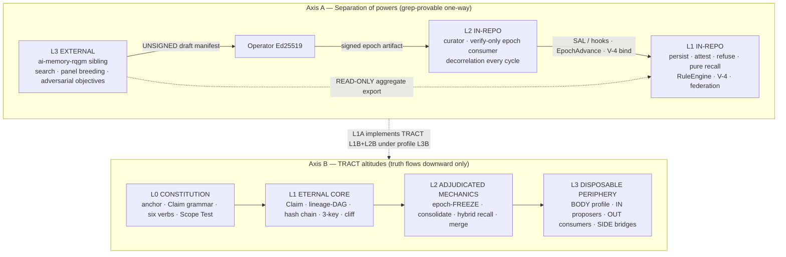

**Hard rules (eternity):**

1. `rg -i 'rqgm|epoch_manifest|red.?queen' src/` = **0** forever (`check-l3-boundary.sh`).  
2. No flag merges L2+L3 into one process.  
3. L3 may **never** compile-depend on substrate internals; substrate may **never** import L3.  
4. If **all** of Axis-B L3 dies, Axis-B L1 still rebuilds the mind.  
5. L2 is **verify-only** for epoch law — optimizer is external and **killed as in-process player**.

---

## 2. System context (perfect deployment topology)

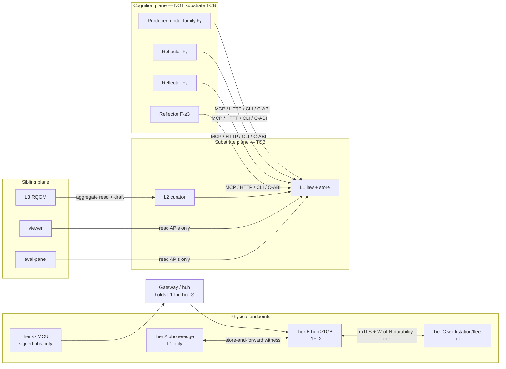

**Capability cliff (TRACT):** the substrate **attests, counts, freezes**. It never judges whether a superior mind’s content is *true*, *safe*, or *aligned*. Oversight of ASI is **integrity UX over the record**, not semantic grading of the mind (W4-A4).

---

## 3. Axis A — L1 / L2 / L3 in depth

### 3.1 L1 — Substrate (law + persistence)

**Home:** `ai-memory` monorepo (`src/`).  
**Role:** The only place durable cognitive artifacts land.

| Domain | Perfect-system obligation |
|---|---|
| **Persist** | ASSERT / RELATE / SUPERSEDE / FORGET as **append-first** paths; UUID operational PK may coexist, but **cid / content-address** is authoritative identity for meaning |
| **Recall** | **Pure read** — zero mutation of `memories` on recall path; access signal is ledgered then **folded** off-path (P0-1 permanence; no `RECALL_TOUCH_SYNC` escape) |
| **Attest** | Store + federation DATA + authority lanes require attestation by default; claimed is a **labeled degradation**, never silent majority |
| **Refuse** | Typed refusal-as-data (hooks, depth, tier-lock, secret-screen, decorrelation, governance); record-stop ≠ world kill-switch |
| **RuleEngine** | Operator-signed only; **read-only** to agents; three-key Recorder ≠ Judge ≠ Stopper when enrolled |
| **Audit** | V-4 chain + cause-binding + independent witness + role separation **require-modes ON** after key enroll |
| **Decorrelate** | Write-time **and** consolidate-time N≥3 on **attested** families only; enforce inert on CLAIMED (theater ban) |
| **Identity** | Self = signed lineage-DAG; rotation + ante-mortem succession; M-of-N recovery; crypto-agility (`algorithm_id`) |
| **Federation** | Local-first commit; W-of-N = durability **tier** not write gate; causal `fork_set`; quarantine inbound |
| **Erasure** | Dual-plane: forget is witnessed tombstone + purge (DLQ, HNSW, replicas via tombstone-subscription); forensics retain **identity-only** where law demands |
| **Portability** | C-ABI / staticlib+cdylib + cross-compile; Portability Spec + ≥2 interoperable impls (CC0 vectors) |
| **Surfaces** | MCP + HTTP + CLI as three equal APIs over one SAL; no viewer/UI in-daemon |

### 3.2 L2 — Curator (verify-only freeze + maintenance)

**Home:** same binary / `ai-memory curator`, still monorepo.  
**Role:** Bounded maintenance **inside** the law; **never** invents epoch law.

| Duty | Perfect posture |
|---|---|
| Epoch consumer | Verify `SignableEpochManifest` → bind `EpochAdvance` checkpoint → V-4 `epoch.manifest_applied` |
| Decorrelation | Run every cycle; advisory→enforce only on attested families; dominance + quorum N |
| Compaction | Consolidation with D3-031 re-correlation gate; tombstone sources when lineage DAG ON |
| Capture | L1 agent discipline + L2 recover-on-boot + **L3 substrate watcher** (filesystem notify) + L4 turn capture — layered, not single-point |
| Reflect | Bounded depth; stamps `model_family` + `loader_observed`; refuses self-attestation of reflections |
| Export for L3 | Privacy-preserving **aggregate** utility / dominance only — never raw rates or public leaderboards |

### 3.3 L3 — RQGM sibling (external optimizer)

**Home:** `ai-memory-rqgm` (sibling, never `src/`).  
**Role:** Search, panel breeding, adversarial objectives — **player**, not referee.

```
L3 READS  → aggregate telemetry exports (read-only)
L3 WRITES → one UNSIGNED epoch_manifest draft
Operator  → Ed25519 signs draft (out of band)
L2        → verifies signature + schema + binds to chain
L1        → holds frozen-within-epoch law as data, not as L3 code
```

**Why external forever:** welding the optimizer into the verifier falsifies §2.6 (separation-of-powers) and the TRACT cliff. Perfect systems are **federations of roles**, not monorepos of features (W3-A4).

### 3.4 Other siblings (perfect consumption graph)

| Sibling | Consumes | Must never |
|---|---|---|
| `ai-memory-viewer` | read APIs, metrics, signed_events | embed in daemon / write law |
| `ai-memory-schema-tools` | schema SSOT / migrations **definitions** | become second substrate |
| `ai-memory-eval-panel` | read APIs + #1171 methodology | rewrite epoch slots via MCP |
| `alphaone-dev-skills` | source-URI knowledge | store bare wiki propositions as L1 truth |

---

## 4. Axis B — TRACT altitudes (perfect data/trust stack)

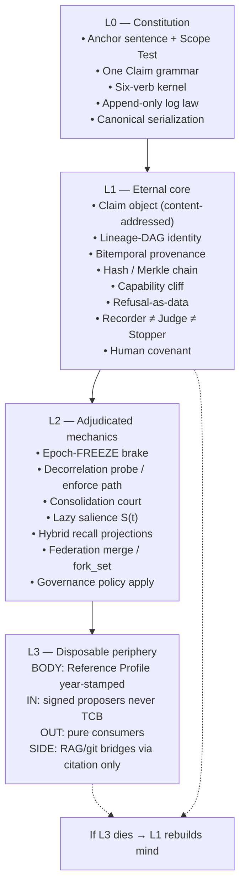

### 4.1 Six-verb kernel (perfect surface)

| Verb | Law |
|---|---|
| **ASSERT** | Add Claim with provenance; born *claimed* |
| **RELATE** | Typed directional signed edge |
| **RECALL** | Owner-scoped relevance — **pure read** |
| **ATTEST** | Raise claimed → attested (only trust upgrade path) |
| **SUPERSEDE** | Forward correction; **no silent UPDATE** |
| **FORGET** | Witnessed erasure + tombstone; **no silent DELETE** |

Everything else (MCP tools, HTTP routes, CLI verbs, skills, actions, signals, checkpoints) **composes** from these — or lives at L2/L3 as non-authoritative mechanics.

### 4.2 Recall purity + CONSUME (perfect read path)

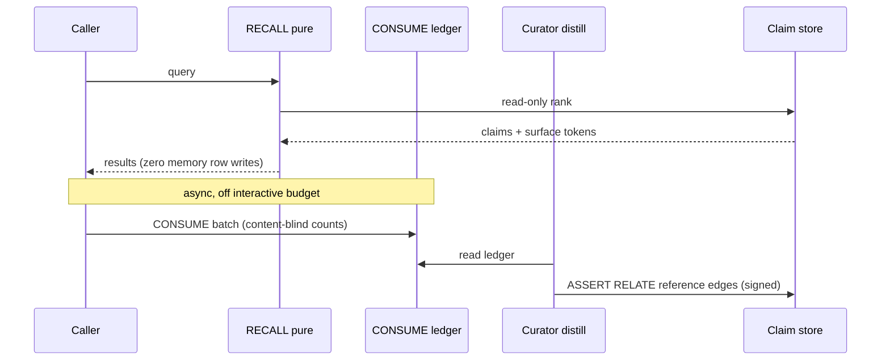

**Landauer discipline:** reading is cheap/reversible; erasure is the expensive irreversible act. Reads never tax the store.

---

## 5. Endpoint tiers (silicon map, not nameplate L1 fields)

**L1 law (silicon-independent):**  
`tier(Claim, endpoint) = f(joules_to_retrieve, latency, light_cone_distance)`.  
No fixed byte-count is constitutional.

**TRACT-2026 measured instantiation (swappable):**

| Tier | Hardware sketch | Hosts | Cannot claim |
|---|---|---|---|
| **∅** | MCU 64–256 KB | Signed observations only; **gateway holds L1** | Local pure semantic recall, curator, full audit independence |
| **A** | Phone / edge &lt;256 MB RSS class | L1 store + pure recall; no full curator | Epoch breeding, heavy reflect, full 3-key hub |
| **B** | Hub ≥1 GB | L1 + L2 curator + local witness raise | Multi-org BFT; hive-of-millions alone |
| **C** | Workstation / fleet node | Full profile: federation, AGE option, 3-key, RQGM export | ASI behavioral containment |
| **∞** | Gradient itself | Same Claim, different residency; remote = **enrichment never dependency** | — |

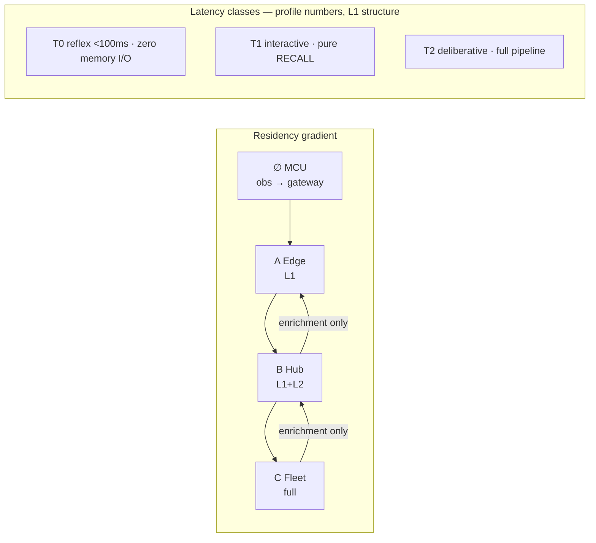

**Witness_level degrades honestly (never backdates independence):**  
`threshold` → `deferred` → `counter` → `bare`. Tier ∅ emits `bare`; gateway raises on contact.

**Floor honesty (moonshot correction D-OPUS-5):** real binary floor ~31 MB / ~18–25 MB idle RSS — tens-of-MB endpoints, not kilobyte MCUs for self-host L1.

---

## 6. Properties — perfect held-state

### 6.1 Moonshot seven (§2) — what “held” means at perfect

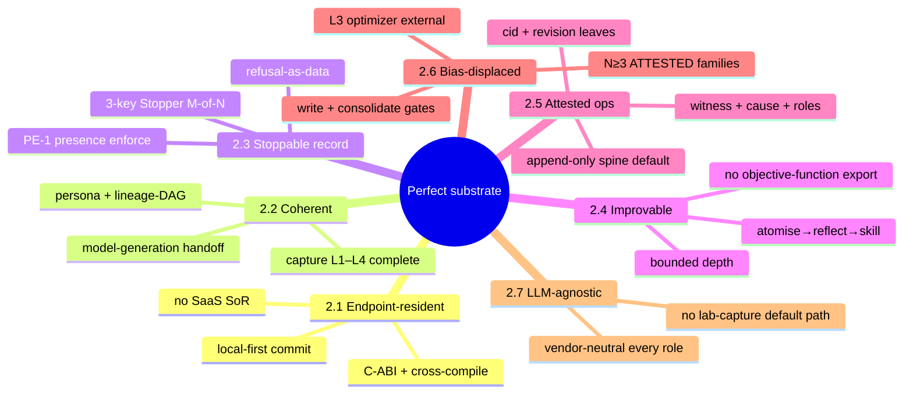

| Prop | Perfect held criterion (falsifiable) |
|---|---|
| **2.1** | Any Tier ≥A node commits locally without cloud; Tier ∅ via gateway; light-cone recall correct offline |
| **2.2** | Agent identity + corpus survive process death, model swap, and SIGKILL mid-dialog (capture L1–L4) |
| **2.3** | Every deny is a typed, auditable row; phantom-context “as if write landed” impossible; **record-stop only** (no world kill-switch claim) |
| **2.4** | Skills/reflections compound across model gens; reflection cannot rewrite reflection machinery |
| **2.5** | Under enrolled defaults, every state-changing op is non-repudiable; green `verify-audit-trail` implies require-modes satisfied |
| **2.6** | Reflection admission / consolidate refuse monoculture on **attested** families; CLAIMED never green-checks enforce |
| **2.7** | Producer/reflector/curator roles swappable without code fork; no single-vendor required for core path |

### 6.2 Structural S-properties (W1 bind — perfect targets)

| ID | Name | Perfect posture |
|---|---|---|
| **S1** | Hold / refuse classes | Secrets refuse; namespace write not Any-by-silence; governance fail-closed |
| **S2** | Authority ≠ data | Action transitions + signals author-bound; memory lane attested on mesh |
| **S3** | Capture under death | L3 watcher + L4 idempotent turn capture complete the #1389 stack |
| **S4** | Anti-launder envelope | Pure recall permanent; dual identity resolved (cid authority / UUID operational or migration ADR closed) |
| **S5** | Capability cliff | No semantic ASI judge in TCB; attest-only oversight |

### 6.3 Explicit non-properties (perfect system still refuses these claims)

- World-action kill-switch / behavioral ASI containment  
- Vote-independence **proof** (estimable only)  
- Signer = thinker  
- “Implements RQGM” inside `src/`  
- BLAKE3-primary without dual-truth ADR if UUID still LWW  
- Capability/model-state attestation as full DeepMind capability standard  
- Hive-of-millions BFT under hostile peers  

These are **honesty features** of the perfect design, not backlog bugs.

---

## 7. Trust, identity, federation (perfect spine)

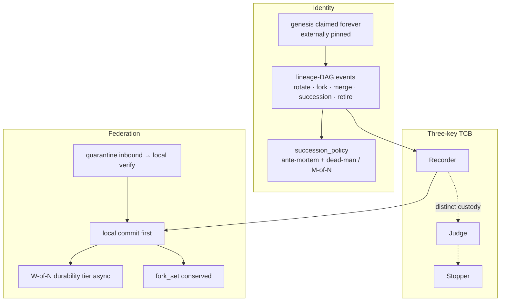

**Secure-default matrix (perfect ops, not cold-flip theater):**

| Domain | Perfect default |
|---|---|
| Store attestation | ON (v0.9 #1751 already) |
| Fed envelope / nonce / peer enrollment / transition sig | ON |
| Fed write-sig + signal-sig | ON after one-cycle WARN (W4-A5 ladder) |
| Secret screen | refuse (caller); redact degrade on receive |
| Append-only spine | ON |
| Decorrelation | enforce on attested N≥3 after soak + D3-060 |
| Witness / role / identity lineage require | ON **after** key enroll (never greenwash empty install) |
| PE-1 hooks | enforce + non-empty Pre\* required_events in procurement profile |
| Escape hatches | exist, logged, doctor-flagged if permanent |

---

## 8. Data model (perfect Claim vs shipped Memory)

Perfect system end-state is **one Claim object** (TRACT §2) with kinds-as-tags, not parallel class hierarchies.

| Perfect Claim field | Role |
|---|---|
| `id` | Content-address (BLAKE3/dCBOR of content‖provenance) |
| `kind` | fact \| episode \| skill \| policy \| relation (authored, hashed) |
| `content` | mime+bytes; L1 content-blind for sealing |
| `provenance` | asserter, source, span, valid_time, transaction_time |
| `owner` | lineage-DAG ref (outside hash for succession) |
| `confidence` | value_at_assert + basis (immutable authored) |
| `attestation` | claimed \| attested + sigs + algorithm_id |
| `lifecycle` | asserted \| superseded \| forgotten(receipt) |
| `links` | kernel relations + open CID predicates |

**Shipped Memory (v0.9)** is a TRACT-2026 **projection**: UUID PK, additive `cid`, `memory_kind` (13 variants), tiers short/mid/long, FTS/HNSW derived columns. Perfect system either:

1. Completes **Claim algebra migration** (TRACT G22) with dual-write → cutover, **or**  
2. Freezes an explicit dual-model ADR where Memory remains profile projection of Claim with proven round-trip vectors.

Either path is allowed; **silent dual-truth without ADR is not**.

---

## 9. Cognitive pipeline (perfect compound record)

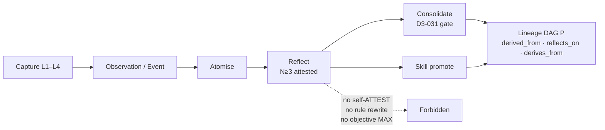

**Learning-vs-RSI line:** the substrate may compound the **record**; it may never compound the **reasoner**. No write path from substrate scores into substrate policy, reflection caps, or model weights.

---

## 10. Deployment architectures (perfect consumption patterns)

| Pattern | Maps to tiers | Properties stressed |
|---|---|---|
| Personal SQLite MCP | A/B | 2.1, 2.2, 2.7 |
| Team hub + Postgres+AGE | B/C | 2.5, 2.6, S2 |
| Multi-org federation | C mesh | 2.5, S2, FED honest-peer |
| Edge gateway + MCU | ∅+B | 2.1, witness degrade honesty |
| Air-gapped clinical / defense | B/C offline | 2.3, 2.5, secret refuse, export/forget |

**Never the perfect core:** multi-tenant SaaS as System of Record; general orchestration product; emotion-internals product; third DB backend gravity well.

---

## 11. Conformance & moat (perfect openness)

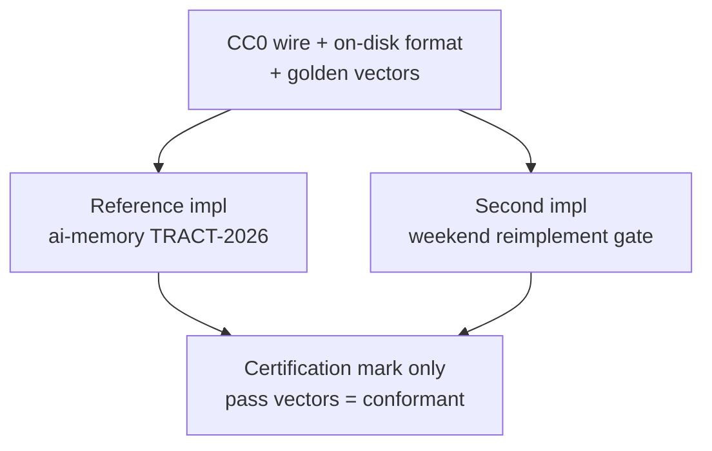

**Durable moat (W3-A6):** composition of attest-never-judge + record-stop + multi-org federation + **enforced** multi-family bias-displacement + portable multi-impl protocol — **not** R@k race vs Mem0/Zep/Letta.

---

## 12. Perfect vs v1.0 vs v0.9 (distance honesty)

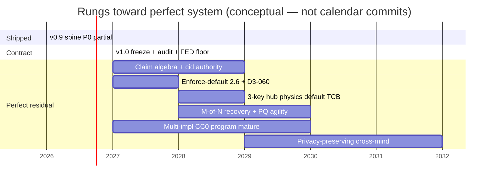

| Rung | Is perfect system? | What it is |
|---|---|---|
| **v0.9.0** | **No** | Machinery-rich Reference Profile; soft defaults residual (W2/W4) |
| **v1.0.0** | **No** | Stable contract + default integrity + audited federation floor (W3) |
| **Perfect system** | **Target** | Properties held under defaults; TRACT L1 data-model complete; L1/L2/L3 powers separated; multi-impl gravity real |

---

## 13. Acceptance tests for “architecture is perfect” (design gates)

A future release may claim **perfect-system architecture closed** only when **all** hold:

1. **Axis A:** L3 sibling ships; L2 verify-only epoch path live; `src/` RQGM boundary CI green.  
2. **Axis B:** L0/L1 frozen; Reference Profile year-stamped; golden vectors pass on ≥2 impls.  
3. **Seven properties** held under **compiled defaults** (not only max-enrolled posture).  
4. **2.6** enforce path field-fireable on attested families + consolidate gate; ban unlock only after D3-060.  
5. **S1–S5** non-theater (PE-1 non-empty; pure recall permanent; dual-identity ADR closed).  
6. **Capture** L1–L4 complete including L3 watcher.  
7. **Federation** data-lane attestation default ON; durability tier language honest.  
8. **Erasure dual-plane** fleet-aware (tombstone-subscription).  
9. **Crypto** succession + recovery + algorithm_id agility beyond Ed25519 monoculture.  
10. **Claims pack** still bans grandeur, RQGM-in-tree, vote-independence proof, world kill-switch, TRACT-L1-complete-as-marketing-lie.

Until then: ship **rungs**, never brand perfection.

---

## 14. Synthesis diagrams — single-page target

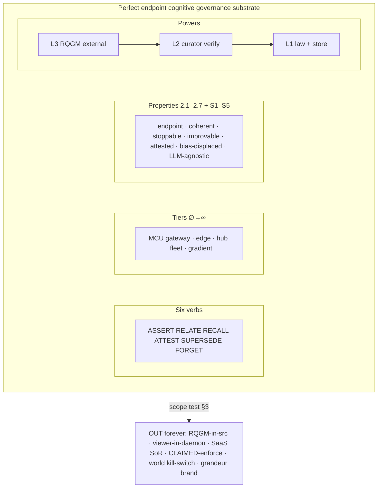

---

## 15. Verdict

| Question | Answer |
|---|---|
| What is the perfect architecture? | **Two-axis L-stack** (powers + altitudes) + **tiered residency** + **seven+S properties** held under defaults + **six-verb Claim core** + **external optimizer** + **multi-impl CC0 gravity** |
| Is v0.9 / v1.0 that architecture? | **No** — necessary rungs (W3/W4) |
| May we brand “perfect memory”? | **No** (W3-A6) — brand governance substrate |
| May RQGM enter `src/` for cohesion? | **Eternity NO** |
| What is IN that looks cut-adjacent? | Epoch verify, attested N≥3, pure recall, aggregate L3 export, C-ABI (W3-A4) |

**One-line close:**

> *Perfect system = TRACT-complete continuity organ under moonshot powers — L1 persists/attests/refuses, L2 freezes/verifies, L3 optimizes outside the TCB — tiered to real silicon, pure on recall, hard on attestation, soft never on CLAIMED enforce, honest about every proof it cannot make.*

---

## Handoff

| Next | Use this doc for |
|---|---|
| W7 synthesis / ROADMAP § rewrite | Canonical **target** picture vs v1.0 epic cutline |
| Implementation epics | Map each V10-G* / TRACT G* to a box above; refuse scope that fails §3 |
| Positioning / site | Category language + mermaid-exportable architecture only |
| Never | Treat this as a claim that HEAD is perfect |

---

*W7-A4 · Perfect-system target architecture · final design · mermaid + narrative · under 550 lines*  
*Absolute path: `/Users/fate/Downloads/ai-memory-mcp/waves/w7-a4-perfect-architecture.md`*
